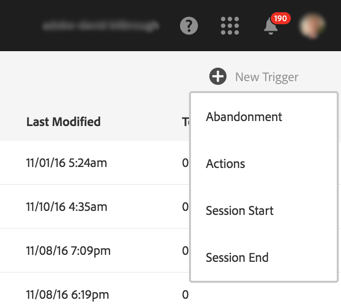
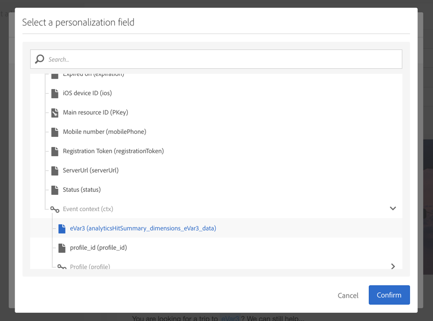

# Användningsexempel för utlösare för övergåenden{#abandonment-triggers-use-cases}

I det här avsnittet beskrivs olika användningsexempel som kan implementeras med hjälp av integreringen mellan Adobe Campaign och Experience Cloud Triggers. Du hittar två exempel på användningsområden:

* [Utlösare](#browse-abandonment-trigger)för bläddring: skicka ett meddelande till kunder som avbrutit sitt besök på er webbplats.
* [Utlösare för](#search-abandonment-trigger)avbruten sökning: engagera besökare som gjort en sökning på er webbplats, men inte gjort något inköp.

>[!NOTE]
>
>De användningsfall som beskrivs i det här avsnittet är beroende av Experience Cloud Visitor ID. Det går också att implementera dem med Experience Cloud-deklarerat ID. Hash-kodade och krypterade deklarerade ID:n stöds också. Du kan skicka e-post/SMS till en profil som inte finns i Campaign genom att direkt dekryptera den krypterade e-postadressen/det krypterade mobilnumret. Men i det här fallet kan personalisering med hjälp av profildata inte användas.

## Krav {#pre-requisites}

För att dessa användningsområden ska kunna implementeras måste du ha tillgång till följande lösningar/bastjänster:

* Adobe Campaign
* Adobe Analytics Ultimate, Premium, Foundation, OD, Select, Prime, Mobile Apps, Select eller Standard.
* Bastjänsten Experience Cloud-utlösare
* Bastjänsten Experience Cloud DTM
* Experience Cloud Visitor ID och Experience Cloud People - bastjänst

Du måste också ha en fungerande webbplats.

Mer information finns i [Konfigurera lösningar och tjänster](../../integrating/using/configuring-triggers-in-experience-cloud.md#configuring-solutions-and-services).

## Bläddra efter utlösare för övergivna {#browse-abandonment-trigger}

I det här fallet ska vi skapa en enkel utlösare som aktiveras varje gång en kund avstår från ett besök på webbplatsen. I det här exemplet förutsätts det att du redan har DTM som samlar in och överför data till Adobe Analytics och har skapat alla händelser.

### Skapa en Experience Cloud-utlösare {#creating-an-experience-cloud-trigger}

1. Välj **[!UICONTROL Manage Triggers]** på menyn Experience Cloud Activation Core Service.

   

1. Välj en utlösartyp ( **[!UICONTROL Abandonment]** i vårt användningsfall).

   

1. I det här fallet behöver vi en enkel utlösare för att överge. Affärssyftet är att identifiera besökare som bläddrar på vår webbplats för resebokning, tittar på sidan&quot;Erbjudanden&quot; men inte bokar någon resa. När vi har identifierat den här målgruppen vill vi nå tillbaka till dem inom en kort tidsperiod. I det här exemplet väljer vi att skicka utlösaren efter en period på 10 minuter.

   

### Använda utlösaren i Adobe Campaign {#using-the-trigger-in-adobe-campaign}

Nu när vi har skapat en Experience Cloud Trigger kan vi använda den i Adobe Campaign.

I Adobe Campaign måste du skapa en utlösare länkad till den du skapade i Experience Cloud.

1. Om du vill skapa utlösaren i Adobe Campaign klickar du på **[!UICONTROL Adobe Campaign]** logotypen i det övre vänstra hörnet och väljer sedan **[!UICONTROL Marketing plans]** > **[!UICONTROL Transactional messages]** > **[!UICONTROL Experience Cloud triggers]**.

   

1. Klicka på **[!UICONTROL Create]**.
1. Markera utlösaren som du skapade tidigare och klicka på **[!UICONTROL Next]**.

   

1. Markera **[!UICONTROL Email]** kanalen och **[!UICONTROL Real-time event]** måldimensionen och klicka **[!UICONTROL Create]**.

   

1. Publicera utlösaren i Adobe Campaign. Den här processen skapar automatiskt en transaktionsmeddelandemall.

   

1. Om du vill visa meddelandemallen klickar du på **[!UICONTROL More]** knappen längst upp till höger och sedan på **[!UICONTROL Trigger Transactional Template]**.

1. Anpassa innehållet och avsändarinformationen.

   

1. Publicera meddelandemallen. Utlösaren är nu aktiv och funktionell.

   

### Kör scenariot {#running-the-scenario}

1. Det här användningsexemplet börjar med ett första e-postmeddelande som skickas till er målgrupp med Adobe Campaign.

   

1. Mottagaren öppnar e-postmeddelandet.

   

1. Han klickar på en länk som för honom till er webbplats. I det här exemplet placerar banderollen mottagaren på startsidan för resebokningswebbplatsen.

   

1. Mottagaren går till sidan&quot;Erbjudanden&quot; men stannar plötsligt upp. Efter en 10-minutersperiod utlöser Adobe Campaign sändningen av transaktionsmeddelandet.

   

1. Du kan när som helst kontrollera Experience Cloud-loggarna för att se hur många gånger utlösaren utlöses.

   

1. Du kan också visa utlösarrapporten för Adobe Campaign.

   

## Utlösare för avbruten sökning {#search-abandonment-trigger}

I det här fallet kommer vi att skapa en utlösare för att återengagera besökare som var på vår bokningswebbplats, sökte efter en destination, hittade inga framgångsrika resultat och bokade ingenting efter det. Den allmänna processen är densamma som i det föregående användningsfallet (se [Bläddra efter utlösare](#browse-abandonment-trigger)för övergiven åtgärd). Här fokuserar vi på hur vi personaliserar e-postmeddelandet om återmarknadsföring.

### Skapa en Experience Cloud-utlösare {#creating-an-experience-cloud-trigger-1}

Följ stegen som beskrivs i det föregående användningsexemplet för att skapa Experience Cloud Trigger. Se [Skapa en Experience Cloud-utlösare](#creating-an-experience-cloud-trigger). Den största skillnaden är utlösardefinitionen.

I det här avsnittet kan du skicka alla data som samlats in från Analytics till utlösarens nyttolast. **[!UICONTROL Include Meta Data]** I det här exemplet skapar vi en anpassad eVar (till exempel eVar 3) för att samla in söktermen som besökaren anger. Den här termen används sedan i det transaktionsbaserade e-postmeddelandet som skickas till samma besökare.

### Använda utlösaren i Adobe Campaign {#using-the-trigger-in-adobe-campaign-1}

1. Följ stegen som beskrivs i det föregående användningsexemplet för att skapa utlösaren i Adobe Campaign. Se [Använda utlösaren i Adobe Campaign](#using-the-trigger-in-adobe-campaign). Den största skillnaden är hur vi i Adobe Campaign får åtkomst till och använder de metadata som knuffas in i utlösarens nyttolast.
1. Klicka på ikonen i den utlösare för sökbortfall som du skapade i Adobe Campaign för att visa den nyttolast som har skickats till Adobe Campaign. **[!UICONTROL Event content and enrichment]**

   

1. Som du kan se skickas den anpassade eVar-variabeln i utlösarnyttolasten och mappas till **händelsekontexttabellen** (ctx). Vi har nu tillgång till den för att personalisera transaktionsmeddelandet.

   

1. I det här exemplet väljer vi att inkludera målsöktermen i ämnesraden och i e-postbrödtexten.

   

1. När du väljer ett anpassat fält ska du leta efter dina nyttolastmetadata i tabellen **Transactional event** (rtEvent) och sedan i undertabellen **Event context** (ctx).

   

### Kör scenariot {#running-the-scenario-1}

1. Besökaren går vidare till resebokningswebbplatsen och söker efter en destination. I det här exemplet letar besökaren efter en resa till Japan men hittar inget resultat. Det här är en möjlighet för oss att nå tillbaka till besökaren och rekommendera en alternativ reseplan.

   

   >[!NOTE]
   >
   >I det här fallet antar vi att besökaren/mottagaren redan har öppnat och klickat på ett e-postmeddelande som kommer från samma webbplats. Detta gör att vi kan använda och samla in VisitorID och mappa det till mottagaren. Vi behöver bara göra detta en gång.

1. En stund senare får samma besökare/mottagare ett meddelande om återmarknadsföring. Meddelandet innehåller det nyligen sökta målet.

   

