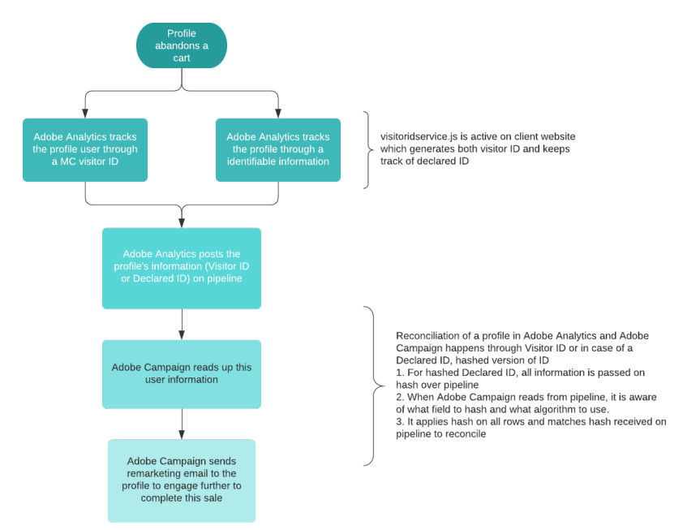

# Om Adobe Experience Cloud-utlösare{#about-adobe-experience-cloud-triggers}

Integrationen mellan huvudtjänsten Experience Cloud Activation **[!UICONTROL Triggers]** och Adobe Campaign gör att ni kan skicka personaliserade e-postmeddelanden till era kunder som en reaktion på specifika beteenden eller händelser som Adobe Analytics spårar på er hemsida (inom 15 minuter).

I Adobe Experience Cloud definierar ni olika utlösare, det vill säga de kundbeteenden som ni vill övervaka. Exempelvis alla kunder som avbrutit sitt besök på eran hemsida, gjort en sökning på eran hemsida men inte köpt något, eller till och med de kunder vars session har gått ut. När du skapar en utlösare så definierar du utlösarens villkor och de data som ska skickas i händelsen (uppladdningen) till Adobe Campaign.

I Adobe Campaign väljer du den utlösare som tidigare skapats. Sedan länkar du händelsedatan med datamart-datan och väljer transaktionsmeddelande-mallen som är associerad med utlösaren/händelsen.    När en kund till exempel avbryter sitt besök på din hemsida skickas ett event till Adobe Campaign som sedan kan återanvända eventet genom ett e-postmeddelande som skickas till kunden inom 15 minuter.

Följande diagram visar hur den här integreringen fungerar.

**Relaterade ämnen:**

* Lär dig mer om de olika typerna av utlösare: [Adobe Experience Cloud-dokumentation](https://experienceleague.adobe.com/docs/core-services/interface/activation/triggers.html).
* Titta på videon [Trigger Remarketing Messages som baseras på hemsideaktivitet](https://helpx.adobe.com/marketing-cloud/how-to/email-marketing.html#step-two)
* Upptäck våra två [utlösare vid övergiven kundkorg](../../integrating/using/abandonment-triggers-use-cases.md).

## Användarprocess för utlösare {#triggers-user-process}

>[!CAUTION]
>
>Innan du kör huvudstegen för användare så måste funktionerna konfigureras.    Mer information om detta hittar du i [Aktivera funktionen](../../integrating/using/configuring-triggers-in-experience-cloud.md#activating-the-functionality), [Konfigurera lösningar och tjänster](../../integrating/using/configuring-triggers-in-experience-cloud.md#configuring-solutions-and-services) och [Skapa en mappad utlösare i Campaign](../../integrating/using/using-triggers-in-campaign.md#creating-a-mapped-trigger-in-campaign).

Huvudstegen för användarprocessen i Adobe Campaign är:

1. Skapa en utlösarhändelse som är länkad till en befintlig Adobe Experience Cloud-utlösare.
1. Publicera utlösarehändelsen.
1. Definiera innehållet i mallen för transaktionsmeddelandet.
1. Testa mallen (skapa en testprofil och skicka ett testmeddelande).
1. Publicera mallen för transaktionsmeddelande.

Fullständiga användningsexempel beskrivs i [det här avsnittet](../../integrating/using/abandonment-triggers-use-cases.md).

## Viktiga anteckningar {#important-notes}

Här är några viktiga saker att tänka på innan du använder utlösare - Campaign-integrering:

* Push-meddelanden stöds inte för utlösare.        Endast e-post och SMS stöds.
* Du kan berika din utlösare med metadata som har hämtats in via analyser så som e-post-ID, sidnamn etc.
* Du kan koppla din utlösare till en profil som lagras i Campaign Standard och använda profilens fält för att anpassa meddelandet.
* Så snart en utlösare tas emot behandlas den och stäms av och sedan skickas ut.        Det tar ca 5 till 15 minuter beroende på hur många utlösare som har tagits emot och antalet anpassningsfält som används i mallen.

>[!NOTE]
>
>Mer information om bästa praxis och tekniska begränsningar finns i [Utlösare - bästa praxis och begränsningar](../../integrating/using/configuring-triggers-in-experience-cloud.md#triggers-best-practices-and-limitations).
