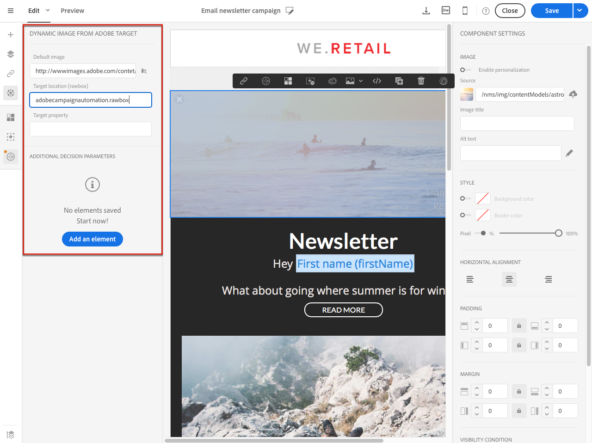

# Lägga till dynamiskt innehåll från Target{#adding-target-dynamic-content}

Tack vare integreringen med Adobe Target kan dynamiska bilder läggas till i en leverans för att personalisera ert innehåll utifrån upplevelser.

När du redigerar ett e-postmeddelande kan du infoga en dynamisk bild från Adobe Target som ändras beroende på mottagarna.

Innan du får åtkomst till bilden i Adobe Campaign måste följande åtgärder först utföras i Adobe Target:

* Skapa ett eller flera [omdirigeringserbjudanden](https://docs.adobe.com/content/help/en/target/using/experiences/offers/offer-redirect.html), där du måste ange webbadressen till den bild du vill använda.
* Skapa en eller flera [målgrupper](https://docs.adobe.com/content/help/en/target/using/audiences/create-audiences/audiences.html)för att definiera målet för din aktivitet.
* Skapa en [formulärbaserad upplevelsedispositionsaktivitet](https://docs.adobe.com/content/help/en/target/using/experiences/form-experience-composer.html) , där du måste välja en ruta och ange flera upplevelser, beroende på hur många omdirigeringserbjudanden som skapas. För varje upplevelse måste du välja ett av de omdirigeringserbjudanden som skapas.
* Skapa segment med hjälp av information från Adobe Campaign för att specificera upplevelser. Om du vill använda data från Adobe Campaign i erbjudandets urvalsregler måste du ange data i rutan Adobe Target.

1. Skapa en e-postleverans.
1. När du redigerar innehållet i ett e-postmeddelande eller en landningssida går du till ett bildblock och väljer **[!UICONTROL Dynamic image from Adobe Target]** via snabbmenyn.

   

1. Markera bilden som ska visas som standard i e-postmeddelandet. Du kan direkt ange bild-URL:en eller välja en bild som delas via [Resurser](../../integrating/using/working-with-campaign-and-assets-core-service.md).

   Integreringen stöder bara statiska bilder. Resten av innehållet går inte att anpassa.

1. Ange namnet på radrutan som anges i Adobe Target.
1. Om du använder Enterprise-behörigheter i inställningarna i Adobe Target lägger du till motsvarande egenskap i det här fältet. Läs mer om Target Enterprise-behörigheter på [den här sidan](https://docs.adobe.com/content/help/en/target/using/administer/manage-users/enterprise/properties-overview.html). Det här fältet är valfritt och krävs inte om du inte använder Enterprise-behörigheter i Target.
1. I **[!UICONTROL Additional decision parameters]** anger du mappningen mellan fälten som definieras i segmenten Adobe Target och i fälten Adobe Campaign.

   De Adobe Campaign-fält som används måste ha angetts i rutan. Här definierar vi olika upplevelser beroende på mottagarens kön.

   

1. Förhandsgranska e-postmeddelandet för att se om bilden ändras när du väljer olika profiler beroende på vilka parametrar som har angetts i aktiviteten Adobe Target och i Adobe Campaign.

Leveransen som innehåller den dynamiska bilden kan nu skickas. Resultaten av den finns i Adobe Target.

**Relaterade ämnen:**

* [Adobe Target Portal](https://docs.adobe.com/content/help/en/target/using/integrate/campaign-and-target.html)
* [Om design av e-postinnehåll](../../designing/using/designing-content-in-adobe-campaign.md)
* [Anpassa e-postbilder i realtidsvideo](https://helpx.adobe.com/marketing-cloud/how-to/email-marketing.html)

