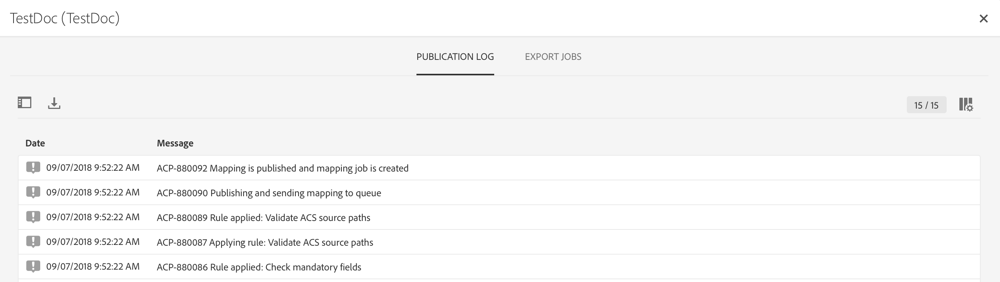
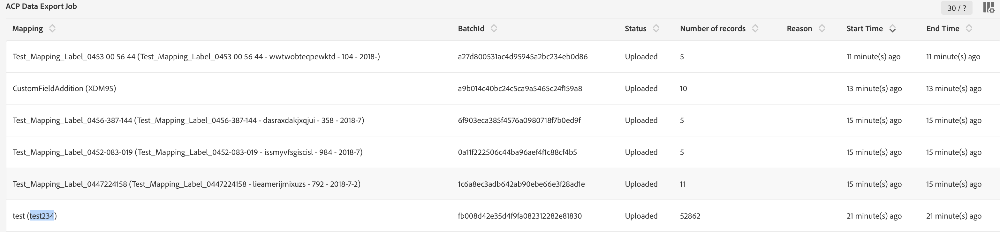

# Aktivera mappning {#mapping-activation}

>[!IMPORTANT]
>
>Adobe Experience Platform Data Connector är för närvarande en betaversion som kan komma att uppdateras ofta utan föregående meddelande. Kunderna måste vara värdbaserade på Azure (för närvarande endast betaversioner för Nordamerika) för att få tillgång till dessa funktioner. Kontakta Adobe kundtjänst om du vill ha tillgång till tjänsten.

När mappningsdefinitionen är klar kan du publicera mappningen. Efter distributionssteget startas datareplikeringen mellan Campaign Standard och Adobe Experience Platform automatiskt. Du kan när som helst stoppa replikeringen genom att klicka på knappen **[!UICONTROL Stop]**.

Beroende på dina mappningsändringar kan du välja att skicka om alla dina poster till Adobe Experience Platform.

På distributionspanelen kommer du åt publiceringsloggen och exportloggarna.

På fliken **[!UICONTROL Export jobs]** kan du övervaka exportjobbet för den publicerade mappningen.

Om du vill övervaka alla dataexportjobb går du till menyn **[!UICONTROL Administration]** > **[!UICONTROL Development]** > **[!UICONTROL Platform]** > **[!UICONTROL Status of data export to platform]** .

Statusen för dataöverföringsjobb är:

* **[!UICONTROL Created]**: Ett datainmatningsjobb skapas och datainmatning pågår.
* **[!UICONTROL Failed]**: Ett datainmatningsjobb misslyckades. I fältet reason beskrivs orsaken till felet. Misslyckandet kan vara övergående eller permanent. Om det uppstår tillfälliga fel skapas ett nytt intag-jobb efter ett konfigurerat intervall. Som ett första steg i felsökningen kan användaren kontrollera felets orsaksfält. Om anledningen omdirigerar en användare till Adobe Experience Platform UI kan användaren logga in på Adobe Experience Platform och kontrollera batchstatusen i datauppsättningen för att fastställa en exakt felorsak.
* **[!UICONTROL Uploaded]**: En batch skapas först i Adobe Experience Platform och data importeras sedan till gruppen. I fältet för batch-ID visas batch-ID för batchen i Adobe Experience Platform. Adobe Experience Platform utför också en eftervalidering av gruppen. Batchen markeras först som överförd tills Adobe Experience Platform slutför steget efter valideringen. Ett jobb fortsätter att avfråga Adobe Experience Platform om batchstatus efter överföring. En batch kan antingen köras i läget Misslyckades eller i läget Slutfört efter validering i Adobe Experience Platform.
* **[!UICONTROL Success]**: När en batch har överförts till Adobe Experience Platform kontrolleras jobbets status (efter validering på plattformen) efter ett konfigurerat intervall. Statusen&quot;Success&quot; har identifierat ett lyckat dataintag i Adobe Experience Platform.

I vissa fall kan du få valideringsfelet nedan när du publicerar mappningen.

Detta inträffar när det XDM-schema som du använder inte har uppdaterats med det senaste XDM-fältet som rör sekretesshantering och fortfarande innehåller det borttagna XDM-fältet &quot;ccpa&quot;.

Så här uppdaterar du XDM-schemat:

1. Gå till datauppsättningen på Adobe Experience Platform via länken på XDM-mappningssidan.

1. Navigera till ditt XDM-schema.

1. Lägg till **[!UICONTROL Profile Privacy]**-blandningen i schemat.

   

1. Spara schemat och försök sedan publicera mappningen igen. Publikationen bör nu bli klar.

   
