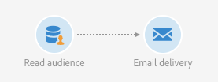

# Målinrikta Adobe Experience Platform-målgrupper  {#targeting-aep-audiences}

>[!IMPORTANT]
>
>Målgruppstjänsten är för närvarande i betaversion, som kan uppdateras ofta utan föregående meddelande. Kunderna måste vara värdbaserade på Azure (för närvarande endast betaversioner för Nordamerika) för att få tillgång till dessa funktioner. Kontakta Adobe kundtjänst om du vill ha tillgång till tjänsten.

När du har skapat en [Adobe Experience Platform](../../integrating/using/aep-about-audience-destinations-service.md) Med segmentbyggaren kan ni använda den på samma sätt som ni gör för en Campaign-målgrupp inom arbetsflöden att personalisera och skicka meddelanden.

Så här aktiverar du en Adobe Experience Platform-målgrupp i dina arbetsflöden:

1. Lägg till en **[!UICONTROL Read audience]** till arbetsflödet och öppna det.

1. Välj **[!UICONTROL Adobe Experience Platform]** option under **[!UICONTROL Type of audience]** och sedan lägga till önskad målgrupp.

   

1. (Valfritt) När målgruppen har valts kan du klicka på ögonknappen för att granska och/eller redigera segmentdefinitionen (se till att spara ändringarna igen).

   Om du klickar på ögonknappen dirigeras du till segmentbyggaren (på en annan flik) som är kopplad till den valda målgruppen i Campaign.

1. Välj en **[!UICONTROL Platform data mapping]** -element för att ange önskad måldimension för den valda Adobe Experience Platform-målgruppen.

   Som standard är primärnyckeln (t.ex. iRecipientID för profiltabellen, iAppSubscriptionID för AppSubscription-tabellen) som används för avstämning automatiskt tillgänglig i listrutan. Om du vill ange mål utanför primärnyckeln måste du skapa en egen **Namnutrymme**.

   >[!NOTE]
   >
   >För mål utanför primärnyckeln måste du också skapa en anpassad målmappning som motsvarar det anpassade namnutrymmet. Mer information om målmappning finns i [det här avsnittet](../../administration/using/target-mappings-in-campaign.md).

   

   Den här listan innehåller alla XDM-mappningar (Experience Data Model) som har konfigurerats på din instans. Mer information om Adobe Experience Platform Data Connector finns i [det här dedikerade dokumentet](../../integrating/using/aep-about-data-connector.md).

   

1. När målgrupps- och målinriktningsdimensionerna är korrekt konfigurerade klickar du på **[!UICONTROL Confirm]** för att spara ändringarna.

Du kan nu konfigurera ditt arbetsflöde med andra aktiviteter. Du kan till exempel länka en **[!UICONTROL Email delivery]** aktivitet för att skicka ett e-postmeddelande till den valda målgruppen.

>[!NOTE]
>
>Med Campaign Standard kan ni inrikta er på Adobe Experience Platform målgrupper i alla distributionskanaler: E-post, SMS-meddelanden, direktmeddelanden, push-meddelanden och meddelanden i appen.
>
>*Obs! För alla push- och In-App-meddelanden stöder Campaign Standard endast leveranser för kända profiler.

Mer information om hur du använder arbetsflöden och leveranser finns i följande avsnitt:

* [Identifiera arbetsflöden](../../automating/using/get-started-workflows.md)
* [Skapa ett arbetsflöde](../../automating/using/building-a-workflow.md)
* [Identifiera kommunikationskanaler](../../channels/using/get-started-communication-channels.md)
* [Om kanalaktiviteter](../../automating/using/about-channel-activities.md)
