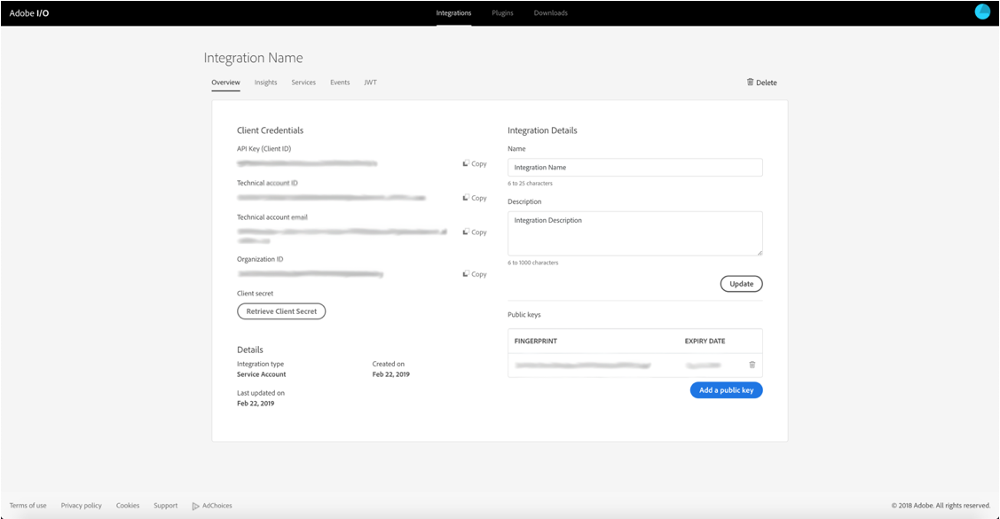

# Konfigurera integrering med Adobe IO för Microsoft Dynamics 365

Aktivera dina CRM-data för kommunikation över flera kanaler: lär dig steg som krävs under efteretableringen för att skapa en ny integrering för Microsoft Dynamics 365.

## Översikt

Adobe Campaign Standard - Integrering med Microsoft Dynamics 365 beskrivs på [den här sidan](../../integrating/using/working-with-campaign-standard-and-microsoft-dynamics-365.md).

Innan du utför stegen efter etablering i den här artikeln förutsätts det att du redan har etablerats och har administratörsåtkomst till din organisations Campaign Standard-instans.  Om detta inte har hänt måste du kontakta Adobes kundtjänst för att slutföra etableringen av Campaign.

>[!CAUTION]
>
>Steg som beskrivs nedan måste utföras av en administratör.

## Konfiguration

Du måste konfigurera API-åtkomst och konfigurera en ny integrering för Unifi.

Konfigurationen görs i Adobe IO: behöver du skapa en ny integrering för Unifi, vilket visas i den här videon:

>[!VIDEO](https://video.tv.adobe.com/v/27308)

### Skapa en ny integrering

Följ nedanstående procedur för att uppnå detta:

1. Navigera till [Adobe IO Console](https://console.adobe.io/home#) och välj ditt Adobe IMS Organization ID i listrutan längst upp till vänster (se nedan).

Klicka sedan på **[!UICONTROL New Integration]** längst upp till höger.

>[!NOTE]
>
>Om detta är organisationens första integration kan knappen för **[!UICONTROL New Integration]** finnas mitt på sidan.

1. Markera **[!UICONTROL Access an API]** och klicka **[!UICONTROL Continue]**.

1. Välj _Adobe Campaign_ i **[!UICONTROL Experience Cloud]** -avsnittet och klicka på **[!UICONTROL Continue]**.

1. Skapa ett certifikat och en nyckel.

**För MacOS- och Linux-plattformar**

Öppna terminalprogram och kör under kommando:

```
openssl req -x509 -sha256 -nodes -days 365 -newkey rsa:2048 -keyout private.key -out certificate_pub.crt
```

**För Windows-plattformar**

* Ladda ned en öppen klient för att generera offentliga certifikat (t.ex. [OpenSL Windows-klient](https://bintray.com/vszakats/generic/download_file?file_path=openssl-1.1.1-win64-mingw.zip))

* Extrahera mappen från zip-filen

* Öppna kommandoradsfrågan och kör under kommandon.

Ersätt `<containing folder path>` nedan med sökvägen till den extraherade mappen (t.ex. C:\Users\labuser\Downloads\openssl-1.1.1-win64-mingw\openssl-1.1.1-win64-mingw):

```
set OPENSSL_CONF=<containing folder path>/openssl.cnf
 
cd <containing folder path>/
 
openssl req -x509 -sha256 -nodes -days 365 -newkey rsa:2048 -keyout private.key -out certificate_pub.crt
```

**För alla plattformar**

Följ anvisningarna för att slutföra certifikatbegäran:

```
Generating a 2048 bit RSA private key
 
.................+++
 
.......................................+++
 
writing new private key to 'private.key'
 
-----
 
You are about to be asked to enter information that will be incorporated
 
into your certificate request.
 
What you are about to enter is what is called a Distinguished Name or a DN.
 
There are quite a few fields but you can leave some blank
 
For some fields there will be a default value,
 
If you enter '.', the field will be left blank.
 
-----
```

När informationen har angetts skapas två filer: **[!UICONTROL certificate_pub.crt]** och **[!UICONTROL private.key]**.

* **[!UICONTROL certificate_pub.crt]** upphör att gälla om 365 dagar. Du kan ändra förfalloperioden genom att ändra värdet för dagar i kommandot openssl ovan, men det är bra att rotera inloggningsuppgifter regelbundet.

* **[!UICONTROL certificate_pub.crt]** kommer att användas på nästa skärm för att slutföra integreringen i Adobe I/O Console.

>[!NOTE]
>
> **[!UICONTROL private.key]** kommer att användas vid ett senare tillfälle under steg efter etableringen för Unifi.

1. Gå tillbaka till Adobe I/O Console och ange ett namn och en beskrivning för integreringen.

1. Överför **[!UICONTROL certificate_pub.crt]**

1. Välj den produktprofil som har rubriken:

* Organisations-ID för Campaign-instansen
* **[!UICONTROL Administrators]**

Exempel:  Campaign Standard - ditt kampanjorganisations-ID - Administratörer

Klicka på **[!UICONTROL Create Integration]**.


### Ställ in integreringsinformation

1. Välj **[!UICONTROL Continue to Integration Details]**

Granska integreringsinformationen.  Du måste referera tillbaka till dem när du kör Unifi efter etableringen.



1. Klicka över till **[!UICONTROL Services]** fliken och lägg till **[!UICONTROL I/O Events]** och **[!UICONTROL I/O Management API]** tjänster.  Om du vill lägga till tjänsten klickar du på alternativknappen och sedan **[!UICONTROL Add service]**.  Du gör detta för varje tjänst separat.

När du är klar bör dina tjänster visas högst upp som bilden nedan. Du behöver inte slutföra avsnittsgenereringen som en JWT och åtkomsttoken.


Publiceringen i Campaign är nu klar.  Fortsätt till [stegen efter etablering för Microsoft Dynamics 365](../../integrating/using/configure-microsoft-dynamics-365-for-campaign-integration.md).

**Relaterade ämnen**

* [Adobe IO - Integrering med tjänstkonto](https://www.adobe.io/authentication/auth-methods.html#!AdobeDocs/adobeio-auth/master/AuthenticationOverview/ServiceAccountIntegration.md)
* [Campaign Standard - API Access Setup](https://docs.campaign.adobe.com/doc/standard/en/api/ACS_API.html#setting-up-api-access)
* [Campaign Standard - Dynamics 365-integrering](../../integrating/using/configure-microsoft-dynamics-365-for-campaign-integration.md)
