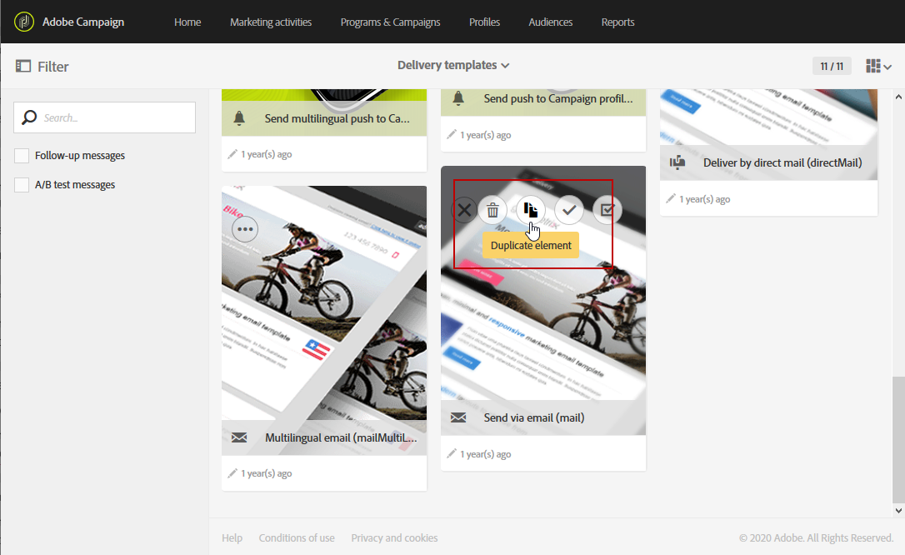

# Konfigurera integrering av Experience Manager och Campaign {#configuration-aem}

Tack vare integreringen mellan Adobe Campaign Standard och Adobe Experience Manager kan du använda innehåll som skapats i Adobe Experience Manager i Adobe Campaign e-postmeddelanden.

I det här användningsexemplet får du lära dig att skapa och hantera e-postinnehåll i Adobe Experience Manager och sedan använda dem för marknadsföringskampanjer genom att importera dem i e-postmeddelanden till Adobe Campaign Standard.

## Förhandskrav {#prerequisites}

Du bör kontrollera att du har följande element i förväg:

* En Adobe Experience Manager **redigering** instance
* En Adobe Experience Manager **publicera** instance
* En Adobe Campaign-instans

## Konfiguration i Adobe Campaign Standard {#config-acs}

Om du vill använda dessa två lösningar tillsammans måste du konfigurera dem så att de ansluter till varandra.
Konfigurera Adobe Campaign:

1. Du måste först konfigurera **[!UICONTROL Adobe Experience Manager instance]** externt konto under **[!UICONTROL Administration]** > **[!UICONTROL Application settings]** > **[!UICONTROL External accounts menu]**.

1. Konfigurera ett externt Adobe Experience Manager-konto med ditt **[!UICONTROL Server]** URL, **[!UICONTROL Account]** och **[!UICONTROL Password]**.

   

1. Kontrollera att **[!UICONTROL AEMResourceTypeFilter]** alternativet har konfigurerats korrekt. Öppna **[!UICONTROL Options]** meny under **[!UICONTROL Administration]** > **[!UICONTROL Application settings]** > **[!UICONTROL Options]** -menyn.

1. I **[!UICONTROL Value (text)]** kontrollerar du att följande syntax är korrekt:

   ```
   mcm/campaign/components/newsletter,mcm/campaign/components/campaign_newsletterpage,mcm/neolane/components/newsletter
   ```

   

1. På den avancerade menyn under **[!UICONTROL Resources]** > **[!UICONTROL Templates]** > **[!UICONTROL Delivery templates]**, duplicera en av de befintliga mallarna för att skapa en e-postmall som är specifik för Adobe Experience Manager.

   

1. Klicka på **[!UICONTROL Edit properties]** -ikon.

   

1. Under **[!UICONTROL Content]** nedrullningsbar meny, välja **[!UICONTROL Adobe Experience Manager]** i **[!UICONTROL Content source]** fältet och sedan ditt tidigare skapade externa konto i **[!UICONTROL Adobe Experience Manager account]**.

Nu måste du konfigurera integreringen i Adobe Experience Manager.

## Konfiguration i Adobe Experience Manager {#config-aem}

Om du vill konfigurera Adobe Experience Manager med Adobe Campaign Standard måste du följa dessa steg:

1. Du måste först konfigurera replikeringen mellan Adobe Experience Manager redigerings- och publiceringsinstanser. Se detta [section](https://experienceleague.adobe.com/docs/experience-manager-65/administering/integration/campaignstandard.html#configuring-adobe-experience-manager).

1. Anslut sedan Adobe Experience Manager till Adobe Campaign genom att konfigurera en dedikerad **[!UICONTROL Cloud Service]**. Se detta [section](https://experienceleague.adobe.com/docs/experience-manager-65/administering/integration/campaignstandard.html#connecting-aem-to-adobe-campaign).

1. Nu måste du konfigurera externaliseraren i Adobe Experience Manager på din författarinstans. Se detta [section](https://experienceleague.adobe.com/docs/experience-manager-65/administering/integration/campaignstandard.html#configuring-the-externalizer).
