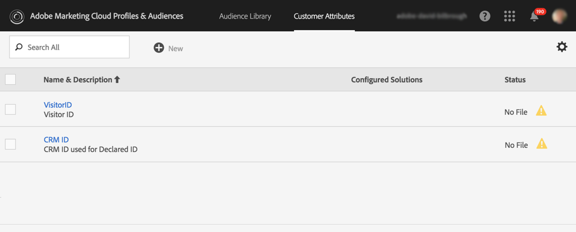
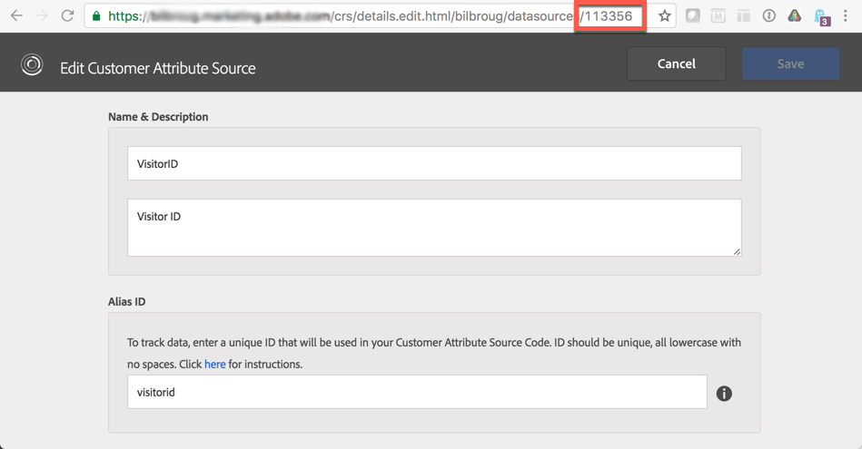
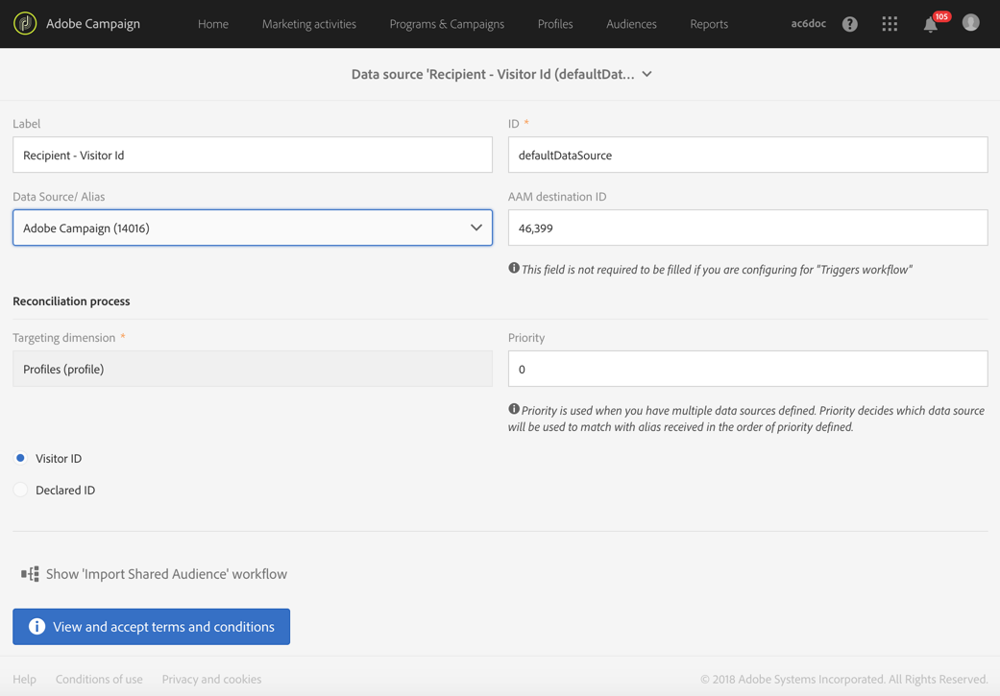

# Konfigurera utlösare i Experience Cloud{#configuring-triggers-in-experience-cloud}

## Aktivera funktionen {#activating-the-functionality}

Funktionen måste aktiveras i Adobe Campaign av Adobe. Kontakta er kontoansvarige på Adobe eller er partner inom professionella tjänster.

Adobe-teamet behöver följande information för att aktivera utlösare:

* Företagsnamn för Marketing Cloud
* IMS-ORG-ID
* Analytics inloggningsföretag (kan vara samma som Marketing Cloud-företagets namn)

## Konfigurera lösningar och tjänster {#configuring-solutions-and-services}

Om du vill använda den här funktionen måste du ha tillgång till följande lösningar/bastjänster:

* Adobe Campaign
* Adobe Analytics Ultimate, Premium, Foundation, OD, Select, Prime, Mobile Apps, Select eller Standard.
* Experience Cloud-utlösarens bastjänst

   

* Experience Cloud DTM Core Service

   

* Experience Cloud Visitor ID och Experience Cloud People Core Service

   

Du måste också ha en fungerande webbplats.

>[!CAUTION]
>
>Delegering till underdomäner är ett leveransnyckelelement. Se till att Adobe Campaign e-postmeddelanden skickas från samma domän som den som används på webbplatsen.

Du måste konfigurera [Experience Cloud DTM Core Service](#configuring-experience-cloud-dtm-core-service), [Experience Cloud People Core Service](#configuring-experience-cloud-people-core-service) och [Campaign](#configuring-triggers-and-aliases-in-campaign) för att köra dessa användningsfall.

### Konfigurerar Experience Cloud DTM Core Service {#configuring-experience-cloud-dtm-core-service}

1. I Experience Cloud DTM Core Service (Dynamic Tag Management) aktiverar du Experience Cloud ID och Adobe Analytics för dina webbplatssidor.

   

1. ID-avstämning mellan webbplatsen kräver Adobe Analytics och Adobe Campaign att alias används. Skapa till exempel ett alias,&quot;visitorid&quot;.

   

### Konfigurerar Experience Cloud People Core Service {#configuring-experience-cloud-people-core-service}

Aliaset som tidigare refererats i DTM måste skapas i Experience Cloud People Core Service via ett kundattribut. Se till att du skapar ett nytt och refererar till samma DTM-alias i integreringskoden (till exempel&quot;visitorid&quot;).

>[!NOTE]
>
>Vi kommer att använda det här kundattributet i datakällan i Adobe Campaign (nästa steg).

### Konfigurera utlösare och alias i Campaign {#configuring-triggers-and-aliases-in-campaign}

1. Kontrollera att Adobe Campaign Standarden är **[!UICONTROL Experience Cloud triggers]** synlig. Om du inte gör det kontaktar du Adobe Campaign-administratörerna.

   

1. Med alias kan en kontakt i Analytics förenas med en profil i Campaign. Du måste matcha de alias som definieras i Experience Cloud ID-tjänsten med en delad datakälla i Campaign. Du måste konfigurera aliasupplösningen i Adobe Campaign via en datakälla ( **[!UICONTROL Administration]** > **[!UICONTROL Application Settings]** > **[!UICONTROL Shared Data Sources]** ). Se till att du väljer rätt datakälla på den **[!UICONTROL Data Source/Alias]** nedrullningsbara menyn, som mappas med samma datakälla för kundattribut som skapades i föregående steg.

   

   >[!NOTE]
   >
   >Du kan stämma av utlösarna för både anonyma och inloggade användare. För anonyma användare bör profilen finnas i Adobe Campaign och ett e-postmeddelande har skickats till användaren tidigare. Det räcker med konfiguration av besökar-ID. Om du vill stämma av utlösare för inloggade användare måste du konfigurera deklarerad ID-datakälla. Mer information finns i [Datakällans konfiguration](../../integrating/using/provisioning-and-configuring-integration-with-audience-manager-or-people-core-service.md#step-2--configure-the-data-sources).

## Skapa en utlösare i Experience Cloud-gränssnittet {#creating-a-trigger-in-the-experience-cloud-interface}

En Adobe Experience Cloud-utlösare måste skapas så att ni kan använda den i Campaign.

Skapa en ny utlösare i Experience Cloud och se till att du väljer den rapportsvit som används på webbplatsen. Se till att du väljer rätt dimension så att utlösaren aktiveras.

Titta på [Adobe Experience Cloud-dokumentationen](https://docs.adobe.com/content/help/en/core-services/interface/activation/triggers.html) och se den här [videon](https://helpx.adobe.com/marketing-cloud/how-to/email-marketing.html#step-two).

## Utlöser bästa praxis och begränsningar {#triggers-best-practices-and-limitations}

Här följer en lista över bästa praxis och begränsningar för användningen av Campaign - integrering av utlösare:

* Om du har flera instanser av Campaign Standard kan utlösare tas emot av alla instanser så länge de finns i samma IMS-org-ID. Analytics måste också finnas på samma IMS-org-ID.
* Du kan inte skapa en utlösare i Trigger Core Service med händelser från två olika rapportsviter.
* Utlösare baseras på transaktionsmeddelanden. Transaktionsmeddelanden används när du måste skicka ett meddelande mycket snabbt. Du kan inte placera transaktionsmeddelanden i kö och sedan slinga dem i grupp.
* Utlösare är inte deterministiska till sin natur. När en utlösare genereras skickas alla alias som är kopplade till cookien, så när det gäller delade webbläsare som kioskdatorer, bibliotek, cyber cafes eller delade enheter hemma (man och fru loggar in från samma enhet) går det inte att mappa till rätt ID. Alla ID:n som används för att logga in med webbläsaren skickas till Campaign som skickar ett meddelande baserat på den första avstämningen. Om det finns flera e-post-ID:n som är berättigade för avstämning skickar Campaign inget e-postmeddelande. Det finns inget sätt för Campaign att veta vilket e-post-ID som är rätt om det inte hämtas och skickas av Analytics.
* Du kan inte lagra innehåll i nyttolasten i Campaign. Utlösare kan inte användas för att uppdatera data för en profil.
* Kundattribut stöds inte i utlösare (d.v.s. endast rapportsvitsdata kan användas för att definiera affärsregler för utlösare).
* Samlingar stöds inte i Campaign.

>[!CAUTION]
>
>Din webbplats måste köras på samma domän som Adobe Campaign-servern. Annars kan du inte använda besökar-ID för att stämma av och nå ut till användare som besöker webbplatsen anonymt.

