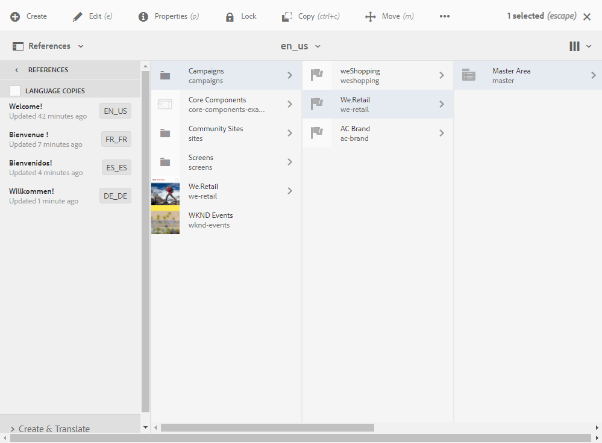

# Skapa ett flerspråkigt e-postmeddelande med Adobe Experience Manager-integrering {#creating-multilingual-email-aem}

I det här dokumentet får du lära dig hur du skapar flerspråkiga e-postmeddelanden med Adobe Experience Manager innehåll och språkkopior.

Förutsättningarna är:

* Åtkomst till en AEM som konfigurerats för integreringen.
* Åtkomst till en Adobe Campaign-instans som konfigurerats för integreringen.
* En flerspråkig e-postmall från Adobe Campaign har konfigurerats för att ta emot AEM.

## Skapa nytt e-postinnehåll i Adobe Experience Manager {#creating-email-content-aem}

1. På Adobe Experience Manager hemsida väljer du **[!UICONTROL Site]**.

   

1. Välj i vilken mapp du vill skapa sidan och klicka sedan på **[!UICONTROL Create]** och **[!UICONTROL Page]**. Här skapar vi en sida i mappen en_us som blir vårt standardspråk.

   

1. Välj mallen **[!UICONTROL Adobe Campaign Email (ACS)]**.

1. Fyll i egenskaperna för e-postmeddelandet och klicka på **[!UICONTROL Create]**.

   

1. Öppna ditt nya e-postinnehåll och anpassa det efter behov. Se denna [sida](../../integrating/using/creating-email-experience-manager.md#editing-email-aem) för mer information om detta.

   

1. Välj valideringsarbetsflödet för **[!UICONTROL Approve for Adobe Campaign]** på fliken **[!UICONTROL Workflow]**. Du kan inte skicka e-postmeddelanden i Adobe Campaign om det innehåller ett innehåll som inte har godkänts.

   

1. Klicka på **[!UICONTROL Complete]** och sedan **[!UICONTROL Newsletter review]** i fönstret **[!UICONTROL Complete work item]**.

1. Klicka **[!UICONTROL Complete]** och sen **[!UICONTROL Newsletter approval]**. När parametrarna för innehåll och sändning har definierats kan du godkänna, förbereda och skicka e-postmeddelandet i Adobe Campaign Standard.

   

## Skapar språkkopior {#creating-language-copies}

När du har utformat ditt e-postinnehåll måste du nu skapa språkkopior som ska synkroniseras med Adobe Campaign Standard som varianter.

1. Markera sidan som du skapat tidigare, klicka på **[!UICONTROL Create]** och **[!UICONTROL Language Copy]**.

   

1. Välj det e-postinnehåll som du har skapat tidigare och som ska översättas på de valda språken. Klicka sedan på **[!UICONTROL Next]**.

   

1. I listrutan **[!UICONTROL Target language(s)]** väljer du på vilket språk innehållet ska översättas och klickar sedan på **[!UICONTROL Next]**.

   

1. Klicka på **[!UICONTROL Create]**.

Dina språkkopior har skapats. Nu kan du redigera innehållet beroende på vilket språk du väljer.

>[!CAUTION]
>
>Alla språkversioner måste godkännas via valideringsarbetsflödet för **[!UICONTROL Approve for Adobe Campaign]**. Du kan inte skicka e-postmeddelanden i Adobe Campaign om det innehåller ett innehåll som inte har godkänts.

## Skapa ditt flerspråkiga innehåll i Adobe Campaign Standard {#multilingual-acs}

1. Klicka på **[!UICONTROL Create an email]** på Adobe Campaign Standard hemsida.

   

1. Välj en flerspråkig e-postmall från Adobe Campaign som är konfigurerad för att ta emot Adobe Experience Manager-innehåll. Mer information om hur du skapar en mall som är länkad till din Adobe Experience Manager-instans finns på den här [sidan](../../integrating/using/configure-experience-manager.md#config-acs).

   >[!NOTE]
   >
   >I det här fallet måste du duplicera den inbyggda mallen **[!UICONTROL Multilingual email (mailMultiLang)]** för att kunna skicka din flerspråkiga e-post.

   

1. Fyll i **[!UICONTROL Properties]** och **[!UICONTROL Audience]** i e-postmeddelandet och klicka på **[!UICONTROL Create]**.

1. I listrutan **[!UICONTROL Edit properties]** ser du till att ditt Adobe Experience Manager-konto är korrekt inställt i **[!UICONTROL Content]**.

   

1. Klicka på **[!UICONTROL Language copy creation]**.

   

1. Markera ditt tidigare skapade Adobe Experience Manager-innehåll och klicka på **[!UICONTROL Confirm]**. Adobe Experience Manager-innehållet som visas här är bara validerat innehåll och kan filtreras på sina **[!UICONTROL Label]** och **[!UICONTROL Path]**.

   >[!NOTE]
   >
   >Den valda språkkopian kommer att anges som standard. Du kan ändra den senare i **[!UICONTROL Content variant]**-blocket.

   

1. Klicka på **[!UICONTROL Create variants]** för att länka ditt flerspråkiga innehåll. Adobe Campaign Standard länkar sedan automatiskt de andra språkkopiorna till det här innehållet. De varianter som skapas har samma etikett- och kodspråk som de som väljs i Adobe Experience Manager.

   

1. Klicka på **[!UICONTROL Content variant]**-blocket för att ändra standardvarianten om det behövs och klicka på **[!UICONTROL Confirm]**.

   

1. Om ditt innehåll eller dina varianter uppdateras i Adobe Experience Manager kan du synkronisera det direkt i Adobe Campaign Standard med **[!UICONTROL Refresh AEM contents]**-knappen.

1. Din e-post är nu klar att skickas. Mer information finns på den här [sidan](../../sending/using/get-started-sending-messages.md).

Din publik får ditt e-postmeddelande beroende på **[!UICONTROL Preferred languages]**-uppsättningen i **[!UICONTROL Profiles]**. Mer information om hur du redigerar profiler och önskade språk finns på den här [sidan](../../audiences/using/editing-profiles.md).
