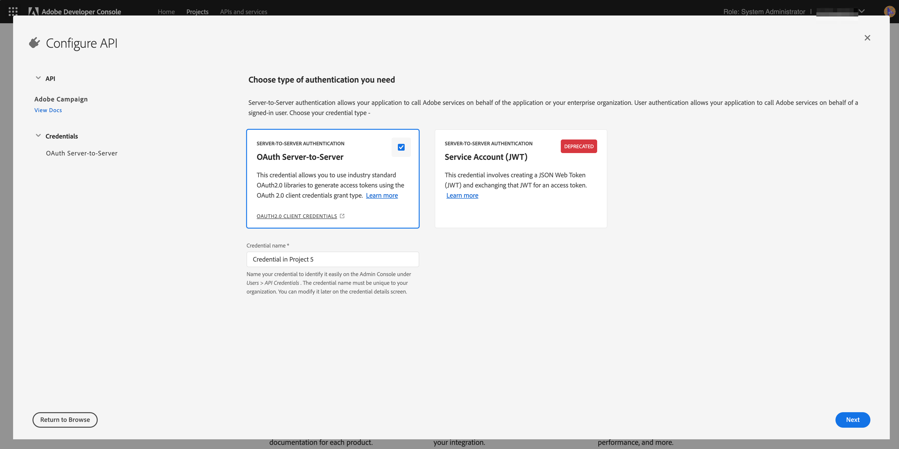

# Adobe Campaign Standard och Adobe Developer Configuration för integrering av Microsoft Dynamics 365

I den här artikeln beskrivs hur du konfigurerar Adobe Campaign Standard och Adobe I/O för att ge integreringsprogrammet åtkomst till data.

## Konfigurera Adobe Campaign Standard {#campaign-standard}

### Profiltillägg

Aktivera profiltillägg i Adobe Campaign Standard.   Detta behövs för att anpassade fält i profilresursen ska kunna synkroniseras från Microsoft Dynamics 365.   Stegen för att aktivera dem är:

1. Gå till Inställningar -> Administration -> Utveckling -> Publicering.
1. Klicka på Förbered publikation för att förbereda en publikation.
1. När färdigställandet är klart markerar du&quot;Create the Profiles &amp; Services Ext API&quot; och klickar på&quot;Publish&quot;.

## Konfigurera Adobe I/O {#adobe-io}

Med Adobe I/O kan du aktivera API-åtkomst till Adobe Campaign Standard och andra Adobe-produkter.   I den här artikeln beskrivs hur du konfigurerar Adobe I/O för att ge Adobe Campaign Standard-integreringen med Microsoft Dynamics 365 åtkomst att synkronisera data.

### Översikt

Innan du utför förintegreringsinställningarna i den här artikeln förutsätts det att du redan har etablerats och har administratörsåtkomst till Campaign Standarden i din organisation.  Om detta inte har hänt måste du kontakta Adobe kundtjänst för att slutföra kampanjetableringen.

>[!CAUTION]
>
>Steg som beskrivs nedan måste utföras av en administratör.

### Konfiguration

Du måste skapa ett nytt Adobe Developer-projekt och konfigurera det för integreringen.

#### Skapa ett nytt projekt

Följ nedanstående procedur för att uppnå detta:

1. Navigera till [Adobe Developer Console](https://console.adobe.io/home#) och välj ditt organisations-ID för Adobe i listrutan längst upp till höger på skärmen.

1. Klicka sedan på **[!UICONTROL Create new project]** under **[!UICONTROL Quick Start]**.

   

1. Under **[!UICONTROL Get started with your new project]**, klicka **[!UICONTROL Add API]**.

   

1. Välj Adobe Campaign API (du kan behöva rulla längst ned) och klicka på **[!UICONTROL Next]**.

   

1. På nästa skärm kan du ladda upp en egen offentlig nyckel eller låta Adobe Developer generera nyckelparet åt dig. Dessa instruktioner följer det senare alternativet. Om du vill låta Adobe Developer generera nyckelparet klickar du på alternativ 1; klickar du på **[!UICONTROL Generate keypair]** -knappen.

   

1. På nästa skärm uppmanas du att namnge och välja hämtningsplats för nyckelparets zip-fil.

När filen har laddats ned kan du packa upp den för att visa offentliga och privata nycklar. Adobe Developer har redan använt den offentliga nyckeln i ditt Adobe Developer-projekt. Du måste behålla din privata nyckel senare; den privata nyckeln kommer att användas under förintegreringsinställningarna för integrationsverktyget.

1. Klicka **[!UICONTROL Next]** fortsätta

   

1. På nästa skärm väljer du produktprofiler som ska associeras med projektet. Välj den produktprofil som innehåller titeln: Klient-ID för Campaign-instansen - [!UICONTROL Administrators]

   Exempel: Campaign Standard - ditt kampanjklient-ID - Administratörer

1. Klicka på **[!UICONTROL Save configured API]**.

   

1. På nästa skärm ser du detaljerna om ditt nya Adobe Developer-projekt. Klicka **[!UICONTROL Add to Project]** längst upp till vänster på skärmen och välj **API** från listrutan.

   

1. På nästa skärm måste du välja API:t för I/O-händelser och sedan klicka på **[!UICONTROL Next]**.

1. På nästa skärm klickar du **[!UICONTROL Save the configured API]**.  Du kommer tillbaka till skärmen med projektinformation.

1. Klicka nu **[!UICONTROL Add to Project]** längst upp till vänster på skärmen och välj **API** från listrutan, som du gjorde tidigare.

1. På nästa skärm måste du välja I/O Management API och klicka på **[!UICONTROL Next]**.

1. På nästa skärm klickar du **[!UICONTROL Save the configured API]**.

Inställningen av förintegrering i Campaign är nu klar.

**Relaterade ämnen**

* [Konfigurera integrering av Adobe Developer för Microsoft Dynamics 365](../../integrating/using/d365-acs-configure-adobe-io.md) är nästa steg i konfigurationen av integreringen
* [Översikt över självbetjäningsprogram för integrering](../../integrating/using/d365-acs-self-service-app-quick-start-guide.md) innehåller en fullständig lista över steg som krävs för att få integreringen att fungera.

* [Adobe Developer - Integrering av tjänstkonto](https://developer.adobe.com/developer-console/docs/guides/#!AdobeDocs/adobeio-auth/master/AuthenticationOverview/ServiceAccountIntegration.md)
* [Campaign Standard - API-åtkomstinställningar](../../api/using/setting-up-api-access.md)
* [Campaign Standard - Dynamics 365-integrering](../../integrating/using/d365-acs-configure-d365.md)
