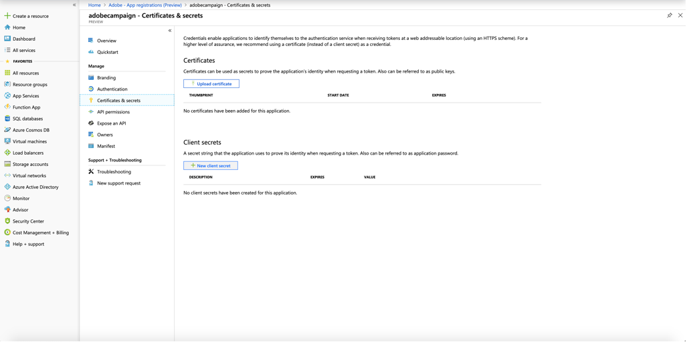
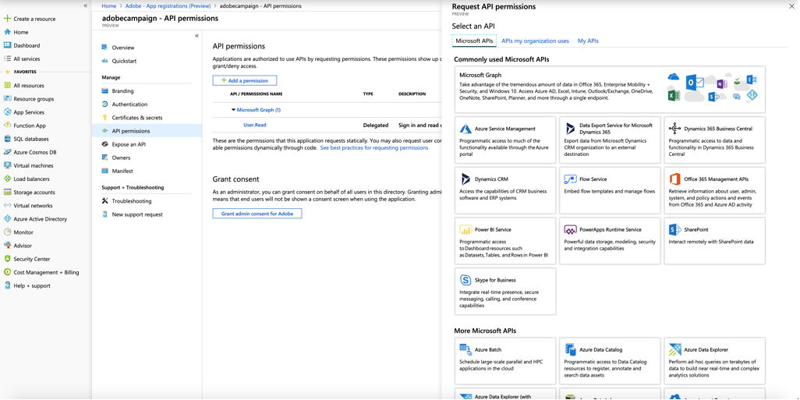

# Konfigurera Microsoft Dynamics 365 för integrering med Adobe Campaign Standard

Lär dig hur du konfigurerar integreringen av Microsoft Dynamics 365 och aktiverar dina CRM-data för kommunikation över flera kanaler med Adobe Campaign Standard.

## Översikt

Den allmänna beskrivningen av Adobe Campaign Standard-integrationen med Microsoft Dynamics 365 beskrivs i [den här sidan](../../integrating/using/d365-acs-get-started.md).

Flera program måste konfigureras för att aktivera integreringen, men den här artikeln fokuserar på steg som krävs i Dynamics 365.

## Förhandskrav

Innan du utför förintegreringsinställningarna i det här dokumentet förutsätts det att du redan har etablerat dig och har administratörsåtkomst till din organisations Microsoft Dynamics 365-instans.  Om detta inte har hänt måste du kontakta Microsofts kundsupport för att slutföra etableringen av Dynamics 365.

Om du konfigurerar integreringen för både testnings- och produktionsmiljöer måste du utföra stegen nedan för både din testnings- och produktionsversion av Dynamics 365-instanser. Nedan finns några instruktioner som varierar något beroende på om du konfigurerar en Dynamics 365-instans för fas eller produktion (t.ex. välj &quot;prod&quot; för `<stage or prod>` för produktionsinstans)

## Konfigurera program och behörigheter

Med en OAuth-åtkomsttoken kan integreringsverktyget autentisera med din Microsoft Dynamics 365-instans via webb-API:er för att publicera Campaign Standardens upplevelsehändelser i tidslinjevyn i Microsoft Dynamics 365-gränssnittet.

De viktigaste stegen beskrivs i följande video:

>[!VIDEO](https://video.tv.adobe.com/v/27637)

Följ stegen nedan för att generera OAuth-åtkomsttoken.

### Registrera ett nytt program {#register-a-new-app}

1. Under administratörsinloggningen loggar du in på portal.azure.com.

1. Klicka på **[!UICONTROL Azure Active Directory]** på den vänstra menyn; klickar du sedan på **[!UICONTROL App registrations]** på undermenyn som visas.

1. Klicka på **[!UICONTROL New registration]** överst på skärmen.

   

1. Fyll i appregistreringsskärmen:

   * Namn: adobe campaign `<stage or prod>`
   * Kontotyp som stöds: **[!UICONTROL Accounts in this organizational directory only]** (standardvärde)

Mer information om hur du skapar ett nytt program finns i [det här avsnittet](https://docs.microsoft.com/en-us/azure/active-directory/develop/quickstart-register-app).

>[!NOTE]
>
>Microsoft Azure Directory tilldelar ditt program ett unikt program-ID (klient). Du behöver det här ID:t senare när du konfigurerar Dynamics 365, samt när du konfigurerar integrationsverktyget.

### Generera klienthemlighet {#generate-a-client-secret}

1. Klicka på **[!UICONTROL Certificates and Secrets > New client secret]** på undermenyn till vänster på skärmen för programöversikt

   

1. Ange en beskrivning, ange varaktighet och klicka på **[!UICONTROL OK]**.

Din klienthemlighet har skapats. Behåll värdet tillfälligt för att slutföra förintegreringsinställningarna för integreringsverktyget.

>[!CAUTION]
>
>Behåll det här värdet som du behöver för att slutföra konfigurationen av integreringsverktyget före integreringen. Den kan inte hämtas efteråt.

### Konfigurera behörigheter

1. Klicka på **[!UICONTROL API permissions]** på undermenyn till vänster på den här skärmen eller programöversiktsskärmen.  När du har klickat på **[!UICONTROL Add a permission]** måste du välja **[!UICONTROL Dynamics CRM]** på menyn.

   

1. Markera sedan rutan för **[!UICONTROL user_impersonation]** och klicka på knappen **[!UICONTROL Add permissions]**.

   

Mer information om behörighetsinställningar finns i [det här avsnittet](https://docs.microsoft.com/en-us/azure/active-directory/develop/quickstart-configure-app-access-web-apis#add-permissions-to-access-web-apis).

### Skapa appanvändaren

Den nya användaren är en allmän användare. Det kommer att användas av programmet: Ändringar i Microsoft Dynamics 365 med API:t görs av den här användaren. Så här skapar du den:

1. Navigera till din Dynamics 365-instans och logga in som administratör.

1. Klicka på kugghjulsikonen i det övre högra hörnet och klicka på **[!UICONTROL Advanced Settings]**. Klicka på listrutan bredvid **[!UICONTROL Settings]** i den översta banderollen och klicka på **[!UICONTROL Security > Users]**.

1. Klicka på listrutan för att gå till **[!UICONTROL Application Users]**. Klicka på **[!UICONTROL New]**.

1. Se till att listrutan visas bredvid användarikonen **[!UICONTROL USER:APPLICATION USER]**.

   Fyll i skärmen för den nya användaren.  Parameterförslag:

   * **[!UICONTROL User Name]** (e-post): adobe_api_`<stage-or-prod>`@`<your-d365-hostname>`&quot; (t.ex. adobe_api_stage@some-company.crm.dynamics.com)
   * **[!UICONTROL Application ID]**: ID för det program du registrerade i Azure AD (detta är obligatoriskt)
   * Du kan lämna tomt **[!UICONTROL Application ID URI]** och **[!UICONTROL Azure AD Object ID]**
   * **[!UICONTROL Full Name]**: Adobe API  `<stage or prod>`
   * **[!UICONTROL Email]**: samma som  **[!UICONTROL User Name]** (eller administratörens e-postadress om du vill)

   Mer information om hur du skapar appanvändare finns i [det här avsnittet](https://docs.microsoft.com/en-gb/power-platform/admin/create-users-assign-online-security-roles#create-an-application-user).

1. Klicka på användarikonen och ladda upp en Adobe Campaign-ikon; det här är ikonen som visas i tidslinjevyn när nya Adobe-händelser visas i Dynamics 365.

1. Öppna listan med användarroller genom att klicka på **[!UICONTROL MANAGE ROLES]** i det övre menyfliksområdet.

1. Bläddra nedåt och välj **[!UICONTROL System administrator]**-åtkomst för den här användaren.

1. Klicka på **[!UICONTROL OK]**.

### Hämta klient-ID {#get-the-tenant-id}

Följ instruktionerna [på den här sidan](https://docs.microsoft.com/en-us/onedrive/find-your-office-365-tenant-id) för att hitta ditt klient-ID.  Du behöver detta ID under förintegreringsinställningarna i integreringsverktyget.

## Installera Campaign Standard för Microsoft Dynamics 365 {#install-appsource-app}

Följ stegen nedan för att integrera appen Dynamics 365 i din Campaign Standard-miljö:

1. Navigera till följande länk: [https://appsource.microsoft.com/en-us/marketplace/apps](https://appsource.microsoft.com/en-us/marketplace/apps) och sök efter _Adobe Campaign för Dynamics 365_ i sökfältet.
Du kan också navigera till den här [länken](https://appsource.microsoft.com/en-us/product/dynamics-365/adobecampaign.re4snj-a4n7-5t6y-a14br-d5d1b?flightCodes=adobesignhide&amp;tab=Overview).
1. Följ instruktionerna för att installera appen för din Dynamics 365-instans.
1. Navigera till din Dynamics 365-instans och logga in som administratör när du har installerat den.
1. Klicka på kugghjulsikonen i det övre högra hörnet och klicka på **[!UICONTROL Advanced Settings]**. Klicka på listrutan bredvid **[!UICONTROL Settings]** i den översta banderollen och klicka på **[!UICONTROL Processes]** under **[!UICONTROL Process Center]**.
1. Sök efter uppgiften **[!UICONTROL Adobe Campaign Email Bounce]** och klicka på den.
1. På fliken **[!UICONTROL Administration]** ändrar du ägaren till Adobe till API-programanvändaren som skapades tidigare genom att klicka på **[!UICONTROL Actions]** i det övre menyfliksområdet och sedan väljer du **[!UICONTROL Assign to another User]**-alternativet och väljer **[!UICONTROL Adobe API application user]** i listrutan som du vill tilldela.
1. Återaktivera processen.
1. Gör samma sak med uppgiften **[!UICONTROL Adobe Campaign Email Click]**.

>[!NOTE]
>
>Om du vill inaktivera dessa processer kan du göra det på den här **[!UICONTROL Processes]**-skärmen.

**Relaterade ämnen**

* [Konfigurera Adobe IO för Microsoft Dynamics 365-](../../integrating/using/d365-acs-configure-adobe-io.md) integration är nästa steg i konfigurationen av integreringen
* [Kom igång med självbetjäningsappen ](../../integrating/using/d365-acs-self-service-app-quick-start-guide.md) innehåller en komplett lista med steg som hjälper dig att komma igång med integreringen.
