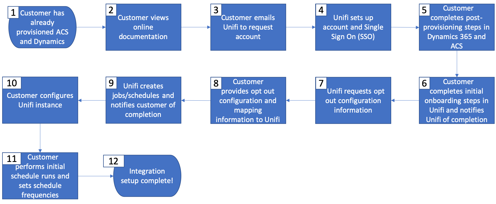

# Kom igång med Microsoft Dynamics 365-integration

Aktivera dina CRM-data för kommunikation över flera kanaler: Lär dig hur du skickar kontakter från Microsoft Dynamics 365 till Adobe Campaign och delar kampanjresultatdata (skickar, öppnar, klickar och studsar) tillbaka från Adobe Campaign till Microsoft Dynamics 365.

För den här integreringen krävs följande programversioner:

* Endast Microsoft Dynamics 365 for Sales Online, senaste versionen

* Adobe Campaign Standard, senaste versionen

>[!CAUTION]
>
>Den här funktionen är inte tillgänglig som en del av produkten. För implementering krävs att Adobe Consulting används. Kontakta din Adobe-representant för mer information.

## Principer

Adobe Campaign Standard-integreringen med Microsoft Dynamics 365 möjliggör synkronisering av alla tillgängliga kontaktdata i CRM-systemet, vilket gör alla relevanta kontaktdata tillgängliga för kampanjaktiviteter.

Omvänt gäller att när profiler i Adobe Campaign Standard interagerar med meddelanden, dessa data (t.ex.: skickar, öppnar, klickar och studsar) automatiskt monteras i Microsoft Dynamics 365 för att hålla kontaktuppgifter komplett med marknadsföringsaktiviteter.

Integreringen stöder även att [anpassade entiteter](../../integrating/using/d365-acs-self-service-app-settings.md) i Dynamics 365 kan synkroniseras med motsvarande **anpassade resurser** i Campaign.

Integrationen är utformad för fyra huvudsakliga användningsområden:

1. Synkronisera kontakter från Dynamics 365 till Campaign så att de kan användas i marknadsföringskampanjer
1. Synkronisera anpassade enheter från Dynamics 365 till Campaign så att de kan användas för segmentering och personalisering
1. Skicka e-postmarknadsföringshändelser (skickar, öppnar, klickar, studsar) från Campaign till Dynamics 365 för att visa dem i säljdatabasen i Dynamics 365-gränssnittet
1. Synkroniserar avanmälningsstatus (t.ex. inte e-posta) mellan Dynamics 365 och Campaign för att behålla kundens sekretessinställningar.

De viktigaste fördelarna är:

* Enhetliga meddelanden mellan försäljning och marknadsföring: Adobe Campaign Standard integrering med Dynamics 365 ger både systemåtkomst till kundinsikter och e-postmarknadsföringshistorik så att alla meddelanden till kunden kan dela samma enhetliga budskap.

* Holistisk bild av alla potentiella kunder och kunddata: genom att integrera Adobe Campaign Standard med Dynamics 365 är det möjligt att dela och komma åt marknadshistorik via e-post för varje kontakt inifrån CRM-systemet.

* Aktivera Dynamics 365-data i valfri kanal: med kontaktdata synkroniserade med Adobe Campaign kan kommunikationen skickas via valfri online- eller offlinekanal med Campaign, inklusive mobil-push, app-kommunikation, e-post eller direktreklam. Kampanjen&quot;har ni täckt&quot; oavsett vilken kanal varje kontakt föredrar.

>[!CAUTION]
>
>Den här integreringen ser Dynamics 365 som en källa till sanning för kontakt- och anpassad entitetssynkronisering.  Ändringar av synkroniserade attribut ska göras i Dynamics 365, inte i Adobe Campaign Standard.  Om ändringar görs i Campaign kan de skrivas över under synkroniseringen.

## Viktiga steg för att implementera Microsoft Dynamics 365-integreringen{#request-and-implement-this-integration}

För att kunna genomföra integreringen måste du följa stegen nedan.

Följ informationen i flödesschemat och flödesschemat nedan för att begära och konfigurera integreringen.

Information om flödesschema (mappas till steg ovan):

* **Steg 1** - Du förutsätts redan ha, eller håller på att köpa, en licens för Microsoft Dynamics 365 för Försäljning och för Adobe Campaign Standard.
* **Steg 2** - Standardintegrationserbjudandet är kostnadsfritt för alla kunder. ytterligare kostnader kan tillkomma beroende på dina behov. Läs mer om [Bästa praxis och begränsningar](../../integrating/using/d365-acs-notices-and-recommendations.md). En ny försäljningsorder måste signeras för att kunna utnyttja integreringen om den inte ingick i den ursprungliga SO:n.
* **Steg 3**  - Slutför förintegreringsstegen för Dynamics 365 och Campaign. Se [Konfigurera den här integreringen](#configure-this-integration).
* **Steg 4** - Adobe kommer att ge dig tillgång till användargränssnittet för integreringsprogrammet.
* **Steg 5** - Du kan konfigurera datamappningar, ersättningar, filter m.m. och testa integreringen inifrån integreringsprogrammets gränssnitt.

   >[!IMPORTANT]
   >
   > Om du vill att avanmälningskonfigurationen för dubbelriktad marknadsföring eller Campaign ska ske till Dynamics 365 måste du göra en begäran till din tekniska Adobe om att avanmälningsarbetsflödena ska konfigureras på din Campaign-instans. [Läs mer](../../integrating/using/d365-acs-notices-and-recommendations.md#opt-out).

### Konfigurera den här integreringen {#configure-this-integration}

Tre system måste etableras och konfigureras för den här integreringen:

* **Adobe Campaign Standard**: du måste konfigurera API-åtkomst och konfigurera en ny integrering för integreringsverktyget. För att uppnå detta, se [den här artikeln](../../integrating/using/d365-acs-configure-adobe-io.md).
* **Microsoft Dynamics 365**: du måste skapa en ny appregistrering och göra det möjligt för en programanvändare att använda integreringen.  Information om hur du konfigurerar Microsoft Dynamics 365 för den här integreringen finns i [den här artikeln](../../integrating/using/d365-acs-configure-d365.md).
* **Adobe Campaign Standard-integrering med självbetjäningsappen** för Microsoft Dynamics 365: måste du följa stegen i  [den här artikeln](../../integrating/using/d365-acs-self-service-app-control-access.md).

>[!IMPORTANT]
>
>För varje system måste dessa steg utföras av en **administratör**.
>
>Steg i den här dokumentationen hjälper dig att skapa integreringar/registreringar som inbegriper tilldelning av behörigheter och/eller administratörsåtkomst.  Det är ditt ansvar att se till att dessa steg följer företagets regler innan de utförs och att de utförs med omsorg.

### Begär support

Supportärenden kan loggas med Adobe kundtjänst.

Om du har problem med integreringsdataflöden bör du ta med följande information:

* **Processägare**: Ingenjörsarkitekter
* **ES Process-ID**: Tillhandahålls under introduktionsprocessen
* **Processtitel**: Microsoft Dynamics 365/Adobe Campaign Standard-integrering
* **Ärendebeskrivning**: Beskrivning av problemet

Stödet för integrering är för närvarande 24x5 (tillgängligt måndag till fredag, exklusive semester och pauser i Adobe).
