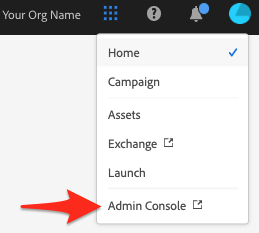

# Få tillgång till Adobe Campaign Standard-integreringen med självbetjäningsappen för Microsoft Dynamics 365

Den här konfigurationen kräver att du arbetar med en Experience Cloud-administratör (EC) för din organisation. Detta är de första steg som krävs för att du ska få tillgång till gränssnittet för självbetjäningsintegreringsprogrammet. När du har tillgång till verktyget skapar du anslutningar till dina data och konfigurerar dataflödet mellan Adobe Campaign och Microsoft Dynamics 365.

>[!NOTE]
>
>Du måste kontakta din Adobe-representant och ange Adobe Campaign Standard organisation och instansnamn. En biljett loggas för att begära att integreringsappen aktiveras för din organisation.

## Lägg till en produktprofil

I det här avsnittet får du lära dig att ge åtkomst till Adobe Campaign Standard-integreringen med självbetjäningsappen för Microsoft Dynamics 365. Användare som har tillgång till din organisation i Adobe Experience Cloud har inte tillgång till självbetjäningsappen för integrering, såvida du inte följer stegen nedan för att ge dem åtkomst.

>[!IMPORTANT]
>
> Dessa steg kräver **administratörsrollen** i Experience Cloud för din organisation.

1. Gå till https://experience.adobe.com/ och logga in på Adobe Experience Cloud.
1. Gå till **Admin Console**.

   

1. Klicka på **[!UICONTROL Products]** för att komma åt dina Experience Cloud-lösningar.

   

   >[!IMPORTANT]
   >
   >De återstående stegen i det här avsnittet kommer att utföras för var och en av dina Campaign-instanser (dev, text, production).

1. Klicka på den första instansen som ska konfigureras.

   

   Instanssidan ska se ut ungefär så här:

   

1. Klicka på knappen **[!UICONTROL New Profile]** och lägg till en ny post med namnet: **Campaign Standard - your-prod-instance-name - D365/ACS Integration**

   * Om du ser den här posten i listan behöver du inte fortsätta. Klicka på **Adobe Campaign Standard** i den vänstra menyn och kontrollera de andra Campaign-instanserna.

   * Se till att ersätta&quot;your-prod-instance-name&quot; med det faktiska namnet för din instans.

1. Du kan lämna listrutan **[!UICONTROL Permission Group]** med standardvärdet.

1. Om tävlingsbidragen liknar följande klickar du på **[!UICONTROL Done]**.

   

   Den nya produktprofilen har lagts till.

   

## Bevilja åtkomst för användare {#add-users-to-profile}

Välj Campaign-instansen på **[!UICONTROL Products]**-sidan och följ stegen nedan:

1. Klicka på den nya profilen som du har skapat tidigare:  **Campaign Standard - your-prod-instance-name - D365/ACS Integration**

   

1. Klicka på fliken **[!UICONTROL Developers]**.

   

1. Klicka på knappen **[!UICONTROL Add Developer]**

1. Ange namnet eller e-postadressen för användaren som du vill lägga till.  Välj resultatet som matchar användaren.

   Om det här är första gången som användaren läggs till i organisationen anger du information.

1. Bekräfta genom att klicka på **[!UICONTROL Save]**.
