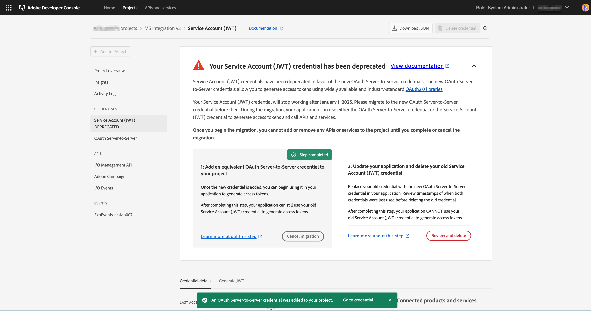

# Migrera autentiseringsuppgifter från JWT till OAuth:s server till server

JWT-autentiseringsuppgifterna (Service Account) har ersatts med de nya autentiseringsuppgifterna för OAuth Server-till-Server. De nya autentiseringsuppgifterna gör det enklare för dig att underhålla Adobe-program. Det eliminerar också behovet av att rotera certifikat regelbundet och fungerar som det ska med vanliga OAuth2-bibliotek.

JWT-autentiseringsuppgifterna (Service Account) har markerats som inaktuella, men de kommer att fortsätta att fungera fram till 1 januari 2025. Därför måste du migrera din integrering för att använda de nya autentiseringsuppgifterna för OAuth Server-till-Server före 1 januari 2025. Mer information finns i [tidslinjer för borttagning](https://developer.adobe.com/developer-console/docs/guides/authentication/ServerToServerAuthentication/migration/#deperecation-timelines)

## Steg för att migrera autentiseringsuppgifter från JWT till OAuth Server-till-Server

Migreringen till autentiseringsuppgifter för OAuth Server-till-Server är en enkel process som möjliggör migrering utan driftstopp för ditt program. Du kan följa stegen nedan för att migrera inloggningsuppgifterna.

1. Logga in på [Adobe Developer Console](https://developer.adobe.com/console)
2. På filtreringsmenyn till vänster väljer du alternativet Har JWT-autentiseringsuppgifter (Service Account). På det här sättet visas alla projekt som har en JWT-autentiseringsuppgift (Service Account). Klicka på det projekt som du vill migrera i listan över projekt.

   

3. Öppna fliken JWT-autentiseringsuppgifter (Service Account) från den vänstra navigeringen och visa migreringskortet. Klicka på knappen **Lägg till nya autentiseringsuppgifter** på migreringskortet för att lägga till motsvarande autentiseringsuppgifter för OAuth Server-till-Server. Om du lägger till en OAuth Server-till-Server-autentiseringsuppgift i ditt projekt startas migreringen.
   
4. Den nya autentiseringsuppgiften **OAuth Server-to-Server** läggs till i navigeringen till vänster.
   * Klicka på Avbryt migrering om du vill avbryta migreringen.
   * Klicka inte på knappen Granska och ta bort förrän du verifierar om den nya autentiseringsuppgiften OAuth Server-to-Server fungerar.

     

5. Uppdatera inloggningsuppgifterna i Microsoft Dynamics 365 till Adobe Campaign Standard-appen
   * Logga in på integrationsappen och navigera till sidan Inställningar.
   * Välj OAuth som autentiseringstyp.
   * Eftersom de nya autentiseringsuppgifterna för OAuth Server-till-Server använder samma autentiseringsuppgifter som de gamla JWT-autentiseringsuppgifterna (Service Account) fylls de flesta fälten redan i.
   * Ange klient-ID och klienthemlighet. Dessa finns i Adobe Developer Console projekt.
   * Klicka på Spara för att spara inställningarna.

     

6. Kontrollera om de nya autentiseringsuppgifterna fungerar
   * Logga in på integrationsappen och navigera till sidan Arbetsflöden.
   * Stoppa aktiva arbetsflöden. Vänta tills arbetsflödena har stoppats.
   * Starta arbetsflödena. Vänta tills arbetsflödena körs.
   * Övervaka arbetsflödena under några minuter för att säkerställa att arbetsflödena fungerar som de ska. Du kan också kontrollera data i Adobe Campaign Standard och Microsoft Dynamics 365 för att se till att data synkroniseras korrekt.

7. Ta bort JWT-autentiseringsuppgifterna för att slutföra migreringen
   * Logga in på [Adobe Developer Console](https://developer.adobe.com/console)
   * Klicka på projekten och välj det projekt som du migrerade.
   * Klicka på fliken JWT-autentiseringsuppgifter (Service Account) i navigeringsfönstret till vänster.
   * Klicka på knappen Granska och ta bort.

     
   * Granska tidsstämpeln för den senaste åtkomstmenyn eller den senast använda menyn för att verifiera om integreringsappen genererar åtkomsttoken med den nya OAuth-autentiseringen eller fortfarande använder den gamla JWT-autentiseringen.

     
   * När det har bekräftats att integreringsappen använder den nya OAuth-autentiseringsuppgiften och inte längre använder JWT-autentiseringsuppgifter fortsätter du med att ta bort den gamla autentiseringsuppgiften genom att klicka på knappen **Bekräfta och fortsätta** och därmed slutföra migreringen.

     
