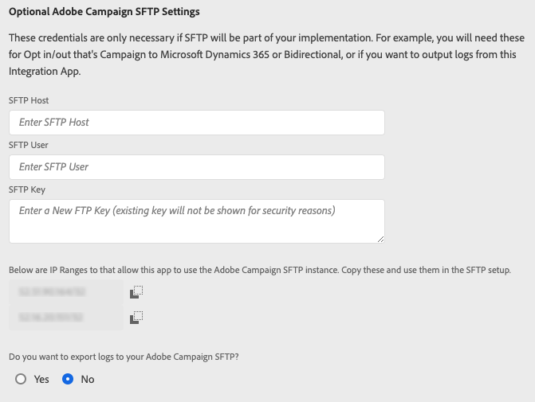

# Koppla samman system med integrationsappen

## Lägg till inloggningsuppgifter i integreringsappen

På skärmen **[!UICONTROL Settings]** kan du ange Microsoft Dynamics 365- och Adobe API-autentiseringsuppgifter. Du kan också konfigurera inställningar för Adobe Campaign SFTP-instansen.

### Microsoft Dynamics 365-autentiseringsuppgifter

Microsoft Dynamics 365-inloggningsuppgifterna ger integreringsprogrammet behörighet att hämta data från Microsoft Dynamics 365.  Du måste först följa stegen på skärmen [Konfigurera Microsoft Dynamics 365 för Campaign-integrering](../../integrating/using/d365-acs-configure-d365.md) för att kunna generera de värden som ska klistras in på den här skärmen. Indata som beskrivs nedan kommer att hänvisa till den här skärmen.

* **[!UICONTROL Client ID]**: Lär dig referera till ditt klient-ID i [det här avsnittet](../../integrating/using/d365-acs-configure-d365.md#register-a-new-app)

* **[!UICONTROL Client Secret]**: Lär dig hur du genererar din klienthemlighet i [det här avsnittet](../../integrating/using/d365-acs-configure-d365.md#generate-a-client-secret)

* **[!UICONTROL Tenant]**: Lär dig hur du hittar ditt klient-ID i [det här avsnittet](../../integrating/using/d365-acs-configure-d365.md#get-the-tenant-id)

* **[!UICONTROL URL]**: URL:en har formatet `https://&lt;servername&gt;.api.crm.dynamics.com/`

### Adobe API-autentiseringsuppgifter

Adobe Campaign-autentiseringsuppgifterna genereras med [Adobe I/O](https://www.adobe.io/). Du måste besöka skärmen [Konfigurera Adobe I/O](../../integrating/using/d365-acs-configure-adobe-io.md) och följa instruktionerna där innan du kan fylla i indata i det här avsnittet.

* Välj autentiseringstypen som Oauth eftersom JWT-baserad autentisering är inaktuell.
* I följande bild förklaras i detalj mappningen mellan Adobe I/O och inställningarna på skärmen.

* *URL*: Det här värdet passar mönstret https\://mc.adobe.io/&lt;campaign-instance-name>. Integreringsprogrammets huvud innehåller både&quot;Org&quot; och&quot;Instance&quot;. Delen&quot;campaign-instance-name&quot; i URL:en är bara det namn som finns i det här instansvärdet.

## Adobe Campaign SFTP-inställningar {#ac-smtp-settings}

Dessa inställningar är valfria. Du måste definiera dem om du tänker använda din Adobe Campaign SFTP-instans för att skriva ut loggar från anslutningen. Detta är praktiskt om du får problem när integreringen körs och du behöver felsöka varför utdata inte uppfyller dina förväntningar.

Ett annat skäl till att konfigurera SFTP-servern är om du planerar att köra arbetsflödet för anmälan/utanmälan och det finns ett dataflöde från Adobe Campaign till Microsoft Dynamics 365, antingen **[!UICONTROL Unidirectional (Campaign to Microsoft Dynamics 365)]** eller **[!UICONTROL Bidirectional]**.

>[!IMPORTANT]
>
>Du ansvarar för den information du får tillgång till och hämtar från SFTP-mapparna. Om informationen innehåller personuppgifter är du ansvarig för att följa gällande sekretesslagstiftning och -bestämmelser. [Läs mer](../../integrating/using/d365-acs-notices-and-recommendations.md#acs-msdyn-manage-privacy).
>

Om du vill definiera inställningar för Campaign SFTP för Microsoft Dynamics 365-integreringen går du till följande avsnitt:

Du måste ange:

* **SFTP-värd**: det här fältet innehåller &lt;campaign-instance-name>.campaign.adobe.com. Integreringsprogrammets huvud innehåller både **organisationen** och **instansen**. Delen&quot;campaign-instance-name&quot; i URL:en är bara det namn som finns i det här instansvärdet.

* **SFTP-användare**: Om du har SFTP-användare lägger du till den här. Se även [det här avsnittet](#ac-control-panel-settings). Som en del av processen visas användarnamnet.

* **SFTP-nyckel**: Om du har en SSH-nyckel lägger du till den här. Se även [det här avsnittet](#ac-control-panel-settings).

* **IP-intervallen** måste inkluderas i din Adobe Campaign SFTP-konfiguration. Dessa måste tillåtslista för att integreringen ska kunna använda SFTP-slutpunkten.

* **Vill du exportera loggar till din Adobe Campaign SFTP?Med** kan du avgöra om integreringen kommer att skicka loggningsinformation till SFTP-slutpunkten. Detta kan användas som hjälp vid felsökning om Adobe Campaign eller Microsoft Dynamics 365 inte visar den förväntade informationen.

## SFTP-konfiguration i Adobe Campaign {#ac-control-panel-settings}

Upptäck SFTP-hantering med [Campaign Control Panel](https://experienceleague.adobe.com/docs/control-panel/using/control-panel-home.html?lang=sv) i följande avsnitt:

* [Om SFTP-hantering](https://experienceleague.adobe.com/docs/control-panel/using/sftp-management/about-sftp-management.html?lang=sv#sftp-management)

* [Hantera SFTP-lagring](https://experienceleague.adobe.com/docs/control-panel/using/sftp-management/key-management.html#installing-ssh-key)

* [Lägg till IP-intervall](https://experienceleague.adobe.com/docs/control-panel/using/sftp-management/ip-range-allow-listing.html#sftp-management)

* [Hantera nycklar](https://experienceleague.adobe.com/docs/control-panel/using/sftp-management/key-management.html#sftp-management)

* [Logga in på SFTP-servern](https://experienceleague.adobe.com/docs/control-panel/using/sftp-management/logging-into-sftp-server.html#sftp-management)

När konfigurationen är klar loggar du in på SFTP-servern med den privata nyckeln och skapar katalogen &quot;d365_loads/exporting&quot;.

[På den här sidan](https://experienceleague.adobe.com/docs/campaign-standard-learn/control-panel/sftp-management/monitoring-server-capacity.html?lang=sv#sftp-management) finns information om Adobe Campaign Standard SFTP-servern.
