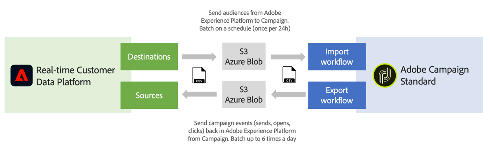

# Kom igång med källor och destinationer {#rtcdp}

## Om Källor och mål

Med Adobe Experience Platform kan du dela data mellan Campaign Standard och Adobe Real-time Customer Data Platform (RTCDP). På så sätt kan ni inrikta er på Adobe Experience Platform målgrupper i era Campaign-arbetsflöden och sedan skicka tillbaka data till Adobe Real-time Customer Data Platform som hör till dessa målgrupper, som utskick, öppningar och klick.

* Med **Destinationer**, som engagerar målgrupper från Adobe Experience Platform i Campaign Standarden. På så sätt kan ni aktivera kända och okända data för era marknadsföringskampanjer.
* Med **Källor**, exporterar Campaign Standarder (t.ex. skickar, öppnar och klickar) till Adobe Experience Platform. På så sätt kan ni centralisera data som ni samlar in från olika källor till en enda plats och använda de insikter ni får av den för att göra mer.

>[!IMPORTANT]
>
>Tänk på lagringsgränserna för SFTP, lagringsgränserna för databaser och de aktiva profilgränserna enligt ditt Adobe Campaign-avtal när du utför den här integreringen.

En mer detaljerad översikt över Adobe Real-time Customer Data Platform, Destinationer och Källor finns på följande sidor:

* [Adobe Real-time Customer Data Platform](https://experienceleague.adobe.com/docs/experience-platform/rtcdp/overview.html?lang=sv)
* [Dokumentation om mål](https://experienceleague.adobe.com/docs/experience-platform/destinations/home.htmll?lang=sv)
* [Dokumentation om källor](https://experienceleague.adobe.com/docs/experience-platform/sources/home.htmll?lang=sv)

## Koppla samman Campaign Standard med Adobe Experience Platform

För att kunna dela data mellan Adobe Experience Platform och Campaign Standard måste du först koppla Adobe Campaign som en **Mål** och ansluta din AWS S3- eller Azure-blobblagringsplats som **Källa** i Adobe Experience Platform.

När kopplingarna har konfigurerats kan du konfigurera en dataimport eller exportera till Campaign Standard med hjälp av arbetsflöden.

Mer information om hur du konfigurerar dessa import- och exportprocesser finns i följande avsnitt:

* [Mata in målgrupper från Adobe Experience Platform i Campaign](../../integrating/using/ingest-aep-data.md)
* [Exportera data från Campaign till Adobe Experience Platform](../../integrating/using/export-campaign-data.md)
