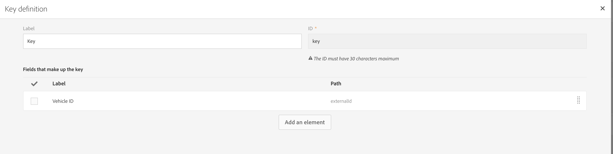
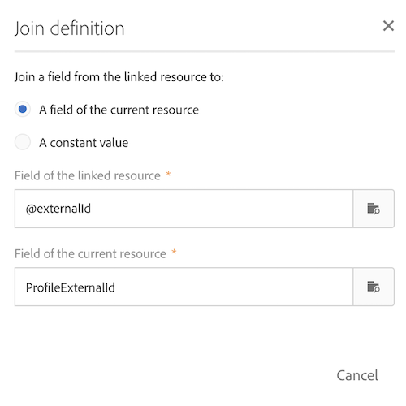

# Mappa anpassade resurser för Campaign och anpassade Dynamics 365-entiteter

Lär dig hur du mappar anpassade resurser och anpassade enheter i samband med integreringen mellan Adobe Campaign Standard och Microsoft Dynamics 365.

## Förutsättningar

Den nya versionen av [Microsoft Dynamics 365-Adobe Campaign Standard-integreringen](../../integrating/using/working-with-campaign-standard-and-microsoft-dynamics-365.md) har stöd för anpassade entiteter.  Detta gör att anpassade entiteter i Dynamics 365 kan replikeras till motsvarande anpassade resurser i Campaign.

När de har replikerats kan de nya uppgifterna i de anpassade resurserna användas för flera syften, inklusive segmentering och personalisering.

>[!CAUTION]
>
>Om en anpassad kampanjresurspost innehåller personlig information, som gäller för en kunds användning av Campaign, ska posten länkas till en motsvarande kampanjprofilpost (antingen direkt eller via en annan anpassad resurs) så att en sekretessrelaterad borttagning i profilposten också kan ta bort den länkade anpassade resursposten som innehåller personlig information. Alternativen för att länka och ta bort mellan enheterna måste konfigureras så att den här överlappande borttagningen av de länkade posterna aktiveras. Personlig information ska inte anges i en anpassad resurs som inte är länkad till profilen.

En mer utförlig översikt över anpassade resurser för Campaign finns [på den här länken](../../developing/using/key-steps-to-add-a-resource.md).

Om du vill konfigurera integreringen för anpassade entiteter kan du kontakta [adobe-support@unifisoftware.com](mailto:adobe-support@unifisoftware.com) för att få detta gjort.  Unifi kräver namnen på de anpassade entitetstabellerna i båda systemen samt de attribut som önskas.  Unifi skapar sedan motsvarande jobb och scheman.

Ett exempel på hur stöd för anpassade entiteter används finns i avsnittet Användningsfall.

>[!CAUTION]
>
>* Anpassade resurser som publicerats före Campaign Standard 19.4-versionen **måste publiceras** på nytt för att kunna användas med integreringen.
>* Att skapa och ändra anpassade resurser för Campaign Standard är känsliga åtgärder som bara måste utföras av expertanvändare.

## Använd skiftläge

### Startläge

Kunden har ett anpassat enhetsfordon fördefinierat i Dynamics 365 och ett motsvarande anpassat resursfordon fördefinierat i Campaign Standard.  Kunden har tillhandahållit information om anpassad entitetsmappning till Unifi, och Unifi har ställt in jobben och tidsplanerna för den anpassade fordonsresursen i Unifi.

|   | Microsoft Dynamics 365 | Adobe Campaign Standard | Anteckningar |
|---|---|---|---|
| Översta nivån | Kontakt | Profil | Standardenheter, färdiga enheter |
| Länkad entitet | Fordon - ny anpassad enhet | Fordon - ny anpassad resurs | Nya anpassade entiteter |
| Länktyp | Föräldralänk till kontakt med N:1 | Liknar Dynamics 365 - se Campaign-avsnittet nedan för mer information |   |

### Konfiguration i Dynamics 365

Kundens anpassade enheter i Dynamics 365 kan visas på kontrollpanelen Försäljning genom att klicka på listrutan bredvid Dynamics 365.  Kundens anpassade enheter grupperas under **[!UICONTROL Extensions]**.

Fordonsuppgifter kan visas genom att klicka på den **[!UICONTROL vehicle]** anpassade enheten.  Se listan över fordon nedan.

Förhållandet mellan **[!UICONTROL vehicle]** enheten och **[!UICONTROL Contact]** enheten framgår nedan. **[!UICONTROL Parental]** har valts för **[!UICONTROL Type of Behavior]**.

### Konfiguration i Campaign Standard

I Campaign kan kundens anpassade resurser visas genom att klicka **[!UICONTROL Adobe Campaign]** i det övre vänstra hörnet och sedan välja **[!UICONTROL Client data]**.

### Mappa anpassade resurser och anpassade entiteter

Den **[!UICONTROL vehicle]** anpassade resursen ska tidigare ha fördefinierats av kunden och ska visas i klientdata. Vi går igenom stegen för att skapa den här **[!UICONTROL vehicle]** anpassade resursen nedan.

Klicka på **[!UICONTROL Adobe Campaign]** i det övre vänstra hörnet och klicka sedan på **[!UICONTROL Administration > Development > Custom Resources]**.

1. Klicka på **[!UICONTROL Custom Resources]**.
1. Klicka på **[!UICONTROL Create]** knappen.  Då öppnas ett popup-fönster.
1. Markera **[!UICONTROL Create a new resource]** och ange **[!UICONTROL Vehicle]** som etikett och ID.
1. Klicka på **[!UICONTROL Create]**.

Kampanjen visar sedan datastrukturer och länksida.  Du ser att flera fält har lagts till.

* Fordonets ID är den unika identitetsbeteckningen för **[!UICONTROL Vehicle]** enheten. dess ID måste vara exakt **[!UICONTROL externalId]** enligt nedan för att integreringen ska fungera.
* Associerad profil är ID för profilen som fordonsposten är kopplad till. när den är länkad länkas den till **[!UICONTROL externalId]** fältet i profiltabellen.
* VIN och fordonets namn är fält för att samla in information om fordonet.

>[!CAUTION]
>
>Varje anpassad resurs måste ha ett unikt fält med ID:t externalId (exakt).  Det här fältet mappas till ID-fältet för den anpassade resursen i Dynamics 365 (se nedan).

### Definiera identifieringsnycklarna

Nästa steg är att definiera identifieringsnycklarna.  Skapa först identifieringsnycklarna enligt nedan.

Markera **[!UICONTROL externalId]** fältet på skärmen Nyckeldefinition.

>[!CAUTION]
>
>Varje anpassad resurs måste ha en identifieringsnyckel med sökvägen &quot;externalId&quot; (exakt).

### Definiera filtret

Nästa steg är att ange filterdefinitionen.

Under **[!UICONTROL Filter Definition]**, klicka **[!UICONTROL Add an element]**.\
Ge etiketten och ID namnet **[!UICONTROL ExternalId]**.
Klicka på **[!UICONTROL Add]**.

Klicka nu på redigera för det nya filterelementet och konfigurera filtret enligt bilden nedan.  Om du skriver **[!UICONTROL externalId]** i **[!UICONTROL Parameters]** fältet och klickar på plustecknet **[!UICONTROL externalId_parameter]** visas det.  Välj det här som parameter.

### Definiera länken

Därefter anger vi länkningen för den anpassade resursen.  I det här fallet valde vi att länka från den **[!UICONTROL Vehicles]** anpassade entiteten (källan) till profilentiteten (målet) med hjälp av en **[!UICONTROL 1 cardinality simple link]**.

1. Välj borttagningsalternativet på **[!UICONTROL Link definitions]** skärmen: **[!UICONTROL Deleting the target record implies deleting records referenced by the link]**. Vi väljer det här alternativet så att alla poster som är länkade till en profil också tas bort när en profil tas bort. **[!UICONTROL Vehicle]**
1. I **[!UICONTROL Join Definitions]** väljer du **[!UICONTROL Define specific join conditions]**.
1. Klicka sedan på **[!UICONTROL Add an element]**.

För kopplingsdefinitionen anger vi värdena nedan.

Observera att **[!UICONTROL @externalId]** posten är fältet externalId i profiltabellen och att posten är ID för motsvarande fält i den anpassade resursen för fordon **[!UICONTROL ProfileExternalId]** .  När en profilposts externalId-värde anges i fältet **[!UICONTROL ProfileExternalId]** för en fordonspost kopplas de två posterna ihop.

Bekräfta ändringarna och spara den anpassade enheten.

### Publicera och sök efter uppdateringar

Det sista steget är att publicera den anpassade resursen.

1. Klicka på **[!UICONTROL Adobe Campaign]** i det övre vänstra hörnet och klicka på **[!UICONTROL Administration > Development > Publishing]**.
1. Behåll standardalternativet: **[!UICONTROL Determine modifications since the last publication]**.
1. Klicka **[!UICONTROL Prepare Publication]** och vänta tills den är klar.

Klicka sedan **[!UICONTROL Publish]** och vänta tills det är klart.

### Unifi ingress-schema

Förutsatt att kunden redan har fyllt i den anpassade enheten för fordon i Dynamics 365 och Unifi har ställt in sina anpassade enhetsjobb och scheman för fordon med, bör kunden kunna starta pressschemat för fordonsenheten.

När ingressjobbet har slutförts kan fordonsdata nu visas i den nyligen ifyllda anpassade **[!UICONTROL Vehicle]** resursen i Campaign.

**Relaterade ämnen**

* Arbeta med Adobe Campaign Standard - Microsoft Dynamics 365
* Viktiga steg för att lägga till en anpassad resurs i Campaign
