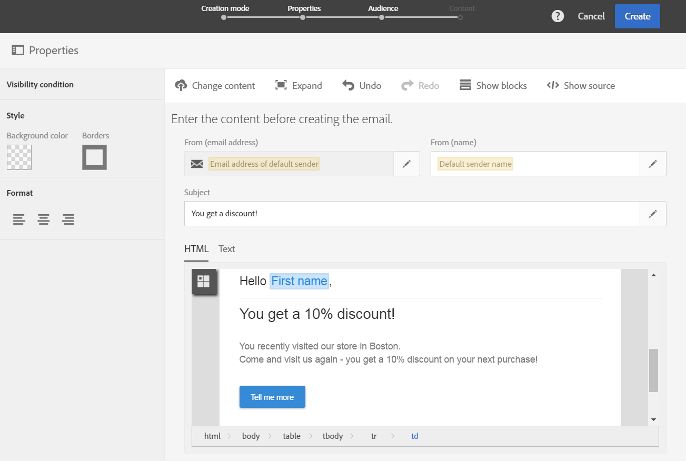

# Personalisera Campaign-meddelanden med Point of Interest-data{#personalizing-campaign-messages-with-point-of-interest-data}

I Adobe Campaign kan du använda de intressepunkter som samlats in från mobilprogrammets prenumeranter för att skicka personaliserade marknadsföringsmeddelanden till dem, till exempel ett e-postmeddelande.

Du kan bara reagera på intressepunktsdata med standardleveranser. [Transaktionsmeddelanden](../../channels/using/getting-started-with-transactional-msg.md) det går inte att använda platsdata.

Den tidigaste reaktionen är cirka 10 minuter.

I så fall bestämmer du dig för att skicka ett e-postmeddelande till alla prenumeranter som har besökt din Boston-butik de senaste två veckorna.

1. Skapa en e-postmarknadsföringsaktivitet.
1. När du definierar målgruppen drar och släpper du **[!UICONTROL Subscriptions to an application]** -element på arbetsytan.

   

   Hantera målgrupper beskrivs i [Definiera målgrupper](../../audiences/using/creating-audiences.md) -avsnitt.

1. I **[!UICONTROL Add a rule - Profile/Subscriptions to an application]** fönster, dra och släppa **[!UICONTROL POI Location Subscription]** -element på arbetsytan.

   

1. I **[!UICONTROL Add a rule - POI Location Subscription]** anger du etiketten för den punkt du vill använda.

   

1. Markera **[!UICONTROL Filter type]** i fältet **[!UICONTROL Relative]**.
1. Kontrollera **[!UICONTROL Preceding days]** och ange **[!UICONTROL 15]** i motsvarande fält.
1. Ange hur många gånger användaren måste ha besökt platsen för intresse.
1. Klicka **[!UICONTROL Confirm]** för att rädda er målgrupp.

   

1. Lägg till innehåll i e-postmeddelandet.

   

1. Bekräfta att du har skapat aktiviteten för att visa e-postens instrumentpanel.
1. Skicka meddelandet.

E-postmeddelandet med rabatten på 10 % skickas till prenumeranter som:

* Besök din Boston-butik minst en gång de senaste två veckorna.
* Var i förgrunden med mobilapplikationen minst en gång under besöket.

**Relaterade ämnen:**

* [Skapa ett e-postmeddelande](../../channels/using/creating-an-email.md)
* [Definiera innehåll](../../designing/using/personalization.md#example-email-personalization)
* [Skicka meddelanden](../../sending/using/confirming-the-send.md)
