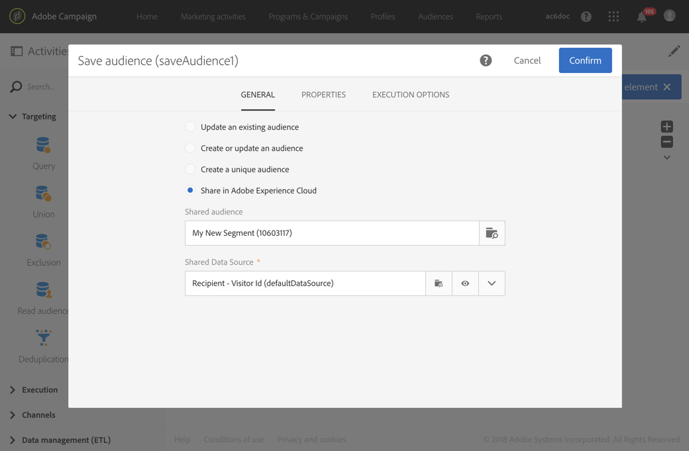

# Dela målgrupper med Audience Manager eller kärntjänsten People{#sharing-audiences-with-audience-manager-or-people-core-service}

## Importera en målgrupp {#importing-an-audience}

Integrering med Bastjänst för människor gör det möjligt att direkt importera en målgrupp till Adobe Campaign via ett tekniskt arbetsflöde som berikar databasen. Mer information om målgruppsdelning i Bastjänsten People finns här [dokumentation](https://experienceleague.adobe.com/docs/analytics/components/segmentation/segmentation-workflow/seg-publish.html).

Import av målgrupper/segment från People core service i Adobe Campaign kan utföras från **[!UICONTROL Audiences]** endast av användare som är anslutna via IMS (autentisering via Adobe ID).

1. Gå till **[!UICONTROL Audiences]** -menyn.
1. Välj **[!UICONTROL Create]** som ska läggas ut på skärmen för att skapa en publik.
1. Ange etiketten för den nya målgruppen.
1. Ange målgrupp **[!UICONTROL Type]** till **[!UICONTROL Experience Cloud]** för att ange att målgruppen som skapas är en målgrupp som importerats från People core Service.
1. Från **[!UICONTROL Name of the shared audience]** väljer du den målgrupp som ska importeras. Endast segment kan importeras. Detaljerade data som nyckelvärdepar, egenskaper och regler stöds inte.

   

1. Välj motsvarande **[!UICONTROL Shared Data Source]**.

   Om den valda datakällan är konfigurerad att använda en krypteringsalgoritm kan du med ytterligare ett alternativ **[!UICONTROL Force reconciliation with a profile]**. Markera det här alternativet om **[!UICONTROL Channel]** -fältet i datakällan är inställt på E-post eller Mobil (SMS) och om du vill utnyttja profildata.

   Om du inte markerar **[!UICONTROL Force reconciliation with a profile]** och if **[!UICONTROL Channel]** är inställt på E-post eller Mobil (SMS) i AMC-datakällan och alla krypterade deklarerade ID:n dekrypteras. En publik av typen **Fil** med en lista över alla e-postadresser/mobiltelefonnummer skapas/uppdateras. På så sätt förloras ingen e-postadress/inget mobiltelefonnummer när en delad målgrupp importeras via den här integreringen, även om profilen inte finns i Campaign. Observera att den här typen av målgrupper inte kan användas direkt eftersom de måste förenas manuellt med hjälp av arbetsflöden.

1. Bekräfta för att skapa målgruppen.

   Publiken importeras sedan via ett tekniskt arbetsflöde. Den består av poster där ID:t (&quot;besökar-ID&quot; eller&quot;Deklarerat ID&quot;) kunde förenas med profildimensionen. ID:n från People core service segments som inte känns igen av Adobe Campaign importeras inte.

Din målgrupp importeras nu i din Adobe Campaign-databas. Det tar 24-36 timmar att synkronisera importprocessen när segment importeras direkt från personbastjänsten eller Audience Manager. Efter den här perioden kan du hitta och använda din nya målgrupp i Adobe Campaign.

>[!NOTE]
>
>Om du importerar målgrupper från Adobe Analytics till Adobe Campaign måste dessa målgrupper först delas i People Core Service eller Audience Manager. Den här processen tar 12-24 timmar, vilket måste läggas till i synkroniseringen av 24-36 timmar med Campaign. I det specifika fallet kan tidsramen för målgruppsdelning vara upp till 60 timmar. Mer information om Adobe Analytics målgruppsdelning i tjänsten People Core och Audience Manager finns i [dokumentation](https://experienceleague.adobe.com/docs/analytics/components/segmentation/segmentation-workflow/seg-publish.html).

## Exportera en målgrupp {#exporting-an-audience}

En målgrupp kan exporteras från Adobe Campaign till Audience Manager eller People core service med hjälp av ett arbetsflöde och **[!UICONTROL Save audience]** aktivitet.

Den kan utföras i ett nytt arbetsflöde och endast av användare som är anslutna via IMS (autentisering via Adobe ID).

1. Skapa ett nytt arbetsflöde från ett program, en kampanj eller listan över marknadsföringsaktiviteter.
1. Använd de olika aktiviteterna för att skapa en uppsättning profiler.
1. Dra och släpp en **[!UICONTROL Save audience]** till arbetsflödet och öppna det.
1. Välj **[!UICONTROL Share in Adobe Experience Cloud]**.

   

1. Ange målgruppen med **[!UICONTROL Shared audience]** fält. I det fönster som öppnas kan du välja om du vill välja en befintlig målgrupp eller skapa en ny:

   * Om du väljer en befintlig målgrupp läggs endast de nya posterna till i målgruppen.
   * Om du vill exportera din profillista till en ny publik fyller du i **[!UICONTROL Segment name]** klicka sedan på **[!UICONTROL Create]** innan du väljer den nya målgruppen.

   

   För att posterna ska kunna stämmas av och bytas ut måste de ha ett Adobe Experience Cloud-id (Visitor-ID eller Deklarerat ID). Ej avstämda poster ignoreras vid import och export av målgrupper.

1. Avsluta genom att klicka på bockmarkeringen längst upp till höger på skärmen.
1. Välj motsvarande **[!UICONTROL Shared Data Source]**.
1. Om du vill kan du kontrollera **[!UICONTROL Generate an outbound transition]** om du vill använda de profiler som exporterades. Endast de profiler som kan förenas exporteras.
1. Bekräfta aktivitetens konfiguration och spara arbetsflödet.
1. Starta arbetsflödet för att exportera målgrupper. Synkronisering mellan Adobe Campaign och People Core Service kan ta flera timmar

Synkronisering mellan Adobe Campaign och People Core Service tar 24-36 timmar. Efter den här perioden kan du hitta din nya målgrupp i bastjänsten People och återanvända den i andra Adobe Experience Cloud-lösningar. Mer information om hur du använder en delad Adobe Campaign-målgrupp i Adobe People-bastjänsten finns i [dokumentation](https://experienceleague.adobe.com/docs/core-services/interface/audiences/t-audience-create.html).

**Relaterade ämnen:**

* [Arbetsflöden](../../automating/using/get-started-workflows.md)
* [Målgrupper](../../audiences/using/about-audiences.md)
