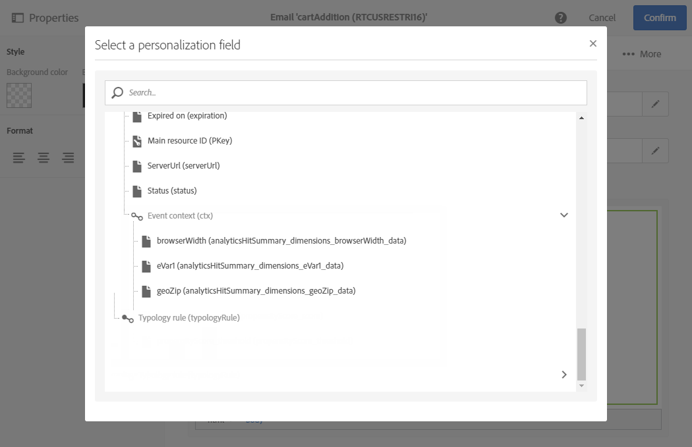

# Använda utlösare i Campaign{#using-triggers-in-campaign}

## Skapa en mappad utlösare i Campaign {#creating-a-mapped-trigger-in-campaign}

>[!NOTE]
>
>Om du vill skapa utlösare måste du ha rollen **[!UICONTROL Administration]** eller vara i säkerhetsgruppen **[!UICONTROL Administrators]**. Mer information finns på [sidan](../../administration/using/list-of-roles.md).

Du måste definiera de beteenden som du vill övervaka i förväg i Adobe Experience Cloud (**[!UICONTROL Triggers]** bastjänst). Mer information finns i dokumentationen för [Adobe Experience Cloud](https://experienceleague.adobe.com/docs/experience-cloud/triggers/create.html?lang=sv-SE). Observera att när du definierar utlösaren måste du aktivera aliasen. För varje beteende (surfning/formulärborttagning, tillägg/borttagning av produkter, session har gått ut, o.s.v.) måste en ny utlösare läggas till i Adobe Experience Cloud.

Nu måste du skapa en utlösande händelse i Adobe Campaign baserat på en befintlig Adobe Experience Cloud-utlösare.

Stegen för att implementera detta är:

1. Klicka på logotypen **Adobe** i det övre vänstra hörnet och välj sedan **[!UICONTROL Marketing plans]** > **[!UICONTROL Transactional messages]** > **[!UICONTROL Experience Cloud Triggers]**.

   

1. Klicka på knappen **[!UICONTROL Create]**. Guiden Skapa som öppnas visar en lista över alla utlösare som definierats i Adobe Experience Cloud. I **[!UICONTROL Fired by Analytics]**-kolumnen visas antalet händelser som skickas av Adobe Experience Cloud-utlösaren till Campaign. Detta är mappning av utlösare som har skapats i Experience Cloud-gränssnittet.

   

1. Välj den Adobe Experience Cloud-utlösare som du vill använda och klicka på **[!UICONTROL Next]**.
1. Konfigurera de allmänna egenskaperna för utlösaren. I det här steget i guiden anger du även kanal- och måldimensionen som ska användas för utlösaren (se [Måldimensioner och resurser](../../automating/using/query.md#targeting-dimensions-and-resources)). Bekräfta sedan utlösaren.
1. Klicka på knappen till höger om **[!UICONTROL Event content and enrichment]**-fältet för att visa nyttolastens innehåll. På den här skärmen kan du även utöka händelsedata med profildata som lagras i Adobe Campaign-databasen. Berikningen utförs på samma sätt som för ett vanligt transaktionsmeddelande.

   

1. I **[!UICONTROL Transactional message validity duration]**-fältet anger du hur länge meddelandet ska vara giltigt efter att händelsen har skickats av Analytics. Om en varaktighet på två dagar har angetts skickas meddelandet inte längre när den tiden har gått. Om du pausar flera meddelanden ser det till att meddelandena inte skickas om du återupptar dem efter en viss tid.

   

1. Nu kan du publicera dina utlösare. Mer information finns i [Publicera en utlösare i Campaign](../../integrating/using/using-triggers-in-campaign.md#publishing-trigger-in-campaign).

## Publicera en utlösare i Campaign {#publishing-trigger-in-campaign}

När du har skapat en utlösarhändelse i Adobe Campaign baserat på en befintlig Adobe Experience Cloud-utlösare måste du nu publicera den.

1. Klicka på knappen **[!UICONTROL Publish]** från den tidigare utlösaren för att börja publicera utlösarhändelsen.

   

1. Du kan kontrollera förloppet för utlösarpublikationen under **[!UICONTROL Publication]**.

   

1. När publiceringen är klar visas följande meddelande under **[!UICONTROL Publication]**.

   

1. Om du behöver göra en ändring i utlösarschemat även efter att du har publicerat utlösarhändelsen klickar du på knappen **[!UICONTROL Update schema]** för att hämta de senaste ändringarna.

   Observera att den här åtgärden avpublicerar utlösaren och transaktionsmeddelandet. Du måste publicera om dem efteråt.

   

1. Klicka på knappen **[!UICONTROL Show Trigger in Experience Cloud]** för att visa utlösardefinitionen i Adobe Experience Cloud.

När händelsen har publicerats skapas sedan en transaktionsmall som är kopplad till den nya händelsen automatiskt. Sedan måste du ändra och publicera mallen som skapades. Mer information finns i avsnittet [Redigera mallen](../../start/using/marketing-activity-templates.md).

## Redigera transaktionsmeddelandemallen {#editing-the-transactional-message-template}

När du har skapat och publicerat utlösarhändelsen skapas motsvarande transaktionsmall automatiskt. Mer information finns i avsnittet [Skapa en mappad utlösare i Campaign](#creating-a-mapped-trigger-in-campaign).

Innan händelsen kan utlösa ett transaktionsmeddelande måste du anpassa mallen, testa det och publicera det. De här stegen är samma som för ett vanligt transaktionsmeddelande. Mer information finns i avsnittet [Redigera ett transaktionsmeddelande](../../channels/using/editing-transactional-message.md).

>[!NOTE]
>
>Om du avpublicerar mallen avpubliceras utlösarhändelsen automatiskt.

När du redigerar innehåll kan du lägga till ett anpassningsfält baserat på den information som skickas av Analytics-utlösaren. Om du förbättrar händelsedata med Adobe Campaign-profildata kan du anpassa meddelandet baserat på den här informationen. Om du vill anpassa meddelandet väljer du **[!UICONTROL Transactional event]** > **[!UICONTROL Event context]** och väljer ett fält.

## Åtkomst till rapporter {#accessing-the-reports}

Om du vill visa den dedikerade utlösarrapporten i Adobe Campaign öppnar du den utlösarhändelse som du skapade tidigare och klickar på **[!UICONTROL Show trigger report]**.

Rapporten visar antalet bearbetade händelser jämfört med antalet händelser som skickats av Analytics. Den visar också en lista över alla de senaste utlösarna.

