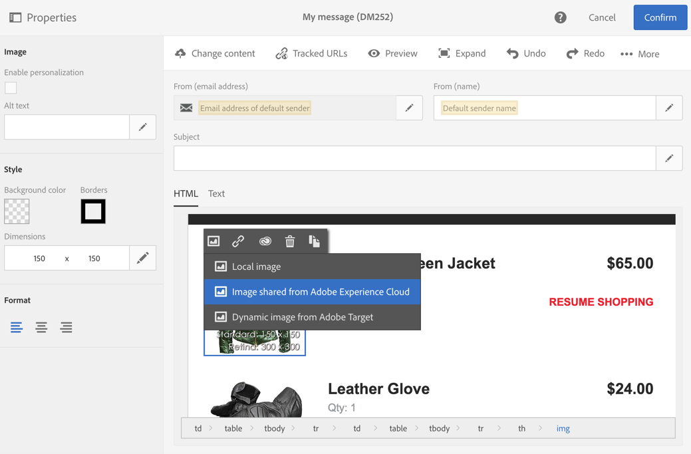

# Arbeta med huvudtjänsten Campaign och Assets Core Service{#working-with-campaign-and-assets-core-service}

Genom att integrera Assets Core-tjänsten eller Assets on Demand (beroende på hur Adobe Experience Cloud-miljön är konfigurerad) med Adobe Campaign kan du använda alla resurser som delas inom Adobe Experience Cloud i Adobe Campaign e-postmeddelanden och på landningssidor.

>[!CAUTION]
>
> Integrationen med bastjänsten Assets är begränsad till [Funktionella administratörer](../../administration/using/users-management.md#functional-administrators).

Resurser som delas från Adobe Experience Cloud kan användas i e-postmeddelanden och på landningssidor enligt följande:

1. När du redigerar innehållet i ett e-postmeddelande eller en landningssida går du till ett bildblock och väljer sedan **[!UICONTROL Image shared from Adobe Experience Cloud]** via snabbmenyn.

   

1. Markera en bild i det urvalsfönster som öppnas och bekräfta sedan.

   

Bilden infogas sedan. Leveransen kan nu anpassas efter behov och skickas.

**Relaterade ämnen:**

* [Resurser och delning](https://experienceleague.adobe.com/docs/core-services/interface/assets/experience-cloud-assets.html)
* [Innehållsredigerare](../../designing/using/personalization.md#example-email-personalization)
