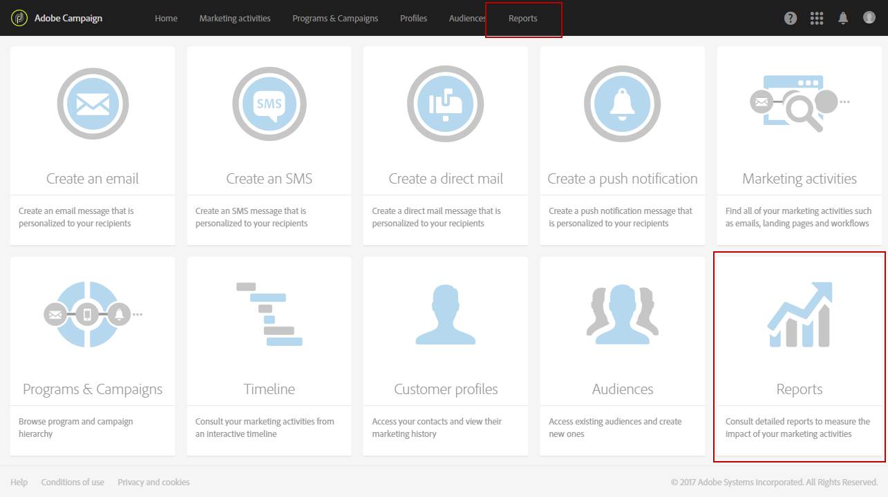

# Kom igång med dynamiska rapporter {#about-dynamic-reports}

Dynamic Reporting ger helt anpassningsbara rapporter i realtid. Det ger åtkomst till profildata, vilket möjliggör demografiska analyser efter profildimensioner som kön, ort och ålder, utöver funktionella e-postkampanjdata som öppningar och klick. Med dra och släpp-gränssnittet kan du utforska data, avgöra hur framgångsrika e-postkampanjerna är för dina viktigaste kundsegment och mäta deras påverkan på mottagarna.

>[!NOTE]
>
>Endast användare med administrationsbehörighet eller organisationsenheter inställda på **Alla** kan skapa eller spara en ny rapport. Mer information om detta hittar du i det här [avsnittet](../../administration/using/users-management.md).

## Åtkomst till dynamiska rapporter {#accessing-dynamic-reports}

Du kan få åtkomst till rapporter:

* Från startsidan genom att välja fliken **[!UICONTROL Reports]** i det övre fältet eller **[!UICONTROL Reports]**-kortet för att få åtkomst till rapporter för alla leveranser.

   

* I varje program, kampanj och meddelande från knappen **Rapporter** genom att klicka på **Dynamiska rapporter** för att endast visa rapporter som är specifika för leveransen.

   

Vissa rapporter är inte tillgängliga omedelbart efter en leverans, beroende på hur lång tid det tar att samla in och bearbeta information.

Dynamiska rapporter är indelade i två kategorier:

* **Mallar**, som kan ändras genom att de kopieras med alternativet  **Spara** som (**Projekt > Spara som).**) i mallen.
* **Anpassade rapporter**  (visas i blått) som kan skapas direkt genom att klicka på knappen  **Skapa nytt** projekt på  **** rapportsidan.

>[!NOTE]
>
>Data filtreras beroende på organisationens enheter.

## Användningsavtal för dynamisk rapportering {#dynamic-reporting-usage-agreement}

Syftet med användningsavtalet för dynamisk rapportering är att det ska fungera som ett popup-medgivande för databearbetning. Som standard är avtalet bara synligt och kan bara accepteras eller avvisas av användare som tilldelats administrationsrättigheter.

Tre alternativ är tillgängliga:

* **[!UICONTROL Ask me later]**: Genom att klicka på  **Fråga mig senare** slutar fönstret att visas i 24 timmar. Innan du har godkänt eller avvisat avtalet visas inte profildimensionerna i dina rapporter och dina kunders personliga ID-information samlas inte in eller skickas.
* **[!UICONTROL Accept]**: Genom att godkänna det här avtalet ger du Adobe Campaign tillstånd att samla in dina kunders personuppgifter och överföra dem till rapportören eller datacentret.
* **[!UICONTROL Decline]**: Om du avböjer avtalet visas inte profildimensionerna i dina rapporter och dina kunders personliga ID-information samlas inte in eller skickas. Observera att i det här fallet kommer externalID fortfarande att samlas in och användas för att identifiera slutanvändare.

Tabellen nedan visar vad som händer efter att du har godkänt det här avtalet beroende på din region.

|  | Dynamisk rapportering | Microsoft Dynamics 365-koppling |
|---|---|---|
| Amerika och Asien-Stillahavsregionen | **Tillgänglig** funktion.  All körklar information (t.ex. ort, land/region, stat, kön och segment baserat på ålder) och anpassad profilinformation som överförts till USA:s rapportcenter. Mer information om profildimensioner finns på den här [sidan](../../reporting/using/list-of-components-.md) | **Tillgänglig** funktion.  Alla färdiga och anpassade profilfält och händelsefält i Adobe Campaign Standard behandlas i datacentret i USA. |
| EMEA (Europa, Mellanöstern och Afrika) | **Tillgänglig** funktion.  All körklar information (t.ex. ort, land/region, stat, kön och segment baserat på ålder) och information om anpassade profiler skickas till EMEA: s rapportcenter. Mer information om profildimensioner finns på den här [sidan](../../reporting/using/list-of-components-.md) | **Tillgänglig funktion.**  Alla färdiga och anpassade profilfält och Adobe Campaign Standard händelsefält bearbetas i EMEA:s datacenter.  **[!UICONTROL Control data]**som innehåller registreringsdata från Adobe I/O och ID:n för kundslutanvändarhändelser som skickas och lagras i datacentret i USA. |

Tabellen nedan visar vad som händer efter att avtalet har avböjts beroende på din region. Observera att även om du avböjer det här avtalet är rapportering om leveranser och Microsoft Dynamics 365-integrering fortfarande tillgänglig.

| Län | Dynamisk rapportering | Microsoft Dynamics 365-koppling |
|---|---|---|
| Amerika och Asien-Stillahavsregionen | **Tillgänglig** funktion.   Ingen körklar och anpassad profilinformation har överförts till USA:s rapportcenter med undantag för ExternalID. | **Tillgänglig** funktion.  Inga färdiga eller anpassade profilfält skickas till datacentret i USA, med undantag för externt ID och mottagar-ID.  Alla Adobe Campaign Standard-händelsefält bearbetas i datacentret i USA med undantag för spegelsides-ID.  Mer information om Microsoft Dynamics 365-integrering finns på den här  [sidan](../../integrating/using/d365-acs-get-started.md). |
| EMEA (Europa, Mellanöstern och Afrika) | **Tillgänglig** funktion.  Ingen körklar och anpassad profilinformation skickas till EMEA: s rapportcenter med undantag för ExternalID. | **Tillgänglig funktion.**  Inga färdiga eller anpassade profilfält skickas till EMEA:s datacenter, med undantag för externt ID och mottagar-ID.  Alla händelsefält i Adobe Campaign Standard behandlas i EMEA:s datacenter med undantag för spegelsides-ID.   **[!UICONTROL Control data]**som innehåller registreringsdata från Adobe I/O och ID:n för kundslutanvändarhändelser som skickas och lagras i datacentret i USA. Mer information om Microsoft Dynamics 365-integrering finns på den här  [sidan](../../integrating/using/d365-acs-get-started.md). |

Det här alternativet är inte slutgiltigt, du kan alltid ändra det genom att välja **[!UICONTROL Enable PII data to be transferred to US region to use reporting on Profile data]** i **[!UICONTROL Administration]** > **[!UICONTROL Application Settings]** > **[!UICONTROL Options]**.

Värdet kan ändras när som helst. Värdet 1 motsvarar **[!UICONTROL Ask me later]**, 2 **[!UICONTROL Decline]** och 3 **[!UICONTROL Accept]**.

