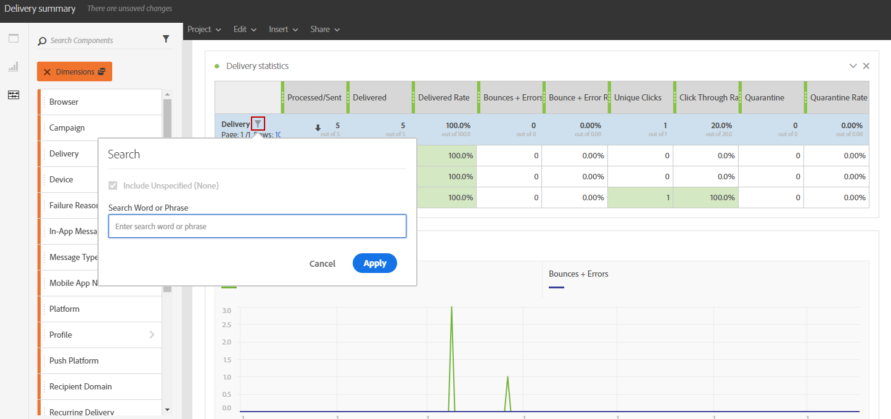

# Lägga till komponenter{#adding-components}

Med komponenter kan du anpassa rapporter med olika dimensioner, mätvärden och tidsperioder.

1. Klicka på **[!UICONTROL Components]** för att komma åt komponentlistan.

   

1. Varje kategori som presenteras i **[!UICONTROL Components]** -fliken visar de fem mest använda objekten. Klicka på namnet på en kategori för att få tillgång till dess fullständiga lista över komponenter.

   Komponenttabellen är uppdelad i fyra kategorier:

   * **Dimensioner**: Hämta information från leveransloggen, t.ex. mottagarens webbläsare eller domän, eller leveransens framgångar.
   * **Mått**: Hämta information om status för ett meddelande. Om ett meddelande till exempel levererades och användaren öppnade det.
   * **[!UICONTROL Segments]**: Filtrera data beroende på mottagarens åldersintervall. **[!UICONTROL Segments]** kan dras och släppas direkt i en frihandstabell eller i panelens övre fält.

     Den här kategorin är bara tillgänglig när administratören har godkänt villkoren i det dynamiska användningsavtalet för rapportering som visas på skärmen. Om administratören avböjer avtalet visas inte segmenten i **[!UICONTROL Components]** och data samlas inte in.

   * **Tid**: Ange en tidsperiod för tabellen.

1. Dra och släpp komponenter på en panel för att börja filtrera data.

   

1. När du har dragit och släppt en komponent kan du konfigurera tabellen ytterligare med **[!UICONTROL Row settings]** alternativ.

   

1. Du kan även filtrera tabellen ytterligare genom att klicka på **Sök** -ikon. Med den här sökningen kan du söka efter specifika resultat, t.ex. en viss leverans eller webbläsare.

   

Du kan dra och släppa så många komponenter som behövs och jämföra dem med varandra.

**Relaterade ämnen:**

* [Lista över komponenter](../../reporting/using/list-of-components-.md)
* [Lista över rapporter](../../reporting/using/defining-the-report-period.md)
