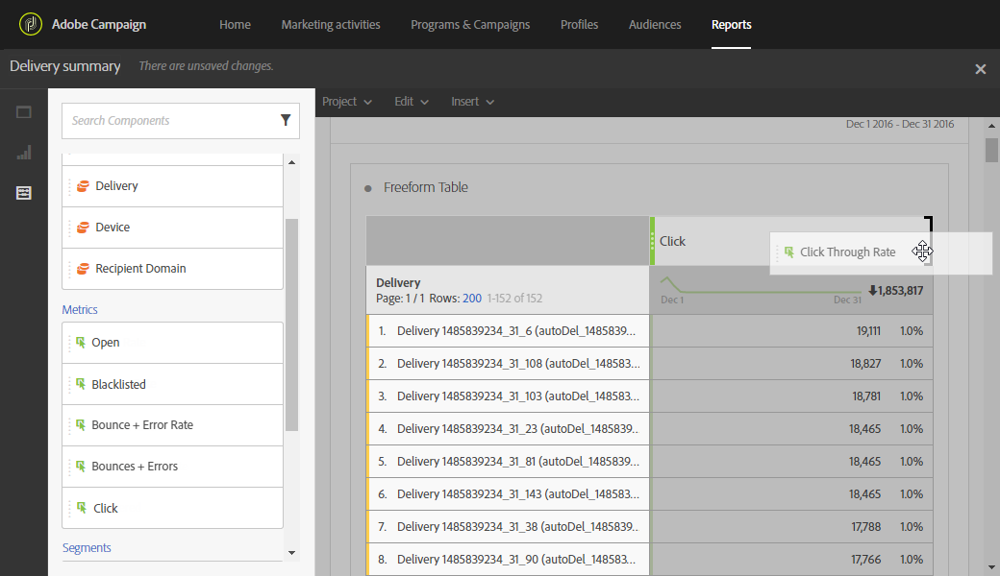

# Lägga till paneler{#adding-panels}

## Lägga till en tom panel {#adding-a-blank-panel}

Du kan påbörja rapporten genom att lägga till en uppsättning paneler i en separat eller anpassad rapport. Varje panel innehåller olika datauppsättningar och består av frihandstabeller och visualiseringar.

Med den här panelen kan du skapa rapporter efter behov. Du kan lägga till så många paneler du vill i dina rapporter för att filtrera data med olika tidsperioder.

1. Klicka på ikonen **Paneler**. Du kan också lägga till en panel genom att klicka på fliken **Infoga** och välja **Ny tom panel**.

   

1. Dra och släpp **panelen Tom** på instrumentpanelen.

   

Nu kan du lägga till en friformstabell på panelen för att börja målinrikta data.

## Lägga till en frihandstabell {#adding-a-freeform-table}

Med frihandstabeller kan du skapa en tabell för att analysera data med hjälp av de olika mätvärden och dimensioner som finns i tabellen **Component**.

Det går att ändra storlek på alla tabeller och visualiseringar och de kan flyttas för att bättre anpassa rapporten.

1. Klicka på ikonen **Paneler**.

   

1. Dra och släpp **frihandsobjektet** på instrumentpanelen.

   Du kan också lägga till en tabell genom att klicka på fliken **Infoga** och välja **Ny frihand** eller genom att klicka på **Lägg till en frihandstabell** i en tom panel.

   

1. Segmentet **[!UICONTROL Exclude proof]** är redan markerat som standard. Om det behövs kan du ändra den genom att dra och släppa en av **[!UICONTROL Segments]** från fliken **[!UICONTROL Components]** i det övre fältet.

   

1. Dra och släpp objekt från fliken **Komponenter** i kolumnerna och raderna för att skapa tabellen.

   

1. Klicka på ikonen **Inställningar** för att ändra hur data visas i kolumnerna.

   

   **[!UICONTROL Column settings]** består av:

   * **[!UICONTROL Number]**: I kan du visa eller dölja sammanfattningsnummer i kolumnen.
   * **[!UICONTROL Percent]**: I kan du visa eller dölja procent i kolumnen.
   * **[!UICONTROL Interpret zero as no value]**: gör att du kan visa eller dölja när värdet är lika med noll.
   * **[!UICONTROL Background]**: I kan du visa eller dölja den vågräta förloppsindikatorn i celler.
   * **[!UICONTROL Include retries]**: gör att du kan inkludera återförsök i resultatet. Detta är endast tillgängligt för **[!UICONTROL Sent]** och **[!UICONTROL Bounces + Errors]**.

1. Markera en eller flera rader och klicka på ikonen **Visa**. En visualisering läggs till för att återspegla de rader du har valt.

   

Nu kan du lägga till så många komponenter du behöver och även lägga till visualiseringar för att ge grafiska representationer av dina data.
