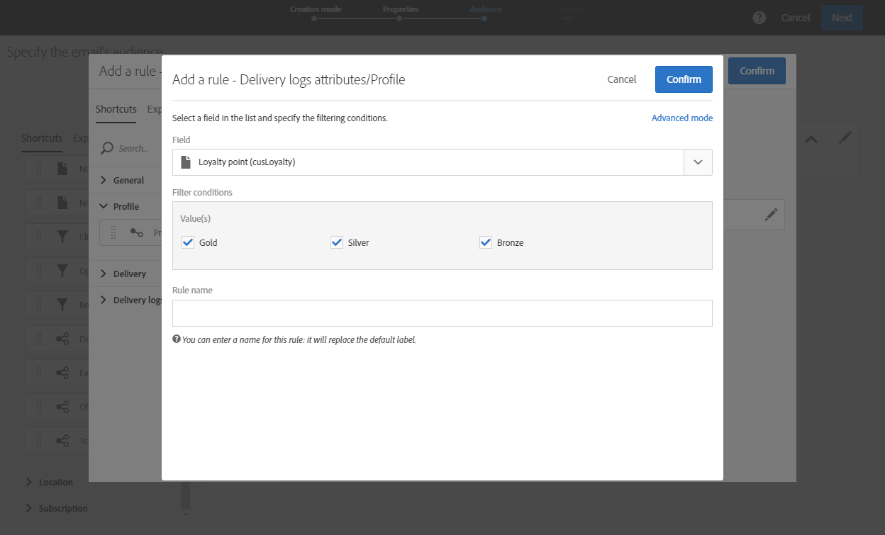

# Skapa en anpassad profildimension{#creating-a-custom-profile-dimension}

Rapporter kan också skapas och hanteras baserat på anpassade profildata som skapats med det anpassade profilresurstillägget.

I det här exemplet vill vi skapa det anpassade profilfältet **Lojalitetsprogram** som ska delas upp i tre nivåer: guld, silver och brons. Den anpassade profilen utökas sedan så att den kan användas som en anpassad profildimension i dynamiska rapporter.

* [Steg 1: Skapa ett nytt profilfält](#step-1--create-a-new-profile-field)
* [Steg 2: Utöka de sändande loggarna med profilfältet](#step-2--extend-the-sending-logs-with-the-profile-field)
* [Steg 3: Skapa en leverans som riktar sig till mottagare som är registrerade i lojalitetsprogrammet](#step-3--create-a-delivery-targeting-recipients-enrolled-in-the-loyalty-program)
* [Steg 4: Skapa en dynamisk rapport för att filtrera mottagare med den anpassade profildimensionen](#step-4--create-a-dynamic-report-to-filter-recipients-with-the-custom-profile-dimension)

## Steg 1: Skapa ett nytt profilfält {#step-1--create-a-new-profile-field}

Först måste vi skapa det nya profilfältet **Lojalitetsprogram** som tilldelar våra mottagare lojalitetsnivå: guld, silver eller brons.

>[!NOTE]
>
>Anpassade resurser kan bara hanteras av en administratör.

För att göra detta:

1. På den avancerade menyn väljer du **[!UICONTROL Administration]** > **[!UICONTROL Development]** > **[!UICONTROL Custom resources]** och sedan den **[!UICONTROL Profile (profile)]** anpassade resursen.

   

1. Klicka på **[!UICONTROL Data structure]** knappen på fliken i **[!UICONTROL Fields]** **[!UICONTROL Add field]** kategorin.

   

1. Ange **[!UICONTROL Label]** och **[!UICONTROL ID]** välj den anpassade resursen **[!UICONTROL Type]**. Här har vi valt **[!UICONTROL Text]** eftersom mottagarna kan välja mellan guld, silver och brons.

   

1. Klicka på  ikonen för att definiera fältet.

   

1. Här måste vi ange auktoriserade värden genom att kontrollera **[!UICONTROL Specify a list of authorized valued]** och skapa varje värde genom att klicka **[!UICONTROL Create element]**.

   

1. Ange **[!UICONTROL Label]** och **[!UICONTROL Value]** klicka sedan **[!UICONTROL Add]**. I det här exemplet måste vi skapa värdet guld, silver och brons. Click **[!UICONTROL Confirm]** when done.

   

1. Klicka på fliken **[!UICONTROL Screen definition]**.  I den **[!UICONTROL Detail screen configuration]** nedrullningsbara menyn markerar du **[!UICONTROL Add personalized fields]** avsnittet för att skapa ett nytt avsnitt i vår profil.

   

1. Klicka på **[!UICONTROL Add an element]** knappen för att skapa det nya avsnittet. Välj **[!UICONTROL Type]**: **[!UICONTROL Input field]** eller **[!UICONTROL Value]** **[!UICONTROL List]** det fält som ska läggas till i det nya avsnittet.

   

1. Du kan också lägga till en titel i avsnittet i fältet **[!UICONTROL Customize the title of the section where the fields will be displayed]**.

   Klicka **[!UICONTROL Save]** när konfigurationen är klar.

   

1. På den avancerade menyn väljer du **[!UICONTROL Administration]** > **[!UICONTROL Development]** > **[!UICONTROL Publication]** för att börja publicera din anpassade resurs.
1. Klicka **[!UICONTROL Prepare publication]** sedan på **[!UICONTROL Publish]** knappen när färdigställandet är klart.

   

Det nya profilfältet är nu klart att användas och markeras av dina mottagare.

## Steg 2: Utöka de sändande loggarna med profilfältet {#step-2--extend-the-sending-logs-with-the-profile-field}

Nu när ditt profilfält har skapats måste vi utöka de sändande loggarna med vårt profilfält för att skapa den associerade anpassade profildimensionen i dynamiska rapporter.

Innan du utökar loggen med vårt profilfält bör du kontrollera att PII-fönstret har accepterats för åtkomst till **[!UICONTROL Sending logs extension]** fliken. Se denna [sida](../../reporting/using/about-dynamic-reports.md#dynamic-reporting-usage-agreement) för mer information om detta.

>[!NOTE]
>
>Loggar kan bara utökas med profilfält av administratören.

1. På den avancerade menyn väljer du **[!UICONTROL Administration]** > **[!UICONTROL Development]** > **[!UICONTROL Custom resources]** och sedan den **[!UICONTROL Profile (profile)]** anpassade resursen.
1. Öppna **[!UICONTROL Sending logs extension]** listrutan.
1. Klicka på knappen **[!UICONTROL Create element]**.

   

1. Select your previously created field and click **[!UICONTROL Confirm]**.
1. Markera **[!UICONTROL Add this field in Dynamic reporting as a new dimension]** för att skapa din anpassade profildimension.

   

   Det här alternativet är bara tillgängligt om PII-fönstret har godkänts. Se denna [sida](../../reporting/using/about-dynamic-reports.md#dynamic-reporting-usage-agreement) för mer information om detta.

1. Klicka **[!UICONTROL Add]** och spara sedan din anpassade resurs.
1. Eftersom den anpassade resursen ändrades måste den publiceras för att implementera de nya ändringarna.

   På den avancerade menyn väljer du **[!UICONTROL Administration]** > **[!UICONTROL Development]** > **[!UICONTROL Publication]** för att börja publicera din anpassade resurs.

1. Klicka **[!UICONTROL Prepare publication]** sedan på **[!UICONTROL Publish]** knappen när färdigställandet är klart.

   

Din anpassade profil är nu tillgänglig som en anpassad profildimension i dina rapporter.

Nu när fältet har skapats och loggen har utökats med det här profilfältet kan du börja rikta in mottagare i leveranser.

## Steg 3: Skapa en leverans som riktar sig till mottagare som är registrerade i lojalitetsprogrammet {#step-3--create-a-delivery-targeting-recipients-enrolled-in-the-loyalty-program}

När profilfältet har publicerats kan du påbörja leveransen. I det här exemplet vill vi inrikta oss på alla mottagare som är registrerade i lojalitetsprogrammet.

1. På fliken **[!UICONTROL Marketing activities]**, klicka på **[!UICONTROL Create]** och välj sedan **[!UICONTROL Email]**.
1. Välj och **[!UICONTROL Email type]** ange sedan e-postens egenskaper.
1. Dra och släpp aktiviteten om du vill ha en målmottagare som är registrerad i lojalitetsprogrammet **[!UICONTROL Profiles (attributes)]** .
1. Välj det fält du skapat tidigare i **[!UICONTROL Field]** listrutan.

   

1. Välj din **[!UICONTROL Filter conditions]**. Här vill vi rikta in oss på mottagare som ingår i en av de tre lojalitetsprogrammens nivåer.

   

1. Klicka **[!UICONTROL Confirm]** sedan på **[!UICONTROL Next]** när du är klar med filtreringen.
1. Definiera och anpassa meddelandeinnehåll, avsändarens namn och ämne. For more information on email creation refer to this [page](../../designing/using/designing-content-in-adobe-campaign.md).

   Then, click **[!UICONTROL Create]**.

1. När det är klart kan du förhandsgranska och skicka meddelandet. Mer information om hur du förbereder och skickar meddelanden finns på den här [sidan](../../sending/using/preparing-the-send.md).

När e-postmeddelandet har skickats korrekt till de valda mottagarna kan du börja filtrera dina data och spåra hur bra leveransen är med rapporter.

## Steg 4: Skapa en dynamisk rapport för att filtrera mottagare med den anpassade profildimensionen {#step-4--create-a-dynamic-report-to-filter-recipients-with-the-custom-profile-dimension}

När leveransen är klar kan du dela upp rapporter med hjälp av din anpassade profildimension från **[!UICONTROL Profile]** tabellen.

1. Välj en användbar rapport på **[!UICONTROL Reports]** fliken eller klicka på **[!UICONTROL Create]** knappen för att starta en från början.

   

1. Klicka på **[!UICONTROL Dimensions]** kategorin **[!UICONTROL Profile]** och dra sedan den anpassade **lojalitetsprogramprofildimensionen** till frihandstabellen.

   

1. Dra och släpp mätvärden **[!UICONTROL Processed/Sent]** och **[!UICONTROL Open]** mätvärden för att börja filtrera data.

   

1. Dra och släpp en visualisering på arbetsytan om det behövs.

   

**Relaterat ämne:**

* [Använda anpassade profildata för att skapa insiktsfulla rapporter](https://helpx.adobe.com/campaign/kb/simplify-campaign-management.html#Reportandshareinsightswithallstakeholders)
