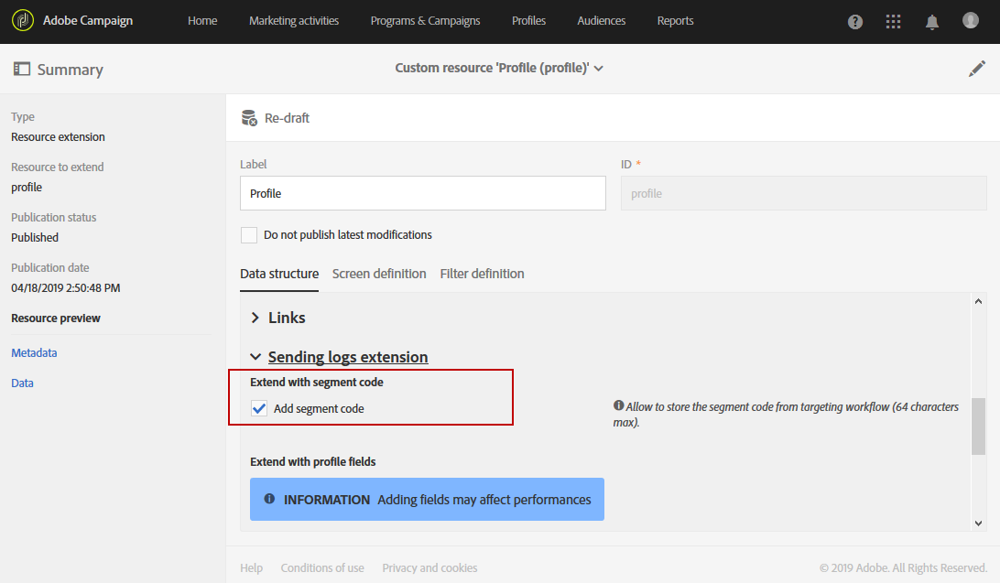
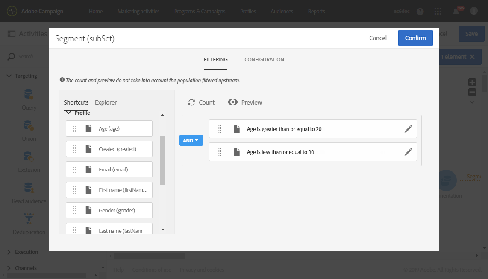
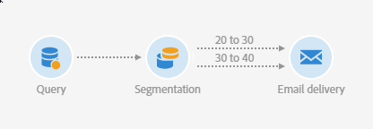
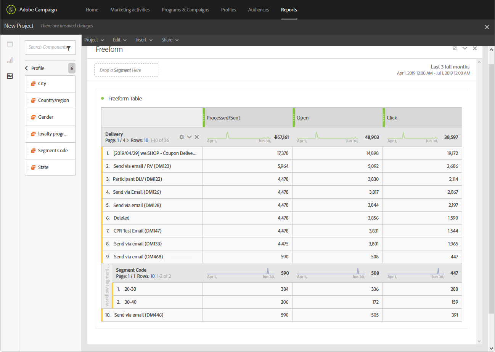

# Skapa en rapport baserad på arbetsflödessegment{#creating-a-report-workflow-segment}

>[!CAUTION]
> **[!UICONTROL Segment code]** kan bara rikta sig till e-post och SMS-leveranser.

När ni har skapat ett arbetsflöde och filtrerat er population till olika målgrupper kan ni mäta effektiviteten hos era marknadsföringskampanjer baserat på segment som definieras i det här arbetsflödet för målinriktning.
Om du vill inrikta dig på dessa segment i dina rapporter:

* [Steg 1: Uppdatera anpassade resurser med profiler](#step-1--update-profiles-custom-resource-segments)
* [Steg 2: Skapa ett arbetsflöde med segment](#step-2--create-a-workflow-segments)
* [Steg 3: Skapa en dynamisk rapport för att filtrera segment](#step-3--create-a-dynamic-report-filter-segments)

>[!CAUTION]
>Användningsavtalet för dynamisk rapportering måste accepteras för att börja samla in dessa data.
>
>Mer information om det här avtalet finns i [page](../../reporting/using/about-dynamic-reports.md#dynamic-reporting-usage-agreement).

## Steg 1: Uppdatera anpassade resurser med profiler{#step-1--update-profiles-custom-resource-segments}

Innan du rapporterar segmentkoden måste du uppdatera **[!UICONTROL Profiles]** anpassad resurs för de segmentkoder som ska lagras.

1. På den avancerade menyn via Adobe Campaign logotyp väljer du **[!UICONTROL Administration]** > **[!UICONTROL Development]** > **[!UICONTROL Custom resources]** väljer du **[!UICONTROL Profile (profile)]** resurs.
1. I **[!UICONTROL Sending logs extension]** från **[!UICONTROL Data structure]** flik, kontrollera **[!UICONTROL Add segment code]** för att tillåta lagring av era segmentkoder från målarbetsflöden och skicka dem till dynamisk rapportering.

   The **[!UICONTROL Segment code]** blir då tillgängligt i **[!UICONTROL Profile]** dimensionsavsnittet i rapporten.

   

1. Spara din anpassade resurs.

1. Nu måste du publicera din anpassade resurs.
Välj på den avancerade menyn **[!UICONTROL Administration]** > **[!UICONTROL Development]** > **[!UICONTROL Publishing]**.

   

1. Klicka **[!UICONTROL Prepare publication]** när färdigställandet är klart klickar du på **[!UICONTROL Publish]** -knappen. Mer information om anpassad resurs finns i [page](../../developing/using/updating-the-database-structure.md).

Nu kan du börja skapa ditt arbetsflöde med segmentkoder.

Observera att segmentkoder samlas in så snart du aktiverar segmentkoden i **[!UICONTROL Sending logs extension]**.

## Steg 2: Skapa ett arbetsflöde med segment {#step-2--create-a-workflow-segments}

>[!NOTE]
>Om indataövergången för e-postleveransen är tom läggs segmentkoden från den föregående övergången till som standard.

Du måste först skapa ett arbetsflöde med olika målgrupper. Här vill vi skicka ett e-postmeddelande som kommer att personaliseras beroende på målgruppens ålder: en leverans för 20 till 30 år gamla profiler och en annan för profiler mellan 30 och 40 år gamla.

1. Skapa ett arbetsflöde. Mer information om hur du skapar arbetsflöden finns i [page](../../automating/using/building-a-workflow.md).

1. Lägg till en **[!UICONTROL Query]** genom att dra den från paletten och släppa den på arbetsytan.

1. Målgrupper från 20 till 40 år för att senare segmentera dem i mer målgruppsinriktade populationer.

   

1. Lägg till en **[!UICONTROL Segmentation]** -aktivitet för att dela upp dina frågeresultat i två målpopulationer. Mer information om segmentering finns i [page](../../automating/using/segmentation.md).

1. Dubbelklicka på **[!UICONTROL Segmentation]** -aktivitet för att konfigurera den. Redigera det första segmentet genom att klicka **[!UICONTROL Edit properties]**.

   

1. Frågeprofiler mellan 20 och 30 år och klicka **[!UICONTROL Confirm]** när det är klart.

   

1. Klicka **[!UICONTROL Add an element]** för att skapa ditt andra segment och konfigurera det enligt anvisningarna i stegen ovan för att skapa målprofiler mellan 30 och 40 år.

1. Redigera **[!UICONTROL Segment code]** för varje population som ska överföras genom dynamisk rapportering.

   >[!NOTE]
   >Det här steget är obligatoriskt, annars kan du inte förstå vilka segment du ska rapportera om.

   

1. Dra och släpp en **[!UICONTROL Email delivery]** efter era segment.

   

1. Anpassa era leveranser beroende på vilka målgrupper ni har. Mer information om hur du skapar e-postmeddelanden finns i [page](../../designing/using/designing-content-in-adobe-campaign.md).

1. Spara arbetsflödet.

1. Klicka **[!UICONTROL Start]** när arbetsflödet är klart.

Nu kan du komma åt dina rapporter och spåra dina segmentkoder.

## Steg 3: Skapa en dynamisk rapport för att filtrera segment {#step-3--create-a-dynamic-report-filter-segments}

När du har skickat leveranser i arbetsflödet kan du dela upp rapporter med hjälp av dina segmentkoder i arbetsflödet.

1. Från **[!UICONTROL Reports]** väljer du en färdig rapport eller klickar på **[!UICONTROL Create new project]** för att starta en från början.

   
1. Dra och släpp **[!UICONTROL Delivery]** till frihandsritbordet.

   

1. Dra och släpp olika mätvärden i tabellen, till exempel **[!UICONTROL Open]** och **[!UICONTROL Click]** mätvärden för att börja filtrera data.
1. I **[!UICONTROL Dimensions]** klickar du på **[!UICONTROL Profile]** sedan dra och släpp **[!UICONTROL Segment code]** dimensionen på arbetsflödets leverans för att mäta hur framgångsrik e-postleveransen är beroende på målgrupperna.

   

1. Dra och släpp en visualisering på arbetsytan om det behövs.

   
