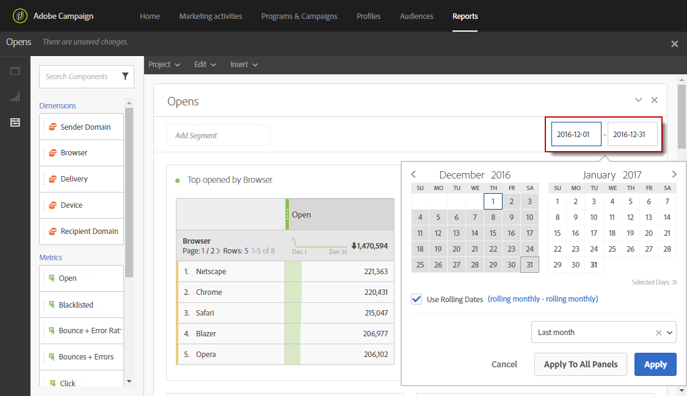

# Definiera rapportperioden{#defining-the-report-period}

Innan du startar eller öppnar en rapport måste du använda en tidsperiod. Den angivna perioden finns längst upp till höger i rapporten.

Som standard anges filterperioden till start- och slutdatumet för programmet eller kampanjen för en kampanj eller ett program. För en leverans motsvarar startdatumet skickat och slutdatumet det skickade datumet plus 7 dagar.

Om du vill ändra filtret väljer du ett startdatum och en period eller använder den förinställda tidsperioden som den senaste veckan, för två månader sedan osv.

Rapporten uppdateras automatiskt när ett filter används eller ändras. Den valda rapportperioden styr händelserna som inträffade under perioden, inte hela datauppsättningen för de leveranser som skapades under intervallet, t.ex. om en leverans gjordes från den 1 januari till den 5 januari och rapportperioden är den 1 januari till den 2 januari, kan du se partiella data. Detta kan påverka antalet öppna/klickningar eftersom öppnings- eller klickningar kan inträffa en månad efter att leveransen skickades.

