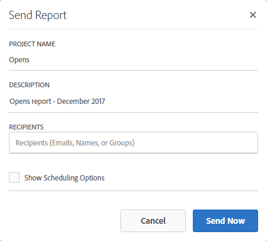

# Rapportgränssnitt{#reporting-interface}

I det övre verktygsfältet kan du till exempel ändra, spara eller skriva ut rapporten.

Använd fliken **Projekt** för att:

* **Öppna..**: Öppnar en rapport eller mall som skapats tidigare.
* **Spara som..**: Duplicerar mallar för att kunna ändra dem.
* **Uppdatera projekt**: Uppdaterar din rapport baserat på nya data och ändringar av filter.
* **Hämta CSV**: Exporterar dina rapporter till en CSV-fil.

På fliken **Redigera** kan du:

* **Ångra**: Avbryter din senaste åtgärd på instrumentpanelen.
* **Radera allt**: Tar bort alla paneler på kontrollpanelen.

Med tabellen **Infoga** kan du anpassa rapporter genom att lägga till diagram och tabeller på kontrollpanelen:

* **Ny tom panel**: Lägger till en ny tom panel på instrumentpanelen.
* **Ny friform**: Lägger till en ny friformstabell på kontrollpanelen.
* **Ny rad**: Lägger till ett nytt linjediagram på instrumentpanelen.
* **Nytt fält**: Lägger till ett nytt stapeldiagram på instrumentpanelen.

**Relaterade ämnen:**

* [Lägga till paneler](../../reporting/using/adding-panels.md)
* [Lägga till visualiseringar](../../reporting/using/adding-visualizations.md)
* [Lägga till komponenter](../../reporting/using/adding-components.md)
* [Dela rapporter automatiskt med intressenter via e-post](https://helpx.adobe.com/campaign/kb/simplify-campaign-management.html#Reportandshareinsightswithallstakeholders)

## Tabbar {#tabs}

Med de vänstra flikarna kan du skapa en rapport och filtrera data efter behov.

Med de här flikarna får du tillgång till följande objekt:

* **[!UICONTROL Panels]**: lägg till en tom panel eller ett frihandsritat i rapporten för att börja filtrera dina data. Mer information finns i avsnittet Lägga till paneler
* **[!UICONTROL Visualizations]**: dra och släpp ett urval av visualiseringsobjekt för att ge rapporten en grafisk dimension. Mer information finns i avsnittet Lägga till visualiseringar.
* **[!UICONTROL Components]**: anpassa era rapporter med olika dimensioner, mätvärden, segment och tidsperioder.

## Verktygsfält {#toolbar}

Verktygsfältet finns ovanför arbetsytan. Med olika flikar kan du till exempel ändra, spara, dela eller skriva ut rapporten.

**Relaterade ämnen:**

* [Lägga till paneler](../../reporting/using/adding-panels.md)
* [Lägga till visualiseringar](../../reporting/using/adding-visualizations.md)
* [Lägga till komponenter](../../reporting/using/adding-components.md)

### Fliken Projekt {#project-tab}

Använd fliken **Projekt** för att:

* **Öppna..**: Öppnar en rapport eller mall som skapats tidigare.
* **Spara som..**: Duplicerar mallar för att kunna ändra dem.
* **Uppdatera projekt**: Uppdaterar din rapport baserat på nya data och ändringar av filter.
* **Hämta CSV**: Exporterar dina rapporter till en CSV-fil.
* **[!UICONTROL Print]**: Skriv ut rapporten.

### Fliken Redigera {#edit-tab}

På fliken **Redigera** kan du:

* **Ångra**: Avbryter din senaste åtgärd på instrumentpanelen.
* **Radera allt**: Tar bort alla paneler på kontrollpanelen.

### Infoga flik {#insert-tab}

På fliken **Infoga** kan du anpassa rapporter genom att lägga till diagram och tabeller på kontrollpanelen:

* **Ny tom panel**: Lägger till en ny tom panel på instrumentpanelen.
* **Ny friform**: Lägger till en ny friformstabell på kontrollpanelen.
* **Ny rad**: Lägger till ett nytt linjediagram på instrumentpanelen.
* **Nytt fält**: Lägger till ett nytt stapeldiagram på instrumentpanelen.

### Fliken Dela {#share-tab}

På fliken **[!UICONTROL Share]** kan du skicka rapporter med Adobe Campaign-användare via e-post med en bild eller återkommande. Målanvändarna får sedan ett e-postmeddelande med din rapport bifogad.

* **[!UICONTROL Send report now]**: Skicka rapporten till en lista över valda mottagare via ett e-postmeddelande.

   1. Lägg till en beskrivning i fönstret **[!UICONTROL Send report]** om det behövs.

      

   1. Markera mottagarna i e-postmeddelandet genom att klicka på fältet och välja dem i listrutan eller genom att skriva deras e-postadresser.
   1. Markera **[!UICONTROL Show scheduling options]** om du vill skicka återkommande e-postmeddelanden. Du kan också göra detta genom att välja **[!UICONTROL Send Report on schedule]** på fliken **[!UICONTROL Share]**.
   1. Klicka på **[!UICONTROL Send now]**. Mottagarna får sedan ett e-postmeddelande med rapporten bifogad.

* **[!UICONTROL Send report on schedule]**: Schemalägg rapporten och skicka återkommande e-postmeddelanden till mottagarna.

   1. Lägg till en beskrivning i fönstret **[!UICONTROL Send report]** om det behövs.
   1. Markera mottagarna i e-postmeddelandet genom att klicka på fältet och välja dem i listrutan eller genom att skriva deras e-postadresser.

      

   1. Välj start- och slutdatum för att konfigurera din e-postgiltighet i fälten **[!UICONTROL Starting on]** och **[!UICONTROL Ending on]**.
   1. Välj hur ofta ditt e-postmeddelande ska skickas.

      

   1. Klicka på **[!UICONTROL Send on schedule]** så får mottagarna ditt återkommande e-postmeddelande beroende på hur ofta de väljer.

* **[!UICONTROL Scheduled reports]**: Hitta och konfigurera alla schemalagda rapporter.

   1. I fönstret **[!UICONTROL Scheduled reports]** hittar du alla dina återkommande skickade rapporter.

      

   1. Om du behöver ta bort en schemalagd rapport markerar du den schemalagda rapport som du vill ta bort och klickar sedan på **[!UICONTROL Delete the section]**.
   1. Om du vill konfigurera eller kontrollera dina schemalagda rapporter klickar du direkt på den rapport du vill ändra.
   1. Fönstret **[!UICONTROL Edit scheduled report]** visas. Nu kan du ändra mottagare eller frekvens för ditt e-postmeddelande om det behövs.

Målanvändarna får sedan ett e-postmeddelande med din rapport bifogad direkt i sina inkorgar. Användare kan alltid bestämma sig för att sluta ta emot återkommande e-postmeddelanden via en länk för att avbryta prenumerationen som finns i varje återkommande e-postmeddelande.

**Relaterat ämne:**

* [Dela rapporter automatiskt med intressenter via e-post](https://helpx.adobe.com/campaign/kb/simplify-campaign-management.html#Reportandshareinsightswithallstakeholders)
