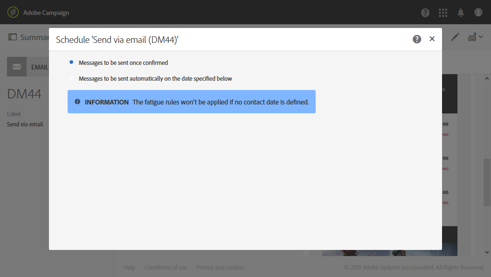

# Om schemaläggning av meddelanden{#about-scheduling-messages}

>[!CAUTION]
>
>När du ändrar ett leveransschema måste du förbereda leveransen på nytt genom att klicka på **Förbered** innan du klickar på **Bekräfta**.

I meddelandekontrollpanelen kan du definiera när meddelanden (e-post, SMS eller push-meddelanden) ska skickas med blocket **[!UICONTROL Schedule]** .

Med **[!UICONTROL Schedule]** egenskaperna kan du ange sändningsalternativ för e-postmeddelanden, SMS eller push-meddelanden:

* **[!UICONTROL Messages to be sent once confirmed]**: meddelanden skickas så snart som sändningen har bekräftats. Se [Bekräfta sändningen](../../sending/using/confirming-the-send.md).

   

* **[!UICONTROL Messages to be sent automatically on the date specified below]**: meddelanden skickas vid ett senare datum och vid ett senare tillfälle. Ange **kontaktdatum** i fältet **Börja skicka från** .

   Du kan förbereda och bekräfta sändningen, men meddelanden skickas endast med början av det valda datumet och den valda tiden. Förberedelser och bekräftelse av sändning presenteras i [Förbereda sändning](../../sending/using/preparing-the-send.md) och [Bekräfta sändning](../../sending/using/confirming-the-send.md) .

   I den **[!UICONTROL Time zone of the contact date]** nedrullningsbara listan kan du ändra den tidszon som ska beaktas för sändningstiden. Om du till exempel anger 09.00 i **[!UICONTROL Start sending from]** fältet och väljer Bryssel, Köpenhamn, Madrid, Paris (GMT+1) i **[!UICONTROL Time zone of the contact date]** listrutan får alla mottagare meddelandet 09.00 i Paris. Därför kommer en mottagare i Moskva (GMT+3) att få meddelandet kl. 11.00 i Moskva.

   Om du vill bekräfta sändningen manuellt markerar du **[!UICONTROL Request confirmation before sending messages]** alternativet. Det här alternativet är aktiverat som standard.

   

>[!CAUTION]
>
>När en leverans dupliceras tas alla schemainställningar bort. Såvida du inte schemalägger ett nytt kontaktdatum, skickas den duplicerade leveransen så snart som sändningen har bekräftats.

**Relaterade ämnen**:

* [Optimera sändningstiden](../../sending/using/optimizing-the-sending-time.md)
* [Skicka meddelanden i mottagarens tidszon](../../sending/using/sending-messages-at-the-recipient-s-time-zone.md)
* [Beräkna utskicksdatum](../../sending/using/computing-the-sending-date.md)

