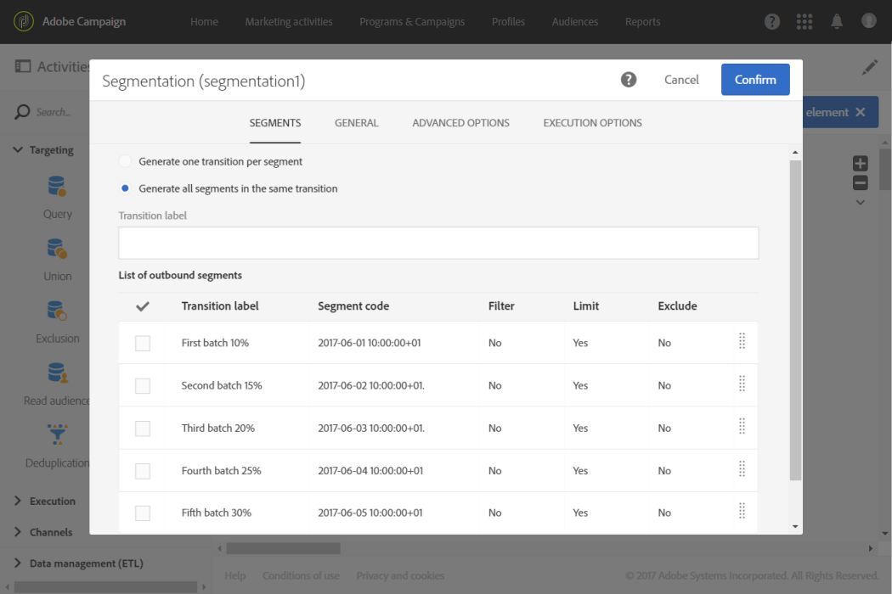
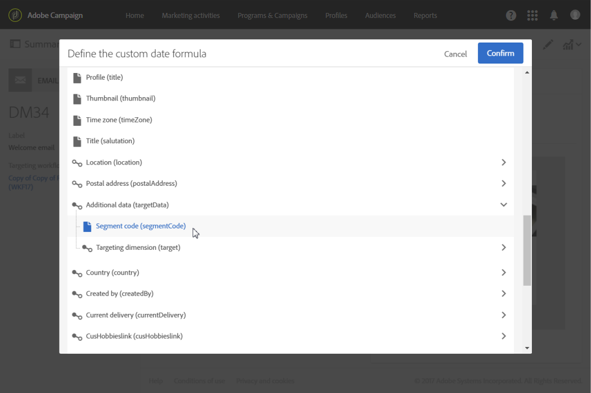
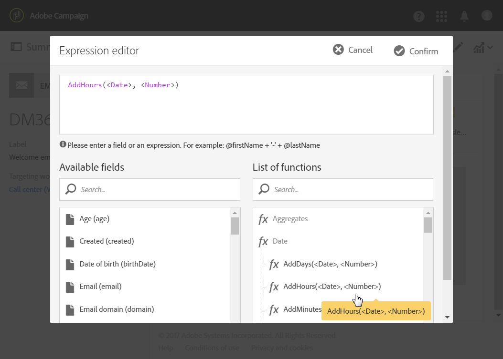

# Beräkna utskicksdatum{#computing-the-sending-date}

Du kan definiera en formel som skickar meddelandet till varje mottagare vid ett visst datum och en viss tidpunkt.

## Anpassa datumformeln {#customizing-date-formula}

Du kan till exempel använda tidsoptimering för sändning under avstämningsprocessen.

När e-postmeddelanden skickas via en ny plattform, är Internetleverantörer (ISP) misstänkta för IP-adresser som inte känns igen. Om stora mängder e-postmeddelanden plötsligt skickas markerar internetleverantörerna dem ofta som skräppost.

För att undvika att markeras som skräppost kan du stegvis öka volymen som skickas genom att distribuera stora mängder e-post över olika tidpunkter. Detta bör säkerställa en smidig utveckling av startfasen och göra det möjligt att minska den totala frekvensen av ogiltiga adresser.

Du kan till exempel segmentera målgruppen slumpmässigt för att skicka leveransen i fem grupper. Du kommer att skicka en första grupp som representerar 10 % av målgruppen den 1 juni kl. 10:00, en andra omgång 24 timmar senare med 15 % av målgruppen osv.

Du kan schemalägga detta med ett arbetsflöde.


1. Få tillgång till listan över marknadsföringsaktiviteter och skapa ett nytt arbetsflöde. Se [Skapa ett arbetsflöde](../../automating/using/building-a-workflow.md#creating-a-workflow).
1. Dra och släpp en **Query**-aktivitet i ditt arbetsflöde och öppna den. Se avsnittet [Fråga](../../automating/using/query.md).
1. Välj en målgrupp, till exempel alla dina guldkunder, och klicka på **[!UICONTROL Confirm]** för att spara frågan.
1. Dra och släpp en **segmenteringsaktivitet** i ditt arbetsflöde och öppna den. Se avsnittet [Segmentering](../../automating/using/segmentation.md).
1. Definiera fem segment. För varje segment:

   * Fyll i fältet **[!UICONTROL Segment code]**: Ange manuellt datum och tid för när meddelandet ska skickas.

      Du vill till exempel skicka den första gruppen den 1 juni kl. 10:00 GMT+1. Använd följande format: **ÅÅÅ-MM-DD hh:mm:ss+tz**.

      

      Om du vill skicka nästa grupp dagen efter anger du **2017-06-02 10:00:00+01** för det andra segmentet.

      För de återstående segmenten definierar du nästa grupp enligt följande:

      * **2017-06-03 10:00:00+01**
      * **2017-06-04 10:00:00+01**
      * **2017-06-05 10:00:00+01**
   * Se till att du väljer alternativet **[!UICONTROL Limit the population of this segment]**.

      På fliken **[!UICONTROL Limitation]** väljer du **[!UICONTROL Random sampling]** och anger önskad procentsats för varje segment: 10 för den första omgången, 15 för den andra och så vidare.

      


1. När alla segment har definierats väljer du **[!UICONTROL Generate all segments in the same transition]** och klickar på **[!UICONTROL Confirm]**.

   

1. Dra och släpp en **e-postleveransaktivitet** i ditt arbetsflöde och öppna den. Se avsnittet [E-postleverans](../../automating/using/email-delivery.md).
1. Klicka på **[!UICONTROL Schedule]**-avsnittet i e-postinstrumentpanelen och välj **[!UICONTROL Messages to be sent automatically on the date specified below]**.
1. Ange ett kontaktdatum i fältet **[!UICONTROL Start sending from]**.
1. Välj **[!UICONTROL Send at a custom date defined by a formula]** i listrutan Tidsoptimering för sändning.
1. Klicka på knappen **[!UICONTROL Edit an expression]** i fältet **[!UICONTROL Custom date formula]**.

   

1. Skapa följande uttryck med hjälp av funktionen **[!UICONTROL ToDateTime]** och fältet **[!UICONTROL Segment code]**. Du kan även skriva direkt i uttrycket men se till att använda rätt syntax och stavning.

   ```
   ToDateTime([targetData/@segmentCode])
   ```

   Funktionen **[!UICONTROL ToDateTime]** omformar segmentkoden från en textsträng till ett datum- och tidsvärde.

   Bekräfta uttrycket för att återgå till föregående skärm.

   

   I fönstret **[!UICONTROL Schedule]** visas den anpassade datumformeln enligt följande:

   ```
   ToDateTime([targetData/@segmentCode])
   ```

   

1. Bekräfta schemat, spara leveransen och kör arbetsflödet.

Leveransen skickas sedan successivt till alla mottagare under fem dagar.

>[!NOTE]
>
>Kontrollera att alla datum finns i framtiden när du bekräftar sändningen. Annars skickas meddelandet så snart som sändningen har bekräftats.

## Använda ett uttryck {#using-an-expression}

Tidsoptimering för sändning är också användbart för kampanjer som involverar ett callcenter. Du kan se till att alla meddelanden inte tas emot samtidigt. På så sätt kan organisationen behandla antalet samtal enligt sin kapacitet.

Du vill till exempel skicka ett e-postmeddelande med en inbjudan till dina kunder att kontakta ett callcenter för att få ett kampanjerbjudande. För att undvika att överbelasta callcentret väljer du att segmentera målgruppen slumpmässigt och skicka e-postmeddelandet i fyra omgångar.

Du kan schemalägga detta med ett arbetsflöde.


1. Få tillgång till listan över marknadsföringsaktiviteter och skapa ett nytt arbetsflöde. Se [Skapa ett arbetsflöde](../../automating/using/building-a-workflow.md#creating-a-workflow).
1. Dra och släpp en **Query**-aktivitet i ditt arbetsflöde och öppna den. Se avsnittet [Fråga](../../automating/using/query.md).
1. Välj en målgrupp, till exempel över 35 profiler, och klicka på **[!UICONTROL Confirm]** för att spara frågan.
1. Dra och släpp en **segmenteringsaktivitet** i ditt arbetsflöde och öppna den. Se avsnittet [Segmentering](../../automating/using/segmentation.md).
1. Definiera fyra segment. För varje segment:

   * Definiera segmentkoderna enligt följande:

      * 08:00-10:00: **0**. Meddelandet skickas till målpopulationens första kvartal kl. 8.00 (kontaktdatum).
      * 10:00-12:00: **2**. Meddelandet skickas till målpopulationens andra kvartal kl. 10.00 (kontaktdatum + 2 timmar).
      * 2:00 PM - 17:00: **6**. Samtalscentret stängs mellan kl. 12.00 och kl. 2:00, och meddelandet skickas till målpopulationens tredje kvartal kl. 2:00 (kontaktdatum + 6 timmar).
      * 4:00 PM - 18:00: **8**. Meddelandet skickas till målpopulationens sista kvartal kl. 17:00 (kontaktdatum + 8 timmar).

      >[!NOTE]
      >
      >Kontaktdatumet definieras i e-postleveransaktiviteten senare i arbetsflödet.

   * Se till att du väljer alternativet **[!UICONTROL Limit the population of this segment]**.
   * På fliken **[!UICONTROL Limitation]** väljer du **[!UICONTROL Random sampling]** och anger önskad procentsats för varje segment: **25**.


1. När alla segment har definierats väljer du **[!UICONTROL Generate all segments in the same transition]** och klickar på **[!UICONTROL Confirm]**.

   

1. Dra och släpp en **e-postleveransaktivitet** i ditt arbetsflöde och öppna den. Se avsnittet [E-postleverans](../../automating/using/email-delivery.md).
1. Klicka på **[!UICONTROL Schedule]**-avsnittet i e-postinstrumentpanelen.
1. Välj **[!UICONTROL Messages to be sent automatically on the date specified below]**.
1. Ange ett kontaktdatum i fältet **[!UICONTROL Start sending from]**.

   I det här exemplet väljer du 25 maj 08:00.

1. I listrutan Tidsoptimering för sändning väljer du **[!UICONTROL Send at a custom date defined by a formula]** och klickar på knappen **[!UICONTROL Edit an expression]**.

   

1. I **[!UICONTROL Expression editor]** anger du datum och segmentkoder för att beräkna data för varje kund.

   Välj **[!UICONTROL AddHours]** i listan över funktioner.

   

   I de tillgängliga fälten väljer du **[!UICONTROL Current delivery]** > **[!UICONTROL Delivery scheduling]** > **[!UICONTROL Contact date]**.

   

   Detta gör att du kan hämta det datum och den tid som anges i fältet **[!UICONTROL Start sending from]**.

   Välj **[!UICONTROL ToInteger]** i listan över funktioner. I de tillgängliga fälten väljer du **[!UICONTROL Additional data]** > **[!UICONTROL Segment code]**.

   

   På så sätt kan du hämta de tal som du har angett i segmentkoderna.

   Du bör hämta följande formel:

   ```
   AddHours([currentDelivery/scheduling/@contactDate], ToInteger([targetData/@segmentCode]))
   ```

1. Bekräfta att du vill spara uttrycket. Bekräfta schemat, spara leveransen och kör arbetsflödet.

* Det första segmentet får meddelandet på kontaktdatumet (25 maj 08:00).
* Det andra segmentet får meddelandet två timmar senare (25 maj klockan 10:00).
* Det tredje segmentet kommer att få meddelandet sex timmar senare (25 maj klockan 2:00).
* Det fjärde segmentet får meddelandet åtta timmar senare (25 maj klockan 17:00).

