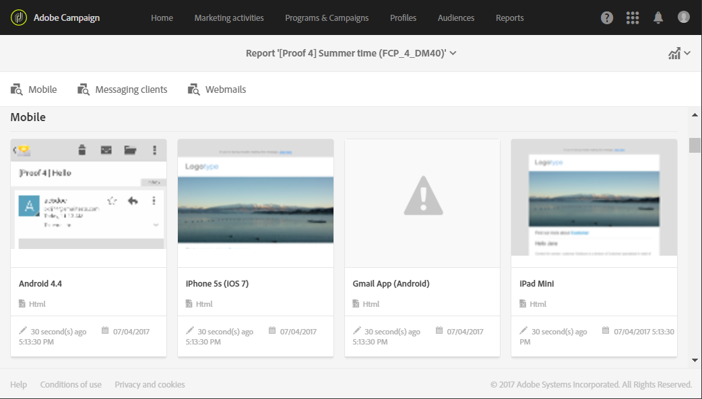

# Kontrollera e-postinnehåll{#control-email-content}

<!--TO KEEP because specific to Campaign-->

För att vara säker på att dina e-postmeddelanden når dina mottagare och förbättrar e-postleveransen måste de följa ett antal regler. Annars kan innehållet i vissa meddelanden identifieras som skräppost. Adobe Campaign tillhandahåller flera verktyg för att se till att ditt innehåll följer dessa regler.

Följ nedanstående principer när du utformar ditt meddelandeinnehåll:

* [Avsändarens namn och adress](#sender-name): adressen måste uttryckligen identifiera avsändaren. Domänen måste ägas av och registreras hos avsändaren. Domänregistret får inte privatiseras.

   <!--**Subject**: Avoid excessive capitalization and punctuation, and words that are frequently used by spammers ("Win", "Free", etc.).-->
* [Optimering av personalisering och sändningstid](#perso-send-time-optimization): genom att personalisera innehåll och definiera en sändningstid per mottagare ökar chanserna för att meddelandet öppnas.
* Bilder och text: respekterar ett bra förhållande mellan text och bild (till exempel 60 % text och 40 % bilder).
* [Unsubscription ](#opt-out) linkor and landing page: länken för att avbeställa prenumerationer är viktig. Den måste vara synlig och giltig och formuläret måste vara funktionellt.
* Förhandsgranska: Använd de verktyg som Adobe Campaign erbjuder för att kontrollera och optimera innehållet i e-postmeddelandet ([skräppostanalys](#anti-spam-analysis), [E-poståtergivning](#message-responsiveness)).

Fler tips om hur du kan optimera slutprodukten när du utformar innehåll finns i [Adobe Deliverability Best Practice Guide](https://experienceleague.adobe.com/docs/deliverability-learn/deliverability-best-practice-guide/content-best-practices-for-optimal-delivery.html).

>[!NOTE]
>
>Mer information om hur du redigerar e-postinnehåll finns i [e-postdesigneröversikten](../../designing/using/designing-content-in-adobe-campaign.md) och [Bästa praxis för meddelandedesign](../../designing/using/designing-content-in-adobe-campaign.md#content-design-best-practices).

## Avsändarens namn och adress {#sender-name}

Vissa Internet-leverantörer kontrollerar giltigheten för avsändaradressen (**[!UICONTROL From]**) innan meddelanden accepteras. En felformaterad adress kan leda till att den nekas av den mottagande servern.

Du måste se till att rätt adress anges på förekomstnivå eller i de vanligaste scenarierna. Kontakta administratören om du vill göra det.

Mer information finns i [Definiera e-postavsändare för ett e-postmeddelande](../../designing/using/subject-line.md#email-sender).

## Optimering av personalisering och sändningstid {#perso-send-time-optimization}

För att förbättra mottagarnas upplevelse och få dem att öppna ditt e-postmeddelande kan du anpassa dina meddelanden med Adobe Campaign. Mer information finns i [det här avsnittet](../../designing/using/personalization.md).

Om du vill öka öppningshastigheten för dina meddelanden kan du även manuellt definiera en sändningstid per mottagare. Varje profil får meddelandet vid det angivna datumet och den angivna tidpunkten, när det är möjligt. Mer information finns i [Optimera sändningstiden](../../sending/using/optimizing-the-sending-time.md).

## Länk och formulär för avanmälan {#opt-out}

När meddelandet analyseras kontrollerar en typologiregel som standard om en avanmälningslänk har inkluderats och genererar en varning om den saknas. Mer information om hur du hanterar länkar finns i [det här avsnittet](../../designing/using/links.md).

Du måste kontrollera att avanmälningslänken fungerar som den ska innan du skickar iväg den. När du till exempel [skickar korrekturet](../../sending/using/sending-proofs.md), kontrollerar du att länken är giltig, att formuläret är online och att valideringen av detta kontrollerar rutorna **[!UICONTROL No longer contact]**. Du bör göra den här kontrollen systematiskt eftersom det alltid är möjligt att göra mänskliga fel när du anger länken eller när du ändrar formuläret. Mer information om hur du hanterar anmälan och avanmälan finns i [det här avsnittet](../../audiences/using/managing-opt-in-and-opt-out-in-campaign.md).

Om ett problem upptäcks med att prenumerationen inte längre kan tas emot efter att leveransen har startats går det fortfarande att göra en manuell avanmälan (med funktionen för massuppdatering till exempel) för de mottagare som klickar på avanmälningslänken, även om de inte kunde bekräfta sitt val.

Som en allmän regel bör du inte försöka hindra mottagare som vill avanmäla sig genom att kräva att de fyller i fält som e-postadress eller namn, till exempel. Startsidan för den sista prenumerationen bör bara ha en valideringsknapp.

Begäran om ytterligare bekräftelse är inte tillförlitlig: en användare kan ha två e-postadresser som omdirigeras till samma ruta (till exempel: firstname.lastname@club.com och firstname.lastname@internet-club.com). Om profilen bara kommer ihåg den första adressen och vill avbeställa prenumerationen via ett meddelande som skickas till den andra, kommer formuläret att avslå detta eftersom den krypterade identifieraren och den angivna e-postadressen inte matchar.

## Analys av skräppostskydd {#anti-spam-analysis}

Adobe Campaign meddelanderedigerare integrerar en **skräppostanalys** som gör att du kan poängsätta e-postmeddelanden för att avgöra om ett meddelande löper risk att betraktas som skräppost av de skräppostverktyg som används vid mottagande. Mer information finns i [Förhandsvisa meddelanden](../../sending/using/previewing-messages.md).

Klicka på **[!UICONTROL Preview]** i meddelandets redigerare. Ett meddelande varnar dig om skräppostkontrollen har upptäckt en hög risk för det här meddelandet. Klicka på **[!UICONTROL Anti-spam analysis]** om du vill visa information.

## E-poståtergivning {#message-responsiveness}

Innan du skickar ditt meddelande kan du testa hur meddelandet kommer att se ut på olika enheter. Det är för att säkerställa att den visas på ett optimalt sätt på olika webbklienter, webbmejl och enheter.

Adobe Campaign hämtar återgivningen och gör den tillgänglig i en dedikerad rapport. På så sätt kan du förhandsgranska det skickade meddelandet i olika sammanhang där det kan tas emot.

Se [E-poståtergivning](../../sending/using/email-rendering.md) för mer information.
