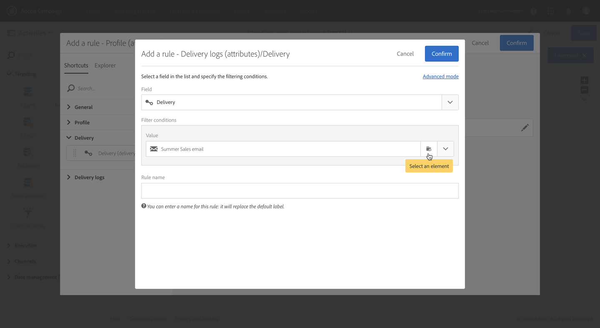

# Lägga till en kontrollgrupp {#adding-control-group}

Ni kan använda kontrollgrupper för att undvika att skicka meddelanden till en del av er målgrupp för att mäta effekten av era kampanjer.

Om du vill göra det i Adobe Campaign skapar du en <b>kontrollgrupp</b> när du definierar leveransmålet. Profiler läggs till i kontrollgruppen slumpmässigt, filtreras eller inte, eller baserat på kriterier.

Sedan kan du jämföra beteendet hos målpopulationen som fick meddelandet med beteendet hos kontakter som inte var målgrupper. Baserat på de sändande loggarna kan ni även inrikta er på en kontrollgrupp i framtida kampanjer.

<!--The control group is built when the delivery is prepared.-->

## Översikt {#overview}

Kontrollgruppen kan extraheras slumpmässigt från huvudmålet och/eller väljas från en viss population. Det finns alltså två sätt att definiera en kontrollgrupp:
* **Extrahera** ett antal profiler från huvudmålet.
* **Uteslut** vissa profiler baserat på villkor som definierats i en fråga.

Du kan använda båda metoderna när du definierar en kontrollgrupp.

Alla profiler som är en del av kontrollgruppen vid leveransförberedelsesteget tas bort från huvudmålet. De får inte meddelandet när det har skickats.

## Extrahera från målpopulationen {#extraction-target-population}

Om du vill definiera en kontrollgrupp kan du välja att extrahera, slumpmässigt eller baserat på en sortering, en procentandel eller ett fast antal profiler från målpopulationen.

### Målextrahering {#target-extraction}

Definiera först hur profilerna ska extraheras från målet: **slumpmässigt** eller baserat på en **sortering**.

Välj något av följande under **[!UICONTROL Target extraction]** avsnittet:

* **[!UICONTROL Random sampling]**: När leveransen förbereds extraherar Adobe Campaign slumpmässigt ett antal profiler som motsvarar procentandelen eller det högsta antal som du anger som [storleksgräns](#size-limit).

   Om du sedan anger tröskelvärdet till 10 i **[!UICONTROL Limits]** avsnittet, kommer kontrollgruppen att bestå av 10 % slumpmässigt utvalda från målpopulationen.<!--Change screenshot to match example)-->

   

* **[!UICONTROL Keep only the first records after sorting]**: Med det här alternativet kan du definiera en begränsning baserat på en eller flera sorteringsordningar.

   Exempel:

   * Välj **[!UICONTROL Age]** fältet som sorteringsvillkor.
   * Definiera 100 som tröskelvärde i **[!UICONTROL Limits]** avsnittet (se [Storleksgräns](#size-limit)).
   * Låt alternativet vara **[!UICONTROL Descending sort]** markerat.

   Kontrollgruppen består av de 100 äldsta mottagarna.<!--Change screenshot to match example)-->

   

   Det kan vara intressant att definiera en kontrollgrupp som innehåller profiler som gör få eller återkommande inköp och att jämföra deras beteende med de kontaktade mottagarna.

>[!NOTE]
>
>Välj **[!UICONTROL No extraction]** om du inte vill använda **[!UICONTROL Target extraction]** alternativet.

<!---->

### Storleksgräns {#size-limit}

Oavsett om du har markerat **[!UICONTROL Random sampling]** eller **[!UICONTROL Keep only the first records after sorting]** måste du ange hur du vill begränsa antalet profiler som du extraherar från huvudmålet. Gör något av följande:

* Markera **[!UICONTROL Size (as a % of the initial population)]** och fyll i motsvarande ram.

   Om du till exempel anger 10, beroende på vilket alternativ du har valt ovan, kommer Adobe Campaign antingen att:
   * Extrahera slumpmässigt 10% av målpopulationen.
   * Om du valde **[!UICONTROL Age]** fältet som sorteringsvillkor extraherar du de 10 % äldsta profilerna från målpopulationen.

   >[!NOTE]
   >
   >Om du avmarkerar **[!UICONTROL Descending sort]** alternativet extraheras de 10 % yngsta profilerna.

* Markera **[!UICONTROL Maximum size]** och fyll i motsvarande ram.

   Om du till exempel anger 100 kommer Adobe Campaign att antingen:
   * Extrahera slumpmässigt 100 profiler från målpopulationen.
   * Om du valde **[!UICONTROL Age]** fältet som sorteringsvillkor extraherar du de 100 äldsta profilerna från målpopulationen.

   >[!NOTE]
   >
   >Om du avmarkerar **[!UICONTROL Descending sort]** alternativet extraheras de 100 yngsta profilerna.

## Utesluta en viss population {#excluding-specific-population}

Ett annat sätt att definiera en kontrollgrupp är att utesluta en specifik population från målet med hjälp av en fråga.

Så här gör du:

1. From the **[!UICONTROL Target exclusion]** section, click **[!UICONTROL Define target exclusion]**.

   

1. Definiera uteslutningskriterierna med [frågeredigeraren](../../automating/using/editing-queries.md). Du kan också välja en [målgrupp](../../audiences/using/about-audiences.md) som har skapats tidigare.

   

1. Klicka på **[!UICONTROL Confirm]**.

Profilerna som matchar frågeresultatet tas inte med i målet.

<!--For more on using the query editor, see the [Editing queries](../../automating/using/editing-queries.md) section.-->

## Användningsfall: konfigurera en kontrollgrupp {#control-group-example}

Nedan visas ett exempel som visar hur du definierar en kontrollgrupp med båda metoderna: extrahera profiler från huvudmålet och använda en fråga för att exkludera en viss population.

1. Skapa ett arbetsflöde. De detaljerade stegen för att skapa ett arbetsflöde visas i avsnittet [Skapa ett arbetsflöde](../../automating/using/building-a-workflow.md).
1. I **[!UICONTROL Activities]** > **[!UICONTROL Targeting]** drar och släpper du en [Query](../../automating/using/query.md) -aktivitet. Dubbelklicka på aktiviteten och definiera målet. <!--For example, in **[!UICONTROL Shortcuts]**, drag and drop **[!UICONTROL Profile]**, select **[!UICONTROL Age]** with the operator **[!UICONTROL Greater than]** and type 25 in the **[!UICONTROL Value]** field.-->

1. I **[!UICONTROL Activities]** > **[!UICONTROL Channels]** drar och släpper du en aktivitet för [e-postleverans](../../automating/using/email-delivery.md) efter huvudmålsegmentet och redigerar den.
1. Klicka på **[!UICONTROL Audience]** blocket på kontrollpanelen för leverans.

1. Klicka på fliken **[!UICONTROL Control group]**.  

   

1. Välj i **[!UICONTROL Target extraction]** avsnittet **[!UICONTROL Keep only the first records after sorting]**.
1. Sortera på sidan och låt alternativet för **[!UICONTROL Descending]** sortering vara markerat.

   

1. Ange 100 som maximal storlek. De 100 äldsta profilerna från ditt mål extraheras.

1. I **[!UICONTROL Target exclusion]** avsnittet definierar du de profiler som ska uteslutas från målet, baserat på de villkor du väljer med [frågeredigeraren](../../automating/using/editing-queries.md). Exempel:&quot;Ålder är mindre än 20&quot;.

   

   Profilerna som är yngre än 20 år kommer att uteslutas.

1. Starta [leveransförberedelsen](../../sending/using/preparing-the-send.md) och [bekräfta sändningen](../../sending/using/confirming-the-send.md).

De profiler som har extraherats (de 100 äldsta profilerna) och de som definierats baserat på frågan (profilerna under 20) tas bort från huvudmålet. De kommer inte att få meddelandet.

## Jämföra resultaten {#delivery-logs}

Nu när du har skickat leveransen, vad kan du göra med kontrollgruppen?

Du kan extrahera de **sändande loggarna** för att jämföra hur kontrollgruppen som inte fick kommunikationen fungerade jämfört med det effektiva målet. Du kan också använda leveransloggarna för att **skapa en ny målinriktning**.

>[!IMPORTANT]
>
>Du måste ha en [administratörsroll](../../administration/using/users-management.md#functional-administrators) och vara en del av **[!UICONTROL All]** organisationsenheten  för att kunna ansluta till Adobe Campaign. Om du vill begränsa åtkomsten för en viss användare eller grupp av användare ska du inte länka den till **[!UICONTROL All]** enheter för att kunna komma åt leveransloggar.

### Kontrollera leveransloggarna {#checking-logs}

Om du vill se vilka profiler som har tagits bort från målet efter att meddelandet har skickats markerar du **[!UICONTROL Delivery logs]**. Mer information om leveransloggar och hur du kommer åt dem finns i [det här avsnittet](../../sending/using/monitoring-a-delivery.md#delivery-logs).

* På **[!UICONTROL Sending logs]** fliken kan du se de extraherade och exkluderade profilerna. De har samma **[!UICONTROL Ignored]** status och **[!UICONTROL Control group]** orsak till misslyckandet.

   

* Du kan också kontrollera fliken **[!UICONTROL Exclusion causes]** för att se hur många profiler som inte ingick i leveransen.

   

### Använda kontrollgruppens loggar {#using-logs}

När leveransen har skickats kan du använda leveransloggarna för att filtrera de profiler som inte fick meddelandet. Följ stegen nedan:

1. Skapa ett arbetsflöde. De detaljerade stegen för att skapa ett arbetsflöde visas i avsnittet [Skapa ett arbetsflöde](../../automating/using/building-a-workflow.md).
1. I **[!UICONTROL Activities]** > **[!UICONTROL Targeting]** drar och släpper du en [Query](../../automating/using/query.md) -aktivitet.
1. På **[!UICONTROL Properties]** fliken anger du **[!UICONTROL Delivery logs]** som **[!UICONTROL Resource]** och **[!UICONTROL Profile]** som **[!UICONTROL Targeting dimension]**.

   

1. På fliken **[!UICONTROL Target]** klickar du på **[!UICONTROL Delivery logs]**.
1. Dra och släpp **[!UICONTROL Status]** och välj **[!UICONTROL Ignored]** som filtervillkor.

   

1. Klicka på **[!UICONTROL Confirm]**.

1. Fortsätt vara på **[!UICONTROL Target]** fliken, dra och släpp **[!UICONTROL Nature of failure]** och välj **[!UICONTROL Control group]** som filtervillkor.

   

1. Klicka på **[!UICONTROL Confirm]**.

   

Du kan sedan exportera loggdata med en **extraheringsfilsaktivitet** följt av en **överföringsfilsaktivitet** , till exempel. På så sätt kan ni i ert eget rapporteringsverktyg analysera resultaten av kampanjen på det effektiva målet jämfört med kontrollgruppen. For more on exporting logs, see [this section](../../automating/using/exporting-logs.md).

### Ange kontrollgruppen som mål {#targeting-control-group}

Om du vill göra en målgruppsanpassning baserat på de profiler som inte fick meddelandet kan du även använda leveransloggarna. Följ stegen nedan:

1. Skapa ett arbetsflöde. De detaljerade stegen för att skapa ett arbetsflöde visas i avsnittet [Skapa ett arbetsflöde](../../automating/using/building-a-workflow.md).
1. I **[!UICONTROL Activities]** > **[!UICONTROL Targeting]** drar och släpper du en första [Query](../../automating/using/query.md) -aktivitet.
1. Kontrollera på **[!UICONTROL Properties]** fliken att **[!UICONTROL Profile]** resursen är markerad som **[!UICONTROL Resource]** och **[!UICONTROL Targeting dimension]**.

   

1. Utöka **[!UICONTROL Target]** och dra och släpp på **[!UICONTROL Delivery]** fliken **[!UICONTROL Delivery logs]**.

   

1. Dra och släpp i **[!UICONTROL Add a rule]** fönstret **[!UICONTROL Delivery]**.

   

1. Välj det e-postmeddelande du skickade som filtervillkor. Klicka på **[!UICONTROL Confirm]**.

   

1. Tillbaka i **[!UICONTROL Add a rule]** fönstret, dra och släpp **[!UICONTROL Status]** och välj **[!UICONTROL Ignored]** som filtervillkor. Klicka på **[!UICONTROL Confirm]**.

   

1. Dra och släpp **[!UICONTROL Nature of failure]** och välj **[!UICONTROL Control group]** som filtervillkor. Klicka på **[!UICONTROL Confirm]**.

   

1. Kontrollera att alla villkor är justerade mot operatorn **AND** boolesk.

   

1. Klicka på **[!UICONTROL Confirm]**.

Nu kan du ange de profiler som inte fick ditt första meddelande som mål, eftersom de var en del av kontrollgruppen och skickade ett nytt e-postmeddelande till dem.

I samma arbetsflöde kan du även skapa en annan fråga för de profiler som fick e-postmeddelandet och skicka ett annat meddelande till dem.

