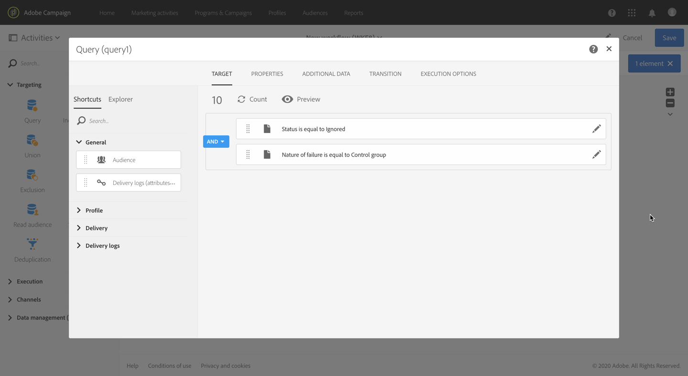
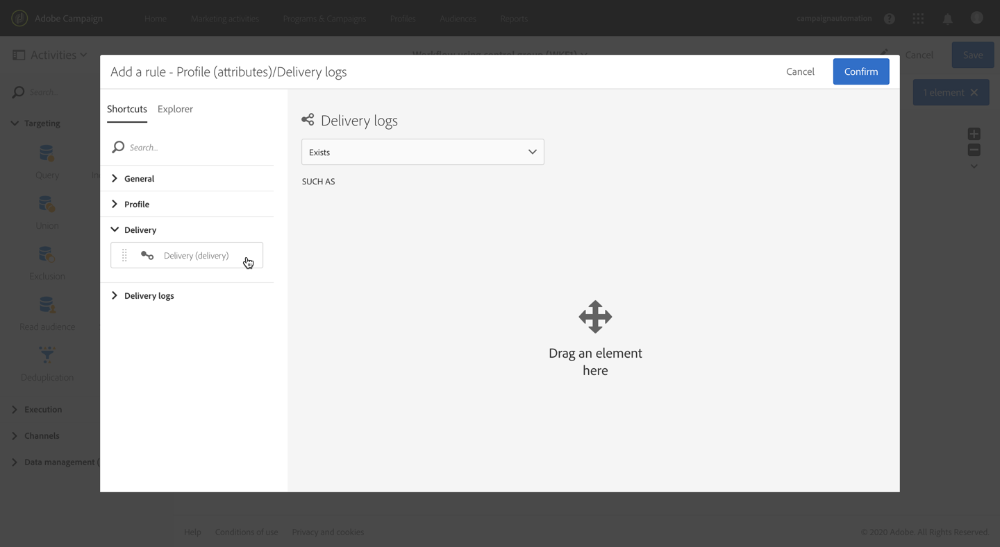

# Lägga till en kontrollgrupp {#adding-control-group}

Du kan använda kontrollgrupper för att undvika att skicka meddelanden till en del av målgruppen för att kunna mäta effekten av kampanjerna.

Gör detta i Adobe Campaign genom att skapa en <b>kontrollgrupp</b> när du definierar leveransmålet. Profiler läggs slumpmässigt till i kontrollgruppen, filtrerade eller inte, eller baserat på kriterier.

Sedan kan du jämföra beteendet hos målpopulationen som fick meddelandet med beteendet hos kontakter som inte var med i målgrupperna. Baserat på de skickade loggarna kan du även inrikta dig på en kontrollgrupp i framtida kampanjer.

<!--The control group is built when the delivery is prepared.-->

## Översikt {#overview}

Kontrollgruppen kan extraheras slumpmässigt från huvudmålet och/eller väljas från en viss målgrupp. Det finns därför två sätt att definiera en kontrollgrupp:
* **Extrahera** ett antal profiler från huvudmålet.
* **Uteslut** vissa profiler baserat på villkor som definierats i en fråga.

Du kan använda båda metoderna för att definiera en kontrollgrupp.

Alla profiler som är en del av kontrollgruppen vid leveransens förberedelsesteg tas bort från huvudmålet. De får inte meddelandet när det har skickats.

## Extrahera från målpopulationen {#extraction-target-population}

För att definiera en kontrollgrupp kan du välja att extrahera – slumpmässigt eller baserat på en sortering – en procentandel eller ett fast antal profiler från målpopulationen.

### Extrahera från mål {#target-extraction}

Definiera först hur profilerna ska extraheras från målet: **slumpmässigt** eller baserat på en **sortering**.

Välj något av följande i avsnittet **[!UICONTROL Target extraction]**:

* **[!UICONTROL Random sampling]**: när leveransen förbereds extraherar Adobe Campaign slumpmässigt ett antal profiler som motsvarar procentandelen eller det högsta antal som du anger som [storleksgräns](#size-limit).

   Om du till exempel sedan anger tröskelvärdet 10 i avsnittet **[!UICONTROL Limits]** består kontrollgruppen av 10 % som väljs slumpmässigt från målpopulationen.<!--Change screenshot to match example)-->

   

* **[!UICONTROL Keep only the first records after sorting]**: med det här alternativet kan du definiera en begränsning baserat på en eller flera sorteringsvillkor.

   Exempel:

   * Välj fältet **[!UICONTROL Age]** som sorteringsvillkor.
   * Definiera 100 som tröskelvärde i avsnittet **[!UICONTROL Limits]** (se [Storleksgräns](#size-limit)).
   * Låt alternativet **[!UICONTROL Descending sort]** vara markerat.

   Resultatet blir att kontrollgruppen består av de 100 äldsta mottagarna.<!--Change screenshot to match example)-->

   

   Det kan vara intressant att definiera en kontrollgrupp som innehåller profiler som gör få eller återkommande inköp och att jämföra deras beteende med de kontaktade mottagarna.

>[!NOTE]
>
>Välj **[!UICONTROL No extraction]** om du inte vill använda alternativet **[!UICONTROL Target extraction]**.

<!---->

### Storleksgräns {#size-limit}

Oavsett om du har valt **[!UICONTROL Random sampling]** eller **[!UICONTROL Keep only the first records after sorting]** måste du ange hur du vill begränsa antalet profiler som du extraherar från huvudmålet. Gör något av följande:

* Välj **[!UICONTROL Size (as a % of the initial population)]** och fyll i motsvarande bildruta.

   Om du till exempel anger 10, beroende på vilket alternativ du har valt ovan, kommer Adobe Campaign antingen att:
   * Extrahera slumpmässigt 10 % av målpopulationen.
   * Om du valt fältet **[!UICONTROL Age]** som sorteringsvillkor extraheras 10 % av de äldsta profilerna från målpopulationen.

   >[!NOTE]
   >
   >Om du avmarkerar alternativet **[!UICONTROL Descending sort]** extraheras 10 % av de yngsta profilerna.

* Välj **[!UICONTROL Maximum size]** och fyll i motsvarande bildruta.

   Om du till exempel anger 100 kommer Adobe Campaign att antingen:
   * Slumpmässigt extrahera 100 profiler från målpopulationen.
   * Om du valt fältet **[!UICONTROL Age]** som sorteringsvillkor extraheras 100 av de äldsta profilerna från målpopulationen.

   >[!NOTE]
   >
   >Om du avmarkerar alternativet **[!UICONTROL Descending sort]** extraheras 100 av de yngsta profilerna.

## Utesluta en viss population {#excluding-specific-population}

Ett annat sätt att definiera en kontrollgrupp är att utesluta en specifik population från målet med hjälp av en fråga.

Så här gör du:

1. Klicka på **[!UICONTROL Define target exclusion]** i avsnittet **[!UICONTROL Target exclusion]**.

   

1. Definiera uteslutningskriterierna med [frågeredigeraren](../../automating/using/editing-queries.md). Du kan även välja en [målgrupp](../../audiences/using/about-audiences.md) som har skapats tidigare.

   

1. Klicka på **[!UICONTROL Confirm]**.

Profilerna som matchar frågeresultatet tas inte med i målet.

<!--For more on using the query editor, see the [Editing queries](../../automating/using/editing-queries.md) section.-->

## Användningsfall: konfigurera en kontrollgrupp {#control-group-example}

Nedan finns ett exempel som visar hur du definierar en kontrollgrupp med båda metoderna: extrahera profiler från huvudmålet och använda en fråga för att utesluta en viss population.

1. Skapa ett arbetsflöde. De detaljerade stegen för att skapa ett arbetsflöde visas i avsnittet [Skapa ett arbetsflöde](../../automating/using/building-a-workflow.md).
1. Dra och släpp en [Fråge](../../automating/using/query.md)-aktivitet i **[!UICONTROL Activities]** > **[!UICONTROL Targeting]**. Dubbelklicka på aktiviteten och definiera målet. <!--For example, in **[!UICONTROL Shortcuts]**, drag and drop **[!UICONTROL Profile]**, select **[!UICONTROL Age]** with the operator **[!UICONTROL Greater than]** and type 25 in the **[!UICONTROL Value]** field.-->

1. Dra och släpp en aktivitet för [e-postleverans](../../automating/using/email-delivery.md) efter huvudmålsegmentet och redigera den i **[!UICONTROL Activities]** > **[!UICONTROL Channels]**.
1. Klicka på blocket **[!UICONTROL Audience]** på kontrollpanelen för leverans.

1. Klicka på fliken **[!UICONTROL Control group]**.  

   

1. Välj **[!UICONTROL Keep only the first records after sorting]** i avsnittet **[!UICONTROL Target extraction]**.
1. Sortera per ålder och låt alternativet för sortering **[!UICONTROL Descending]** vara markerat.

   

1. Ange 100 som maximal storlek. De 100 äldsta profilerna från ditt mål extraheras.

1. I avsnittet **[!UICONTROL Target exclusion]** definierar du de profiler som ska uteslutas från målet baserat på de villkor du väljer med [frågeredigeraren](../../automating/using/editing-queries.md). Exempel: ”åldern är under 20”.

   

   Profilerna som är yngre än 20 år utesluts.

1. Starta [leveransförberedelsen](../../sending/using/preparing-the-send.md) och [bekräfta sändningen](../../sending/using/confirming-the-send.md).

De profiler som har extraherats (de 100 äldsta profilerna) och de som har definierats baserat på frågan (profilerna under 20) tas bort från huvudmålet. De får inte meddelandet.

## Jämföra resultaten {#delivery-logs}

Vad kan du göra med kontrollgruppen när du väl har skickat leveransen?

Du kan extrahera **loggarna med skickade meddelanden** för att jämföra hur kontrollgruppen som inte fick kommunikationen agerade jämfört med det effektiva målet. Du kan även använda leveransloggarna för att **skapa en ny målinriktning**.

>[!IMPORTANT]
>
>Du måste ha en [administratörsroll](../../administration/using/users-management.md#functional-administrators) och vara en del av [organisationsenheten](../../administration/using/organizational-units.md) för **[!UICONTROL All]** för att kunna ansluta till Adobe Campaign. Om du vill begränsa åtkomsten för en viss användare eller grupp av användare ska du inte länka den till **[!UICONTROL All]**-enheter för att kunna komma åt leveransloggar.

### Kontrollera leveransloggarna {#checking-logs}

Välj **[!UICONTROL Delivery logs]** för att se vilka profiler som har tagits bort från målet efter att meddelandet har skickats. Läs [det här avsnittet](../../sending/using/monitoring-a-delivery.md#delivery-logs) för mer information om leveransloggarna och hur du kommer åt dem.

* På fliken **[!UICONTROL Sending logs]** kan du se de extraherade och exkluderade profilerna. De har samma status **[!UICONTROL Ignored]** och **[!UICONTROL Control group]** som orsaken till misslyckandet.

   

* Du kan även kontrollera fliken **[!UICONTROL Exclusion causes]** för att se hur många profiler som inte inkluderades i leveransen.

   

### Använda kontrollgruppens loggar {#using-logs}

När leveransen har skickats kan du använda leveransloggarna för att filtrera de profiler som inte fått meddelandet. Följ stegen nedan:

1. Skapa ett arbetsflöde. De detaljerade stegen för att skapa ett arbetsflöde visas i avsnittet [Skapa ett arbetsflöde](../../automating/using/building-a-workflow.md).
1. Dra och släpp en [Fråge](../../automating/using/query.md)-aktivitet i **[!UICONTROL Activities]** > **[!UICONTROL Targeting]**.
1. På fliken **[!UICONTROL Properties]** ställer du in **[!UICONTROL Delivery logs]** som **[!UICONTROL Resource]** och **[!UICONTROL Profile]** som **[!UICONTROL Targeting dimension]**.

   

1. På fliken **[!UICONTROL Target]** klickar du på **[!UICONTROL Delivery logs]**.
1. Dra och släpp **[!UICONTROL Status]** och välj **[!UICONTROL Ignored]** som filtervillkor.

   

1. Klicka på **[!UICONTROL Confirm]**.

1. När du är på fliken **[!UICONTROL Target]** kan du dra och släppa **[!UICONTROL Nature of failure]** samt välja **[!UICONTROL Control group]** som filtervillkor.

   

1. Klicka på **[!UICONTROL Confirm]**.

   

Du kan sedan exportera loggdata med till exempel aktiviteten **extrahera fil** följt av aktiviteten **föra över fil**. På så sätt kan du i rapporteringsverktyget analysera resultaten av kampanjen på det effektiva målet jämfört med kontrollgruppen. Läs [det här avsnittet](../../automating/using/exporting-logs.md) för mer information om hur du exporterar loggar.

### Ange kontrollgruppen som mål {#targeting-control-group}

Du kan även använda leveransloggarna för att göra en målinriktning baserad på de profiler som inte fått meddelandet. Följ stegen nedan:

1. Skapa ett arbetsflöde. De detaljerade stegen för att skapa ett arbetsflöde visas i avsnittet [Skapa ett arbetsflöde](../../automating/using/building-a-workflow.md).
1. Dra och släpp först en [Fråge](../../automating/using/query.md)-aktivitet i **[!UICONTROL Activities]** > **[!UICONTROL Targeting]**.
1. Kontrollera att resursen **[!UICONTROL Profile]** är markerad som **[!UICONTROL Resource]** och **[!UICONTROL Targeting dimension]** på fliken **[!UICONTROL Properties]**.

   

1. Expandera **[!UICONTROL Delivery]** samt dra och släpp **[!UICONTROL Delivery logs]** på fliken **[!UICONTROL Target]**.

   

1. Dra och släpp **[!UICONTROL Delivery]** i fönstret **[!UICONTROL Add a rule]**.

   

1. Välj det e-postmeddelande du skickat som filtervillkor. Klicka på **[!UICONTROL Confirm]**.

   

1. I fönstret **[!UICONTROL Add a rule]** kan du dra och släppa **[!UICONTROL Status]** samt välja **[!UICONTROL Ignored]** som filtervillkor. Klicka på **[!UICONTROL Confirm]**.

   

1. Dra och släpp **[!UICONTROL Nature of failure]** och välj **[!UICONTROL Control group]** som filtervillkor. Klicka på **[!UICONTROL Confirm]**.

   

1. Kontrollera att alla villkor är justerade mot den booleska logikoperationen **AND**.

   

1. Klicka på **[!UICONTROL Confirm]**.

Du kan nu ange de profiler som inte fått ditt första meddelande som mål, eftersom de var en del av kontrollgruppen, och skicka ett nytt e-postmeddelande till dem.

I samma arbetsflöde kan du även skapa en annan fråga för de profiler som fått e-postmeddelandet och skicka dem ett annat meddelande.

