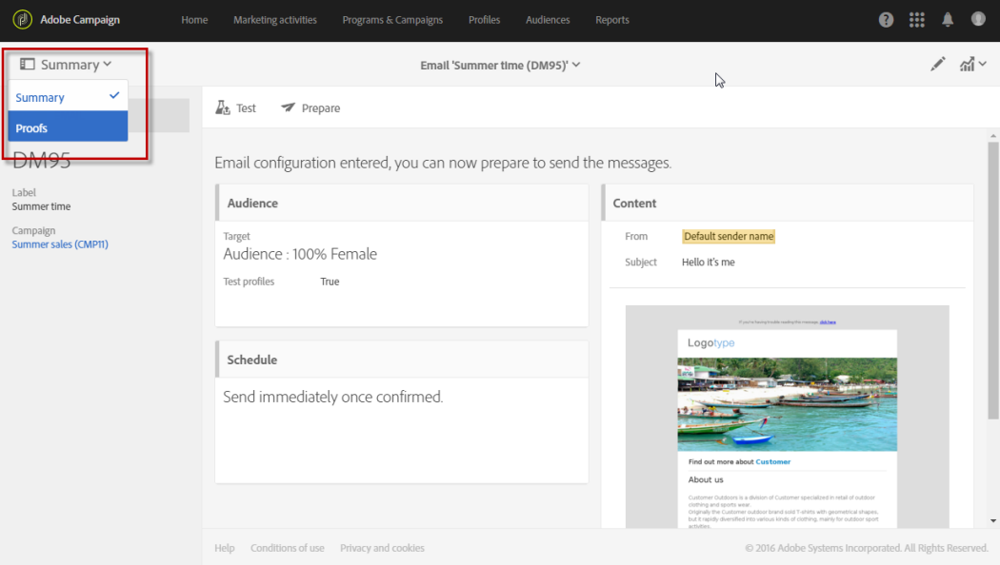

# E-poståtergivning{#email-rendering}

Innan du klickar på knappen **[!UICONTROL Send]** måste du se till att meddelandet visas på ett optimalt sätt på en mängd olika webbklienter, webbmejl och enheter.

Adobe Campaign hämtar återgivningen och gör den tillgänglig i en dedikerad rapport. På så sätt kan du förhandsgranska det skickade meddelandet i olika sammanhang där det kan tas emot.

De mobil-, meddelande- och webbpostklienter som är tillgängliga för **E-poståtergivning** i Adobe Campaign anges på Litmus-[webbplatsen](https://litmus.com/email-testing) (klicka på **Visa alla e-postklienter**).

## Genererar e-poståtergivning {#checking-the-email-rendering-report}

När du har skapat e-postleveransen och definierat innehållet samt målpopulationen följer du stegen nedan.

1. Klicka på **Målgrupp** för att öppna fliken **[!UICONTROL Test profiles]**.

   

1. Använd frågeredigeraren för att definiera de testprofiler som du vill använda, inklusive testprofilerna som ska användas för **E-poståtergivning**. Se [Testprofiler](../../audiences/using/managing-test-profiles.md).

   

1. Kontrollera och bekräfta frågan och spara sedan ändringarna.
1. Klicka på knappen **[!UICONTROL Test]** i åtgärdsfältet.

   

1. Markera alternativet **[!UICONTROL Email rendering]** och klicka sedan på **[!UICONTROL OK]**.

   

   >[!NOTE]
   >
   >Med alternativet **[!UICONTROL Proof + Email rendering]** kan du både skicka en korrekturläsning och använda e-poståtergivningsfunktionen på en och samma gång. Du kan få ditt meddelande godkänt av korrekturmottagarna och samtidigt testa hur meddelandet tas emot beroende på vilka inkorgar som används. Då måste du även välja Korrekturtestprofiler. Se [Testprofiler](../../audiences/using/managing-test-profiles.md).

   Testleveransen skickas.

1. Miniatyrbilderna för återgivning är tillgängliga några minuter efter att du har skickat meddelandena. Du öppnar dem genom att markera **[!UICONTROL Proofs]** i **[!UICONTROL Summary]**-listrutan.

   

1. Klicka på **[!UICONTROL Access email rendering]**-ikonen i **[!UICONTROL Proofs]**-listan.

   

Den dedikerade återgivningsrapporten för e-post visas. Se [Beskrivning av rapport om e-poståtergivning](#email-rendering-report-description).

**Relaterade ämnen**:

* [Skapa ett e-postmeddelande](../../channels/using/creating-an-email.md)
* [Skicka bevis](../../sending/using/sending-proofs.md)
* [Frågeredigerare](../../automating/using/editing-queries.md#about-query-editor)

## Återgivningsrapport för e-post {#email-rendering-report-description}

I den här rapporten visas e-poståtergivningarna så som de visas för mottagaren. E-poståtergivningen kan variera beroende på hur mottagaren öppnar e-postleveransen: i en webbläsare, på en mobil enhet eller via ett e-postprogram.

### Återgivningstoken

Antalet tillgängliga återgivningar visas i licensavtalet. Varje leverans med **E-poståtergivning** aktiverat minskar antalet tillgängliga återgivningar (så kallade tokens) med ett.

Tokens-konto för varje enskild återgivning och inte för hela återgivningsrapporten för e-post, vilket innebär att:

* **Varje** gång återgivningsrapporten för e-post genereras dras en token per meddelandeklient av: en token för Outlook 2000-återgivning, en för Outlook-återgivningen, en för Apple Mail-återgivningen och så vidare.

* **Om du genererar återgivningen av e-post igen för samma leverans** minskas antalet tillgängliga tokens igen med antalet genererade återgivningar.

### Rapportsammanfattning

Rapportsammanfattningen visar antalet mottagna, oönskade (skräppost), ej mottagna eller väntande mottagningar.

Rapporten är uppdelad i tre delar: **[!UICONTROL Mobile]**, **[!UICONTROL Messaging clients]** och **[!UICONTROL Webmails]**. Bläddra nedåt i rapporten för att visa alla återgivningar grupperade i dessa tre kategorier.

Klicka på motsvarande kort om du vill ha information om respektive rapport. Återgivningen visas för den valda mottagningsmetoden.

På fliken **[!UICONTROL Technical data]** kan du få mer information, t.ex. datum för när du tar emot och hämtar meddelanden samt fullständiga rubriker för e-postmeddelanden.
