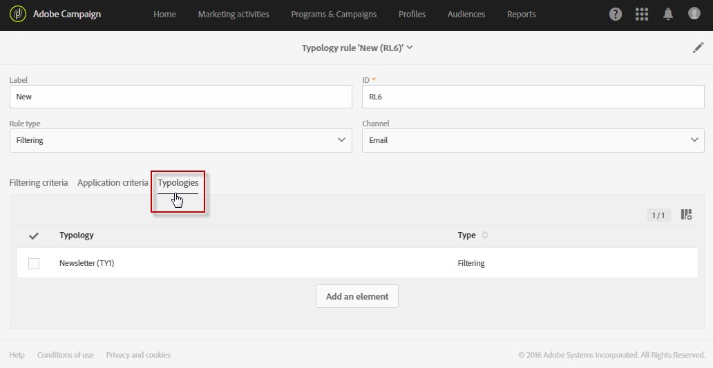
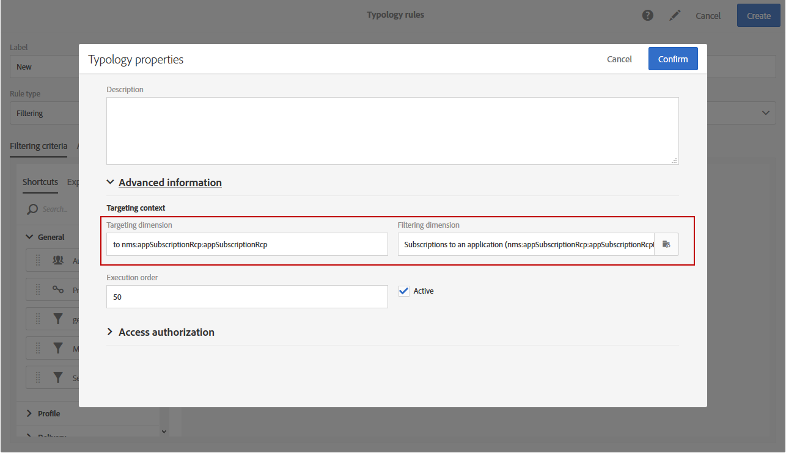

# Filtreringsregler {#filtering-rules}

Med filtreringsregler kan du utesluta en del av meddelandemålet enligt villkor som definierats i en fråga, till exempel profiler i karantän eller profiler som redan har skickats ett visst antal e-postmeddelanden.

## Standardregler för filtreringstyp {#default-filtering-typology-rules}

Tabellen nedan innehåller information om de färdiga filtreringsreglerna och deras relaterade kanaler.

| Etikett | Kanal | Beskrivning |
| ---------|----------|---------|
| **[!UICONTROL Address not specified]** | Alla | Utesluter målpopulationen utan angiven adress (e-postadress, postadress osv.) enligt den valda kanalen). |
| **[!UICONTROL Address on denylist]** | Alla | Exkluderar adresser som finns på blockeringslista. |
| **[!UICONTROL Duplicate]** | Alla | Exkluderar dubbletter som baseras på målpopulationen **[!UICONTROL Address]** fält. |
| **[!UICONTROL Exclude mobile applications]** | Mobilapplikation | Utesluter appprenumerationer som inte matchar mobilappen som definieras i meddelandet. |
| **[!UICONTROL Exclude mobile applications for In-App]** | I appen | Utesluter appprenumerationer som inte matchar det mobilprogram som definieras i meddelandet (mall i appen). |
| **[!UICONTROL Exclude mobile applications for In-App broadcast]** | I appen | Utesluter appprenumerationer som inte matchar det mobilprogram som definieras i meddelandet (sändningsmall i appen) |
| **[!UICONTROL Exclude mobile applications for Push]** | Mobilapplikation | Utesluter appprenumerationer som inte matchar det mobilprogram som definieras i meddelandet (för push) |
| **[!UICONTROL Quarantined address]** | Alla | Exkluderar adresser i karantän. |
| **[!UICONTROL Target limited in size]** | Alla | Kontrollerar om den maximala leveransstorleken har uppnåtts för målet. Gäller för direktutskick med alternativet &quot;leveransgräns&quot; aktiverat. |

Utöver dessa standardfiltreringsregler finns två undantagsregler:

* **[!UICONTROL Exclusion of addresses]** ( **[!UICONTROL addressExclusions]** )
* **[!UICONTROL Exclusion of domains]** ( **[!UICONTROL domainExclusions]** ).

Under e-postanalysen jämför dessa regler mottagarnas e-postadresser med de förbjudna adresserna eller domännamnen i en krypterad global undertryckningslista som hanteras i leveransinstansen. Om det finns en matchning skickas inte meddelandet till den mottagaren.

Detta för att undvika att läggas till i blockeringslista på grund av skadlig aktivitet, särskilt användning av en svampfälla. Om du till exempel använder en svällning för att prenumerera via ett av dina webbformulär, skickas ett bekräftelsemeddelande via e-post till den svällningen, vilket gör att din adress automatiskt läggs till i blockeringslista.

>[!NOTE]
>
>Adresserna och domännamnen som finns i den globala undertryckningslistan är dolda. Endast antalet uteslutna mottagare anges i leveransanalysloggarna.

## Skapa en filtreringsregel {#creating-a-filtering-rule}

Du kan skapa egna filtreringsregler efter behov. Du kan t.ex. filtrera målpopulationen för nyhetsbrev så att de som är yngre än 18 år aldrig får någon kommunikation.

Så här skapar du en filtreringstypologiregel:

1. Skapa en ny typologiregel. De viktigaste stegen för att skapa typologiregler finns i [det här avsnittet](../../sending/using/managing-typology-rules.md).

1. Välj **[!UICONTROL Filtering]** regeltyp och ange sedan önskad kanal.

1. I **[!UICONTROL Filtering criteria]** väljer du prenumerationer på **[!UICONTROL Subscription]** kategori.

   

1. I **[!UICONTROL Explorer]** -fliken i frågeredigeraren drar och släpper du **[!UICONTROL Subscriber]** noden i skärmens huvuddel.

   

1. Välj **[!UICONTROL Age]** och definiera filtreringsvillkoren så att prenumeranternas ålder är mindre än 18.

   

1. I **[!UICONTROL Typologies]** länka den här regeln till en typologi.

   

1. Kontrollera att typologin är markerad i den leverans- eller leveransmall som du vill använda. Mer information om detta finns i [det här avsnittet](../../sending/using/managing-typologies.md#applying-typologies-to-messages).

   

När den här regeln används i ett meddelande, kommer de abonnenter som betraktas som minderåriga automatiskt att uteslutas.

## Konfigurera filterregelns målkontext {#configuring-filtering-rules-targeting-context}

Med Campaign Standarden kan du konfigurera  **Målinriktning** och **Filtrering** vilka dimensioner som ska användas beroende på vilka data du vill använda som mål.

Du gör detta genom att öppna typologiregelns egenskaper och sedan gå till **[!UICONTROL Advanced information]** -avsnitt.

Som standard utförs filtrering på **[!UICONTROL Profiles]**. Om regeln till exempel är avsedd för ett mobilprogram, **[!UICONTROL Filtering dimension]** kan ändras till **[!UICONTROL Subscriptions to an application]**.

## Begränsa tillämpligheten för en filtreringsregel {#restricting-the-applicability-of-a-filtering-rule}

Du kan begränsa tillämpligheten för en filtreringsregel enligt meddelandet som ska skickas.

1. I typologiregelns **[!UICONTROL Application criteria]** -flik, avmarkera **[!UICONTROL Apply the rule on all deliveries]** som är aktiverat som standard.

   

1. Använd frågeredigeraren för att definiera ett filter. Du kan till exempel bara tillämpa regeln på meddelanden vars etikett börjar med ett visst ord eller vars ID innehåller vissa bokstäver.

   

I det här fallet tillämpas regeln bara på meddelanden som motsvarar de definierade villkoren.
