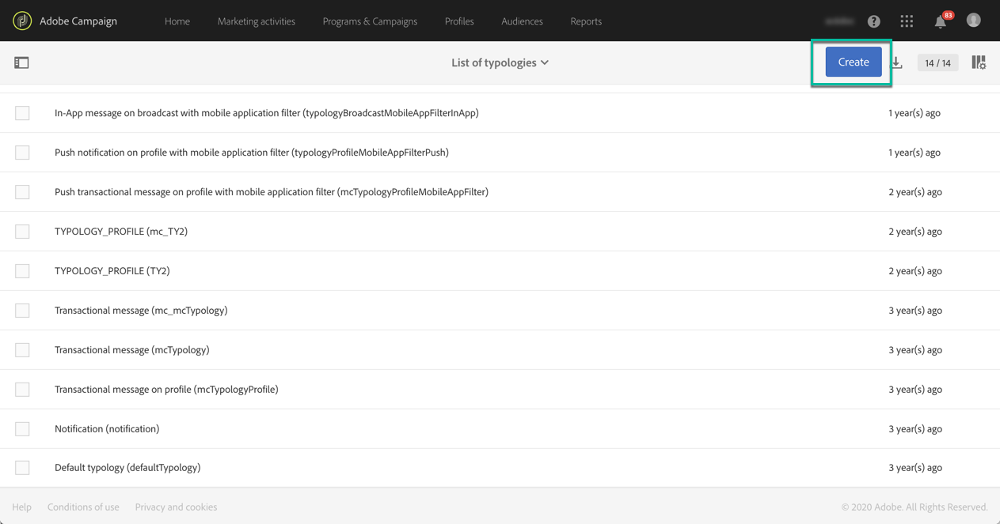

# Hantera typologier {#managing-typologies}

## Om typologier {#about-typologies}

Typologier är en uppsättning regler som gör att du kan kontrollera giltigheten för ditt meddelande innan du skickar det. Till exempel: Meddelandeinnehållet är inte tomt, det finns en prenumeration, det finns inte några dubbletter osv.

Typologier finns på menyn **[!UICONTROL Administration]** > **[!UICONTROL Channels]** > **[!UICONTROL Typologies]** . Som standard är en standardtypologi tillgänglig i programmet. Beroende på dina behov kan du skapa egna typologier eller ändra befintliga.

För varje typologi listar **[!UICONTROL Typology rules]** avsnittet den uppsättning regler som körs när typologin används med ett meddelande.

>[!NOTE]
>
>Om du vill ha mer information om en av typologireglerna dubbelklickar du på den. Regeln visas i skrivskyddat läge.

## Skapa en typologi {#creating-a-typology}

Så här skapar du en ny typologi:

1. Gå till **[!UICONTROL Administration]** > **[!UICONTROL Channels]** > **[!UICONTROL Typologies]** -menyn.

1. Listan över typologier visas. Klicka på **[!UICONTROL Create]** knappen.

   

1. Definiera typologin **[!UICONTROL Label]** och klicka sedan på **[!UICONTROL Add an element]** knappen för att välja de typologiregler som du vill ta med i den. For more on typology rules, refer to [this section](../../sending/using/managing-typology-rules.md).

   

   >[!NOTE]
   >
   >I **[!UICONTROL IP affinity]** fältet kan du hantera tillhörigheterna enligt din konfiguration. De definieras i instansens konfigurationsfil. Kontakta administratören om du vill använda tillhörigheterna.

1. Klicka **[!UICONTROL Create]** för att bekräfta valet. Din typologi kan nu användas i meddelanden.

## Använda typologier i meddelanden {#applying-typologies-to-messages}

När du associerar en typologi med en meddelande- eller meddelandemall kommer de typologiregler som ingår i typologin att köras för att kontrollera meddelandets giltighet.

>[!NOTE]
>
>Varje meddelande- eller meddelandemall kan bara tilldelas en enda typologi.

Följ de här stegen för att länka en typologi till ett meddelande:

1. Öppna meddelandeegenskaperna. Observera att meddelandemallar är tillgängliga via menyn **[!UICONTROL Resources]** > **[!UICONTROL Templates]** Navigering.

1. I avsnittet **[!UICONTROL Advanced parameters]** > **[!UICONTROL Prearation]** väljer du den typologi som ska länkas till meddelandet.

   

1. Klicka på **[!UICONTROL Confirm]**.

   Den valda typologin är nu länkad till meddelandet. Alla tillhörande typologiregler kommer att köras för att kontrollera meddelandets giltighet.
