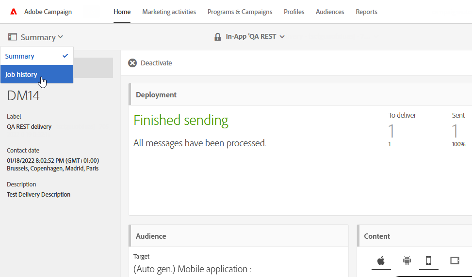

# Övervaka en leverans{#monitoring-a-delivery}

Det finns flera sätt att övervaka en leverans och mäta dess påverkan. Som funktionell administratör kan du komma åt meddelandeloggar och leveransloggar.

>[!IMPORTANT]
>
>Endast funktionell [administratörer](../../administration/using/users-management.md#functional-administrators), med **[!UICONTROL Administration]** roll och åtkomst till **Alla** kan komma åt loggar, meddelandeloggar, spårningsloggar, undantags- och prenumerationsloggar. En icke-admin-användare kan ha loggarna som mål, men med början i en länkad tabell (profiler, leverans).

* **Meddelandeloggar**: Loggarna kan hittas direkt i meddelandepanelen. De visar detaljerna för utskicket, vilket eller vilka mål som har uteslutits och varför de har uteslutits. De visar även spårningsinformation som exempelvis öppningar och klick.

  Om du vill visa meddelandeloggarna klickar du på ikonen längst ned till höger i **[!UICONTROL Deployment]**-sektionen.

  Flera flikar innehåller information (om de finns) gällande **[!UICONTROL Sending logs]**, **[!UICONTROL Exclusion logs]**, **[!UICONTROL Exclusion causes]** och **[!UICONTROL Tracking logs]****[!UICONTROL Tracked URLs]**.    Se [Leveransloggar](#delivery-logs).

  

  Loggen innehåller alla meddelanden som har levererats eller testutskickats.  Med specifika ikoner kan du identifiera fel eller varningar.    Mer information finns i [Godkänna meddelanden](../../sending/using/previewing-messages.md).

  Du kan exportera loggen genom att klicka på **[!UICONTROL Export list]**-knappen.

  

* **Jobbloggar**: En lista över batchjobb som utlöses av leveransen kan nås från meddelandekontrollpanelen genom att välja **[!UICONTROL Job history]** från **[!UICONTROL Summary]** listruta.

  Välj ett jobb i listan om du vill visa information om det valda **[!UICONTROL Batch job]**.

  

* **Leveransmeddelanden**: För att hålla koll på framgångar eller fel i leveranser så tillhandahåller Adobe Campaign ett varningssystem för e-post som skickar meddelanden till användarna gällande viktiga systemaktiviteter.
* **Rapporter**: Från meddelandepanelen kan du få åtkomst till flera rapporter för det specifika meddelandet.    Du har också en **[!UICONTROL Reports]**-meny där du kan få tillgång till en komplett lista med inbyggda eller anpassade rapporter som du kan använda för att skapa mätvärden som är relaterade till ditt meddelande eller din kampanj.
* En administratör kan också exportera loggar i en separat fil som kan bearbetas i dina egna rapporterings- eller BI-verktyg.  Mer information finns att hitta i [Exportera loggar](../../automating/using/exporting-logs.md).

**Relaterade ämnen:**

* [Få aviseringar när fel uppstår](../../sending/using/receiving-alerts-when-failures-happen.md)
* [Rapporter](../../reporting/using/about-dynamic-reports.md)

## Leveransloggar {#delivery-logs}

### Skicka loggar {#sending-logs}

Under fliken **[!UICONTROL Sending logs]** visas en historik över alla förekomster av leveransen.        Listan med skickade meddelanden och deras status lagras här.        Du kan visa leveransstatus för varje mottagare.

För varje profil med **[!UICONTROL Sent]**-status visas **[!UICONTROL Date]**-kolumnen när meddelandet skickades.

Klicka på penn-ikonen till höger om motsvarande rad om du vill visa information om en viss sändningslogg.

Alla loggdetaljer för sändningar är skrivskyddade.  Du kan också se en förhandsvisning av spegelsidan.

>[!NOTE]
>
>Om du vill visa spegelsidan i användargränssnittet för Kampanjer så måste URL:en för spegelsideservern vara säker.  I sådana fall använder du https:// i stället för http:// för att konfigurera den här URL:en när du [konfigurerar ditt varumärke](../../administration/using/branding.md#configuring-and-using-brands).

### Uteslutningsloggar {#exclusion-logs}

Under fliken **[!UICONTROL Exclusion logs]** visas alla meddelanden som har uteslutits från det skickade målet och orsaken för detta.

### Uteslutningsorsaker {#exclusion-causes}

Under fliken **[!UICONTROL Exclusion causes]** visas volymen (i antal meddelanden) för meddelanden som har uteslutits från sändningsmålet.

