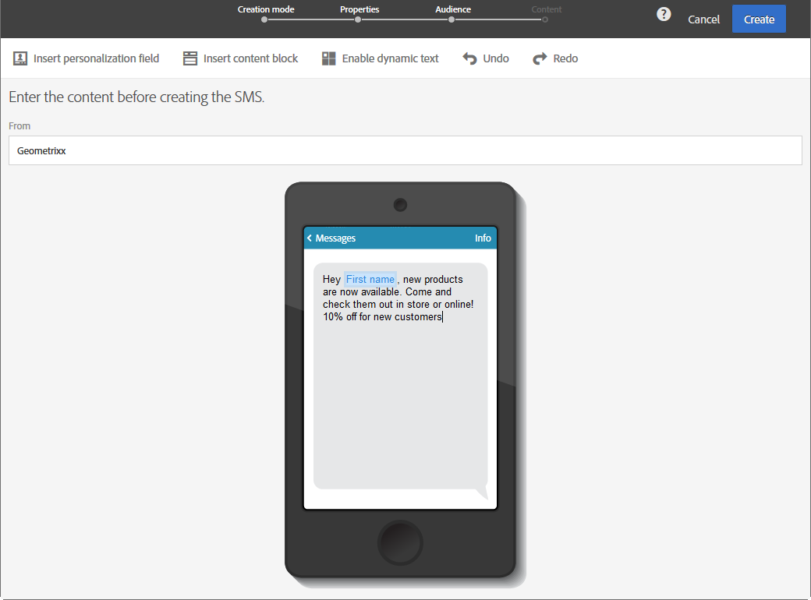

# Förhandsgranska leveranser {#previewing-messages}

## Förhandsgranska e-postmeddelanden {#previewing-emails}

Med Campaign Standard kan du förhandsgranska meddelanden innan de skickas, för att kontrollera deras personalisering och hur mottagarna ser dem.

Förhandsgranskning av meddelanden utförs med **Testprofiler** som du lägger till i meddelandets mål.

För **e-postmeddelanden** kan du med Campaign Standard förhandsgranska meddelanden med målprofiler i stället för testprofiler. På så sätt kan du få en exakt representation av meddelandet som en viss profil får. Mer information finns i [Testa e-postmeddelanden med målprofiler](../../sending/using/testing-messages-using-target.md).

Så här förhandsgranskar du ett meddelande med testprofiler:

1. Klicka på knappen **[!UICONTROL Preview]** i [e-postdesignern](../../designing/using/designing-content-in-adobe-campaign.md).

   

   En skrivbordsvy och en responsiv mobilvy av e-postmeddelandet visas sida vid sida.

1. En automatisk skräppostkontroll utförs under varje förhandsgranskning. Klicka på **[!UICONTROL Anti-spam analysis]** om du vill veta mer om varningen.

   

1. Välj knappen **[!UICONTROL Change profile]** för att välja den testprofil som du vill testa personaliseringselementen i.

   

1. Om du vill avsluta **[!UICONTROL Preview]**-läget klickar du på knappen **[!UICONTROL Edit]** överst till vänster på skärmen.

   

**Relaterade ämnen**

* [Hantera testprofiler](../../audiences/using/managing-test-profiles.md)
* [Testa e-postmeddelanden med målprofiler](../../sending/using/testing-messages-using-target.md)
* [Skicka korrektur](../../sending/using/sending-proofs.md)

## Förhandsgranska SMS-meddelanden {#previewing-sms}

För **SMS**-meddelanden kan du med Campaign Standard förhandsgranska meddelanden med testprofiler. På så sätt kan du få en exakt representation av meddelandet som en viss profil får. Mer information finns i [Hantera testprofiler](../../audiences/using/managing-test-profiles.md).

Så här förhandsgranskar du ett SMS-meddelande med testprofiler:

1. När du har fyllt i **[!UICONTROL Properties]** i SMS-meddelandet och valt målgrupper kan du anpassa leveransen. Mer information finns i [avsnittet](../../channels/using/personalizing-sms-messages.md).

   

1. När du har anpassat innehållet klickar du på **[!UICONTROL Create]** för att öppna fönstret **[!UICONTROL Summary]**.

1. I fönstret **[!UICONTROL Summary]** klickar du på **[!UICONTROL Content]** för att förhandsgranska leveransen.

   

1. Klicka på **[!UICONTROL Preview]** i verktygsfältet.

   

1. Klicka på **[!UICONTROL Change profile]** för att välja din testprofil och sedan **[!UICONTROL Confirm]**.

   

Du kan nu se den exakta representationen av ditt meddelande beroende på de valda testprofilerna.

**Relaterade ämnen**

* [Om SMS-meddelanden](../../channels/using/about-sms-messages.md)
* [Skapa ett SMS-meddelande](../../channels/using/creating-an-sms-message.md)
* [Anpassa SMS-meddelanden](../../channels/using/personalizing-sms-messages.md)

## Förhandsgranska push-meddelanden {#previewing-push}

För **push-meddelanden** kan du med Campaign Standard förhandsgranska meddelanden med testprofiler. På så sätt kan du få en exakt representation av meddelandet som en viss profil får. Mer information finns i [Hantera testprofiler](../../audiences/using/managing-test-profiles.md).

Så här förhandsgranskar du ett push-meddelande med testprofiler:

1. När du har fyllt i **[!UICONTROL Properties]** i ditt push-meddelande och valt målgrupper kan du anpassa leveransen. Mer information finns i [Anpassa ett push-meddelande](../../channels/using/customizing-a-push-notification.md).

1. När du har anpassat innehållet kan du kontrollera återgivningen av dina push-meddelanden direkt, beroende på enheter och operativsystem, i förhandsgranskningsfönstret.

   

1. Om du vill förhandsgranska ditt push-meddelande med testprofiler klickar du på **[!UICONTROL Preview with test profile]**.

   

1. Välj din testprofil och sedan **[!UICONTROL Confirm]**.

Du kan nu se den exakta representationen av ditt meddelande beroende på de valda testprofilerna.

**Relaterade ämnen**

* [Om push-meddelanden](../../channels/using/about-push-notifications.md)
* [Förbereda och skicka ett push-meddelande](../../channels/using/preparing-and-sending-a-push-notification.md)
* [Anpassa ett push-meddelande](../../channels/using/customizing-a-push-notification.md)

## Förhandsgranska meddelanden i appen {#previewing-in-app}

För **In-App** kan du med Campaign Standard förhandsgranska meddelanden med testprofiler. På så sätt kan du få en exakt representation av meddelandet som en viss profil får. Mer information finns i [Hantera testprofiler](../../audiences/using/managing-test-profiles.md).

Så här förhandsgranskar du ett meddelande i appen med testprofiler:

1. När du har fyllt i **[!UICONTROL Properties]** i meddelandet i appen, valt dina målgrupper och angett din **[!UICONTROL Triggers]** kan du anpassa leveransen. Mer information finns i [Anpassa ett meddelande i appen](../../channels/using/customizing-an-in-app-message.md).

1. När du har anpassat innehållet kan du kontrollera återgivningen av ditt In-App-meddelande direkt, beroende på enheter och operativsystem, i förhandsgranskningsfönstret.

   

1. Om du vill förhandsgranska ditt meddelande i appen med testprofiler klickar du på **[!UICONTROL Preview]**.

   

1. Välj din testprofil och sedan **[!UICONTROL Confirm]**.

Du kan nu se den exakta representationen av ditt meddelande beroende på de valda testprofilerna.

**Relaterade ämnen**

* [Om app-meddelanden](../../channels/using/about-in-app-messaging.md)
* [Förbereda och skicka ett meddelande i appen](../../channels/using/preparing-and-sending-an-in-app-message.md)
* [Anpassa ett meddelande i appen](../../channels/using/customizing-an-in-app-message.md)