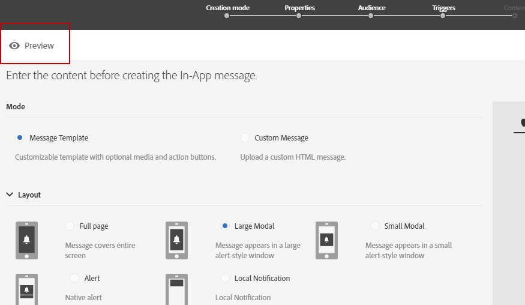

# Förhandsgranska leveranser {#previewing-messages}

## Förhandsgranska e-postmeddelanden {#previewing-emails}

Med Campaign Standard kan du förhandsgranska meddelanden innan de skickas, för att kontrollera deras personalisering och hur mottagarna ser dem.

Förhandsgranskning av meddelanden utförs med **Testprofiler** som du lägger till i meddelandets mål.

För **e-post** -meddelanden kan du med Campaign Standard förhandsgranska meddelanden med målprofiler i stället för testprofiler. På så sätt kan du få en exakt representation av meddelandet som en viss profil får. Mer information finns i [Testa e-postmeddelanden med målprofiler](../../sending/using/testing-messages-using-target.md).

Så här förhandsgranskar du ett meddelande med testprofiler:

1. I [E-postdesigner](../../designing/using/designing-content-in-adobe-campaign.md)klickar du på **[!UICONTROL Preview]** -knappen.

   

   En skrivbordsvy och en responsiv mobilvy av e-postmeddelandet visas sida vid sida.

1. En automatisk skräppostkontroll utförs under varje förhandsgranskning. Klicka på **[!UICONTROL Anti-spam analysis]** om du vill veta mer om varningen.

   

1. Välj **[!UICONTROL Change profile]** för att välja den testprofil som du vill testa personaliseringselementen på.

   

1. Avsluta **[!UICONTROL Preview]** läge, klicka på **[!UICONTROL Edit]** överst till vänster på skärmen.

   

**Relaterade ämnen**

* [Hantera testprofiler](../../audiences/using/managing-test-profiles.md)
* [Testa e-postmeddelanden med målprofiler](../../sending/using/testing-messages-using-target.md)
* [Skicka bevis](../../sending/using/sending-proofs.md)

## Förhandsgranska SMS-meddelanden {#previewing-sms}

För **SMS** -meddelanden kan du med Campaign Standard förhandsgranska meddelanden med testprofiler. På så sätt kan du få en exakt representation av meddelandet som en viss profil får. Mer information finns i [Hantera testprofiler](../../audiences/using/managing-test-profiles.md).

Så här förhandsgranskar du ett SMS-meddelande med testprofiler:

1. När du fyllt i **[!UICONTROL Properties]** av SMS-meddelandet och valda målgrupper kan ni personalisera leveransen. Mer information finns i [section](../../channels/using/personalizing-sms-messages.md).

   

1. När du har anpassat innehållet klickar du **[!UICONTROL Create]** för att komma åt **[!UICONTROL Summary]** -fönstret.

1. Från **[!UICONTROL Summary]** fönster, klicka **[!UICONTROL Content]** för att förhandsgranska materialet.

   

1. Klicka **[!UICONTROL Preview]** i verktygsfältet.

   

1. Klicka **[!UICONTROL Change profile]** för att välja testprofil och sedan **[!UICONTROL Confirm]**.

   

Du kan nu se den exakta representationen av ditt meddelande beroende på de valda testprofilerna.

**Relaterade ämnen**

* [Om SMS-meddelanden](../../channels/using/about-sms-messages.md)
* [Skapa ett SMS-meddelande](../../channels/using/creating-an-sms-message.md)
* [Personalisera SMS-meddelanden](../../channels/using/personalizing-sms-messages.md)

## Förhandsgranska push-meddelanden {#previewing-push}

För **Push-meddelande** Med Campaign Standard kan du förhandsgranska meddelanden med testprofiler. På så sätt kan du få en exakt representation av meddelandet som en viss profil får. Mer information finns i [Hantera testprofiler](../../audiences/using/managing-test-profiles.md).

Så här förhandsgranskar du ett push-meddelande med testprofiler:

1. När du fyllt i **[!UICONTROL Properties]** av era push-meddelanden och valda målgrupper kan ni personalisera era leveranser. Mer information finns i [Anpassa ett push-meddelande](../../channels/using/customizing-a-push-notification.md).

1. När du har anpassat innehållet kan du kontrollera återgivningen av dina push-meddelanden direkt, beroende på enheter och operativsystem, i förhandsgranskningsfönstret.

   

1. Om du vill förhandsgranska ditt push-meddelande med testprofiler klickar du på **[!UICONTROL Preview with test profile]**.

   

1. Välj testprofil och sedan **[!UICONTROL Confirm]**.

Du kan nu se den exakta representationen av ditt meddelande beroende på de valda testprofilerna.

**Relaterade ämnen**

* [Om push-meddelanden](../../channels/using/about-push-notifications.md)
* [Förbereda och skicka ett push-meddelande](../../channels/using/preparing-and-sending-a-push-notification.md)
* [Anpassa ett push-meddelande](../../channels/using/customizing-a-push-notification.md)

## Förhandsgranska meddelanden i appen {#previewing-in-app}

För **I appen** Med Campaign Standard kan du förhandsgranska meddelanden med testprofiler. På så sätt kan du få en exakt representation av meddelandet som en viss profil får. Mer information finns i [Hantera testprofiler](../../audiences/using/managing-test-profiles.md).

Så här förhandsgranskar du ett meddelande i appen med testprofiler:

1. När du fyllt i **[!UICONTROL Properties]** i ert meddelande i appen valde ni era målgrupper och satte er **[!UICONTROL Triggers]** kan ni personalisera leveransen. Mer information finns i [Anpassa ett meddelande i appen](../../channels/using/customizing-an-in-app-message.md).

1. När du har anpassat innehållet kan du kontrollera återgivningen av ditt In-App-meddelande direkt, beroende på enheter och operativsystem, i förhandsgranskningsfönstret.

   

1. Om du vill förhandsgranska ditt meddelande i appen med testprofiler klickar du på **[!UICONTROL Preview]**.

   

1. Välj testprofil och sedan **[!UICONTROL Confirm]**.

Du kan nu se den exakta representationen av ditt meddelande beroende på de valda testprofilerna.

**Relaterade ämnen**

* [Om meddelanden i appen](../../channels/using/about-in-app-messaging.md)
* [Förbereda och skicka ett meddelande i appen](../../channels/using/preparing-and-sending-an-in-app-message.md)
* [Anpassa ett meddelande i appen](../../channels/using/customizing-an-in-app-message.md)
