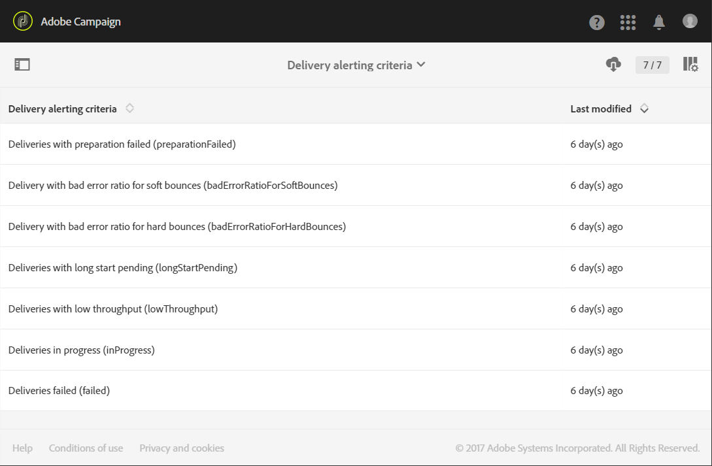

# Få aviseringar när fel uppstår{#receiving-alerts-when-failures-happen}

## Om leveransvarningar {#about-delivery-alerting}

Funktionen **Leveransvarningar** är ett varningssystem som gör att en grupp användare automatiskt kan ta emot meddelanden som innehåller information om hur deras leveranser utförs.

De skickade meddelandena innehåller en rapport som är baserad på följande kriterier:

* Misslyckade leveranser
* Leveranser med misslyckade förberedelser
* Leveranser med en felaktig felkvot för mjuk studs
* Leveranser med ett dåligt felförhållande för hårda studs
* Leveranser med en väntande status som är längre än vanligt
* Leveranser med låg genomströmning
* Pågående leveranser

Mottagarna av varningarna kan övervaka leveranser som bearbetas av Adobe Campaign och vidta lämpliga åtgärder när det uppstår problem i samband med att de utförs.

Dessa varningsmeddelanden kan anpassas beroende på särskilda varningsvillkor som definieras via en kontrollpanel i Adobe Campaign-gränssnittet.

>[!NOTE]
>
>Varningsmeddelandena levereras endast via e-post.

De skickade meddelandena innehåller:

* En **[!UICONTROL Summary]** som visar antalet leveranser som uppfyller villkoren som du har definierat och etiketten/färgen som du valde för varje kriterium.
* Ett **[!UICONTROL Details]**-avsnitt som listar alla leveranskriterier som definierats för motsvarande instrumentpanel och alla leveranser för varje kriterium.

## Kontrollpaneler för leveransvarningar {#delivery-alerting-dashboards}

### Om kontrollpaneler för leveransvarningar {#about-delivery-alerting-dashboards}

Om du vill hantera meddelandenas mottagare, ange aviseringskriterier och komma åt varningshistoriken måste du använda kontrollpaneler.

>[!NOTE]
>
>Om du vill komma åt och konfigurera kontrollpanelerna och varningsvillkoren måste du ha administratörsbehörighet eller visas i säkerhetsgruppen **Leveransansvariga**. Standardanvändare har inte åtkomst till kontrollpanelerna i Adobe Campaign-gränssnittet. De kan bara ta emot varningsmeddelanden. Mer information om användare och säkerhet i Adobe Campaign finns i [Typer av användare](../../administration/using/users-management.md) och [Om säkerhetsgrupper](../../administration/using/managing-groups-and-users.md#about-security-groups).

I Adobe Campaign gränssnitt kan du

* Skapa och hantera kontrollpaneler för leveransvarningar. Se [Skapa en kontrollpanel för leveransvarningar](#creating-a-delivery-alerting-dashboard).
* Definiera och hantera leveransaviseringskriterier för varje kontrollpanel. Du kan t.ex. skapa varningar baserade på leveranser med misslyckade förberedelser eller leveranser med ett lågt dataflöde. Se [Om varningsvillkor](#about-alerting-criteria).
* Ändra villkorsparametrarna för varje kontrollpanel. Se [Kriterieparametrar](#criteria-parameters).
* Definiera en grupp mottagare för varje kontrollpanel.

   Du vill till exempel bara informera användare med administrationsbehörighet om misslyckade leveranser. Ni vill dock att marknadsföringsanvändarna ska få information om leveranser med ett felförhållande som inte är tillräckligt bra för att studsa. Därför måste du skapa två olika kontrollpaneler och definiera villkoren som du vill använda för varje grupp av mottagare.

* Få åtkomst till historiken för alla skickade aviseringar för varje instrumentpanel.

   När du väljer en kontrollpanel visas den senaste skickade varningen för den här instrumentpanelen som standard. Alla skickade aviseringar visas till vänster på skärmen. Klicka på ett objekt i **[!UICONTROL History]**-listan för att komma åt motsvarande aviseringar.

### Skapar en kontrollpanel för leveransvarningar {#creating-a-delivery-alerting-dashboard}

Om du vill skicka meddelanden baserat på specifika villkor till olika användargrupper måste du använda flera kontrollpaneler. Så här skapar du en ny kontrollpanel:

1. Gå till **[!UICONTROL Administration]** > **[!UICONTROL Channels]** > **[!UICONTROL Delivery alerting]**.
1. Markera **[!UICONTROL Delivery alerting dashboards]** och klicka på **[!UICONTROL Create]**.
1. Markera rutan **[!UICONTROL Enabled]** om du vill aktivera den aktuella instrumentpanelen.

   Om det här alternativet är inaktiverat skickas inte längre meddelanden som är länkade till den här instrumentpanelen. Det här alternativet är inaktiverat som standard.

   

1. Välj den grupp mottagare som du vill meddela i listrutan **[!UICONTROL Alert group]**. Information om hur du ändrar eller skapar en grupp finns i [Skapa en säkerhetsgrupp och tilldela användare](../../administration/using/managing-groups-and-users.md#creating-a-security-group-and-assigning-users).
1. Klicka på **[!UICONTROL Create element]** i avsnittet **[!UICONTROL Delivery alerting criteria]** för att lägga till villkor. Se [Om varningsvillkor](#about-alerting-criteria).
1. Markera knappen **[!UICONTROL Edit properties]**. På fliken **[!UICONTROL Criteria parameters]** definierar du hur villkoren ska tillämpas. Se [Kriterieparametrar](#criteria-parameters).
1. Klicka på **[!UICONTROL Create]** för att spara instrumentpanelen.

Varje gång en leverans uppfyller de villkor som du har definierat i den här kontrollpanelen skickas ett varningsmeddelande till den angivna användargruppen.

## Leveransaviseringskriterier {#delivery-alerting-criteria}

### Om varningsvillkor {#about-alerting-criteria}

Om du vill få åtkomst till leveransaviseringsvillkoren går du till **[!UICONTROL Administration]** > **[!UICONTROL Channels]** > **[!UICONTROL Delivery alerting]** och väljer **[!UICONTROL Delivery alerting criteria]**.

Följande kriterier kan användas i kontrollpanelerna för leveransvarningar:

* **[!UICONTROL Deliveries failed]**: Alla leveranser som schemalagts inom ett definierat intervall, med en felaktig status.
* **[!UICONTROL Deliveries with preparation failed]**: Alla leveranser som har ändrats inom ett definierat intervall och för vilka förberedelsesteget (målberäkning och innehållsgenerering) har misslyckats. Mer information finns i [Förbereda sändningen](../../sending/using/preparing-the-send.md).
* **[!UICONTROL Delivery with bad error ratio for soft bounces]**: Alla leveranser som schemalagts inom ett definierat intervall, med en status på minst  **[!UICONTROL In progress]**, med ett felförhållande för mjukt studs som är större än en definierad procentandel.
* **[!UICONTROL Delivery with bad error ratio for hard bounces]**: Alla leveranser som schemalagts inom ett definierat intervall, med en status på minst  **[!UICONTROL In progress]**, med ett felförhållande för grovt studs som är större än en definierad procentandel.
* **[!UICONTROL Deliveries with long start pending]**: Alla leveranser som schemalagts inom ett definierat intervall, med en  **[!UICONTROL Start pending]** status som är längre än en definierad varaktighet,  **[!UICONTROL Start pending]** status som innebär att meddelanden ännu inte har beaktats av systemet.
* **[!UICONTROL Deliveries with low throughput]**: Alla leveranser har startat under längre tid än en definierad varaktighet, med mindre än en definierad procentandel av bearbetade meddelanden, med ett dataflöde som är lägre än ett definierat värde.
* **[!UICONTROL Deliveries in progress]**: Alla leveranser som schemalagts inom ett definierat intervall, med  **[!UICONTROL In progress]** status.

>[!NOTE]
>
>Alla parametrar som gäller ovanstående villkor har standardvärden. Dessa värden kan ändras på fliken **[!UICONTROL Criteria parameters]** på kontrollpanelerna för leveransvarningar. Se [Kriterieparametrar](#criteria-parameters).

Du kan välja vilket objekt som helst i **[!UICONTROL Delivery alerting criteria]**-listan för att komma åt informationen.

För varje kriterium kan du definiera följande inställningar:

* **[!UICONTROL Indicators to add in alerts]**, dvs. de kolumner som ska visas i meddelandets  **[!UICONTROL Details]** avsnitt för de leveranser som motsvarar det valda kriteriet.

   

* **[!UICONTROL Alert type]**, vilket innebär etiketten och färgen som visas bredvid leveransvillkoret i sammanfattningen av meddelandet.

   

* **[!UICONTROL Criteria frequency]**: Om ett kriterium är uppfyllt för en leverans upprepas detta i varje anmälan som skickas inom övervakningsperioden. I annat fall skickas endast en avisering om dagen (vid den första förekomsten) enligt ett aviseringskriterium för en leverans.

   Som standard är det här alternativet inställt på en gång om dagen för alla villkor.

**Relaterade ämnen:**

* [Skicka loggar](../../sending/using/monitoring-a-delivery.md#sending-logs)
* [Varningsfrekvens](#alerting-frequency)
* [Ikoner för marknadsföringsaktiviteter och statusar](../../start/using/marketing-activities.md#marketing-activity-icons-and-statuses)

### Skapa ett leveransvarningsvillkor {#creating-a-delivery-alerting-criterion}

Du kan skapa nya leveransvarningsvillkor som passar dina behov bättre.

Du kan till exempel skapa ett nytt villkor som gör att du kan skicka ett meddelande med en lista över alla leveranser med statusen **[!UICONTROL Finished]**.

För att göra detta måste du först utöka resursen **Delivery** och lägga till ett nytt filter som gör att du bara kan välja leveranser med statusen **[!UICONTROL Finished]**.

1. Gå till **Adobe Campaign** > **Administration** > **Utveckling** > **Anpassade resurser** och klicka på **[!UICONTROL Create]**.
1. Välj **[!UICONTROL Extend an existing resource]**, välj resursen **[!UICONTROL Delivery]** i listrutan och klicka på **[!UICONTROL Create]** för att redigera den.

   

   Mer information om hur du utökar en befintlig resurs finns i [Definiera resursen](../../developing/using/creating-or-extending-the-resource.md).

1. Gå till fliken **[!UICONTROL Filter definition]** i resursen **[!UICONTROL Delivery]** och klicka på **[!UICONTROL Add an element]** för att skapa ett filter.

   

1. Redigera den nya filterdefinitionen: i fönstret **[!UICONTROL Filter definition]** drar och släpper du **[!UICONTROL Status]**-objektet på arbetsytan och väljer **[!UICONTROL Finished]** som filtervillkor.

   

   Mer information om hur du skapar och redigerar anpassade filter finns i [Definiera filter](../../developing/using/configuring-filter-definition.md).

1. Spara ändringarna och publicera resurserna. Mer information finns i [Publicera en anpassad resurs](../../developing/using/updating-the-database-structure.md#publishing-a-custom-resource).

   Filtret skapas och kan nu väljas med ett nytt leveransvarningsvillkor.

1. Gå till **[!UICONTROL Administration]** > **[!UICONTROL Channels]** > **[!UICONTROL Delivery alerting]**, välj **[!UICONTROL Delivery alerting criteria]** och klicka på **[!UICONTROL Create]**.
1. I listrutan **[!UICONTROL Delivery filter applied by this criterion]** väljer du filtret som du just skapade.

   

   Du kan definiera villkorsinställningarna på samma sätt som för standardvillkoren. Se [Om varningsvillkor](#about-alerting-criteria).

När du har skapat dessa villkor kan du lägga till dem i en kontrollpanel för leveransvarningar samt andra villkor. Se [Om kontrollpaneler för leveransvarningar](#about-delivery-alerting-dashboards).

**Relaterat ämne:**

[Lägga till eller utöka en resurs](../../developing/using/key-steps-to-add-a-resource.md)

## Leveransvarningsparametrar {#delivery-alerting-parameters}

### Villkorsparametrar {#criteria-parameters}

På fliken **[!UICONTROL Criteria parameters]** på en [kontrollpanel för leveransvarningar](#creating-a-delivery-alerting-dashboard) kan du definiera inställningar som gäller för de villkor som valts i den här kontrollpanelen.

* **[!UICONTROL Delivery target minimum size]**: Om du till exempel anger 100 i det här fältet skickas ett meddelande endast för leveranser med ett mål som är lika med eller större än 100 mottagare. Den här parametern gäller för alla villkor.
* **[!UICONTROL Monitoring period before and after the contact date (in hours)]**: Antal timmar före och efter den aktuella tiden. Endast leveranser som har ett kontaktdatum i det här tidsintervallet tas med i beräkningen. Den här parametern gäller för alla villkor. Som standard är värdet för det här fältet inställt på 24 timmar.

   Mer information om kontaktdatum finns i [Om schemaläggning](../../sending/using/about-scheduling-messages.md).

* **[!UICONTROL Maximum ratio of soft bounce errors]**: Ett meddelande skickas för alla leveranser med ett felförhållande för mjukt studs som är större än det angivna värdet. Som standard är fältets värde inställt på 0,05 (5 %).

   Mer information om mjuka studs-fel finns i [studsmeddelanden](../../sending/using/understanding-delivery-failures.md#bounce-mail-qualification) och [Lista över leveransfel](../../sending/using/understanding-delivery-failures.md#delivery-failure-types-and-reasons).

* **[!UICONTROL Maximum ratio of hard bounce errors]**: Ett meddelande skickas för alla leveranser med ett felförhållande för hårda studs som är större än det angivna värdet. Som standard är fältets värde inställt på 0,05 (5 %).

   Mer information om studs på hårddiskfel finns i [studsmeddelanden](../../sending/using/understanding-delivery-failures.md#bounce-mail-qualification) och [Lista över leveransfel](../../sending/using/understanding-delivery-failures.md#delivery-failure-types-and-reasons).

* **[!UICONTROL Minimum time threshold for delivery in 'Start pending' status (in minutes)]**: Ett meddelande skickas för alla leveranser med en  **[!UICONTROL Start pending]** status som är längre än den varaktighet som anges i det här fältet,  **[!UICONTROL Start pending]** status som innebär att meddelanden ännu inte har beaktats av systemet.
* **[!UICONTROL Minimum time required for the computation of the throughput (in minutes)]**: Endast leveranser som påbörjats (med  **[!UICONTROL In progress]** status) under längre tid än den angivna varaktigheten beaktas för  **[!UICONTROL Deliveries with low throughput]** kriteriet.
* **[!UICONTROL Maximum percentage of processed messages for the computation of the throughput]**: Endast leveranser med en procentandel av bearbetade meddelanden som är lägre än den angivna procentandelen beaktas för  **[!UICONTROL Deliveries with low throughput]** kriteriet.
* **[!UICONTROL Minimum expected throughput (in sent messages per hour)]**: Endast leveranser med ett dataflöde som är lägre än det angivna värdet beaktas för  **[!UICONTROL Deliveries with low throughput]** kriteriet.
* **[!UICONTROL Minimum processed ratio required for 'Deliveries in progress' criterion]**: Endast leveranser med en procentandel av bearbetade meddelanden som är högre än den angivna procentandelen tas med i beräkningen.

### Varningsfrekvens {#alerting-frequency}

Med alternativet **[!UICONTROL Frequency of delivery alerting]** kan du definiera fördröjningen mellan två varningsmeddelanden. Som standard är den inställd på 10 minuter.

Du kan ändra den här inställningen via menyn **[!UICONTROL Administration]** > **[!UICONTROL Application settings]** > **[!UICONTROL Options]**.

>[!NOTE]
>
>Det här alternativet gäller för alla instrumentpaneler som definieras i Adobe Campaign. Du kan inte ange en specifik frekvens för varje instrumentpanel.

## Orsaker till leveransvarningar {#delivery-alerting-reasons}

Funktionen **Leveransvarning** håller alla berörda Adobe Campaign-användare automatiskt informerade om leveransstatus via e-post och kontrollpanel.

När du får ett leveransvarningsmeddelande får du några tips om vad du kan göra.

Först och främst bör du kontrollera leveransfliken **Logg** för att se all information om leverans och korrektur. Med de röda och gula ikonerna kan du identifiera fel och varningar. Den röda ikonen anger ett kritiskt fel som förhindrar att leveransen startas.

Om du vill visa historiken för varje förekomst av en leverans väljer du fliken **[!UICONTROL Sending logs]**. Den innehåller en lista över skickade meddelanden och deras status. Där kan du kontrollera leveransstatus för varje mottagare ( **[!UICONTROL Sent]**, **[!UICONTROL Pending]**, **[!UICONTROL Failed]** osv.). Mer information finns i [Skicka loggar](../../sending/using/monitoring-a-delivery.md#sending-logs).

Här är några möjliga orsaker till att du får varningsmeddelanden enligt de kriterier som uppfylls för en leverans.

* **[!UICONTROL Deliveries failed]**: Detta kriterium informerar dig om alla leveranser med felaktig status. Det kan bero på:

   * Ett problem med leveransservern (MTA, Message Transfer Agent)
   * En timeout för anslutningen mellan Adobe Campaign-leveransservern och den mottagande servern
   * Ett leveransproblem
   * Ett felaktigt arbetsflöde

   Om leveransen har utlösts med ett arbetsflöde kontrollerar du om arbetsflödet har startats korrekt. Mer information finns i [Köra ett arbetsflöde](../../automating/using/about-workflow-execution.md). Annars kontaktar du Adobe Campaign-administratören för att lösa problemet.

* **[!UICONTROL Deliveries with preparation failed]**: Ett fel kan uppstå under färdigställande av leveransen i följande fall:

   * Leveransen saknar ämne.
   * Det finns en felaktig syntax i personaliseringsfälten.
   * Målet saknas.
   * Leveransen överskrider storleksgränsen.

   Mer information finns i [Förbereda sändningen](../../sending/using/preparing-the-send.md). Dessa fel upptäcks dock vanligtvis under meddelandeanalysen. Se [Kontrollregler](../../sending/using/control-rules.md).

* Möjliga orsaker till en **[!UICONTROL Delivery with bad error ratio for soft bounces]**-varning kan vara:

   * Mottagarens server är inte tillgänglig.
   * Mottagarens postlåda är full.

   Mer information finns på flikarna **[!UICONTROL Exclusion logs]** och **[!UICONTROL Exclusion causes]** i leveransloggarna. Se [Uteslutningsloggar](../../sending/using/monitoring-a-delivery.md#exclusion-logs).

   Möjliga orsaker till en **[!UICONTROL Delivery with bad error ratio for hard bounces]**-varning kan vara:

   * Mottagaren läggs till i blockeringslista, vilket innebär att han/hon inte längre vill bli kontaktad.
   * Mottagarens e-postadress finns inte.
   * Mottagarens domän finns inte.
   * Mottagarens server blockerar leveransen.

   Följ de bästa metoderna nedan för att undvika mjuka och hårda studsfel:

   * Bygg filtreringstypologiregler för att exkludera en del av meddelandemålet under leveransanalysen, till exempel mottagare i karantän. Se [Skapa en filtreringsregel](../../sending/using/filtering-rules.md).
   * Uppdatera regelbundet kunddatabasen för att upprätthålla goda karantänhanteringsprocesser. Se [Om karantäner](../../sending/using/understanding-quarantine-management.md#about-quarantines).
   * Generellt sett kan du förbättra slutresultatet så bra som möjligt. Läs den detaljerade dokumentationen för Adobe Campaign [Deliverability](../../sending/using/about-deliverability.md) och kontakta Adobe Campaign-administratören om du behöver hjälp.

* **[!UICONTROL Deliveries with long start pending]**: Vanligtvis innebär detta att det finns ett problem på MTA-nivån (Message Transfer Agent). Körningsprocessen väntar på att vissa resurser ska vara tillgängliga. MTA har kanske inte startats.

   **[!UICONTROL Deliveries with low throughput]**: Återigen är detta ett leveransproblem, vilket innebär att leveransavtalet är för långsamt.

   Kontakta Adobe Campaign-administratören om du vill ha mer information om dessa problem.

**Relaterade ämnen:**

* [Förstå leveransfel](../../sending/using/understanding-delivery-failures.md)
* [Förstå karantänhantering](../../sending/using/understanding-quarantine-management.md)
* [Om anmälan och avanmälan i Campaign](../../audiences/using/about-opt-in-and-opt-out-in-campaign.md)

