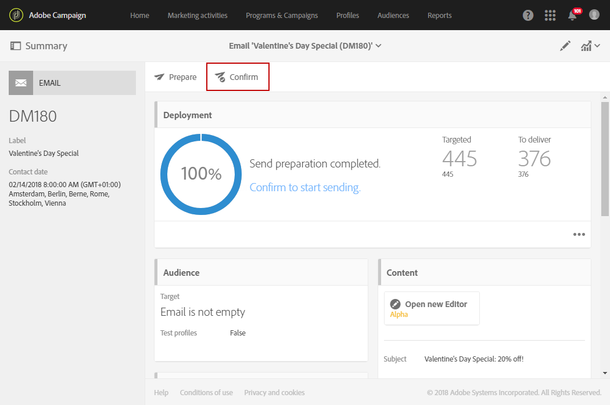

# Skicka meddelanden i mottagarens tidszon{#sending-messages-at-the-recipient-s-time-zone}

När du hanterar en kampanj i vilken datum och tid är viktigt, kan du schemalägga en leverans som tar hänsyn till varje mottagares lokala tid: de får e-post, SMS eller push-meddelanden när du har schemalagt dem – i sin egen tidszon.

>[!NOTE]
>
>Om du vill använda den här funktionen måste du se till att alla profiler som levereras har en angiven tidszon i avsnittet **[!UICONTROL Address]** för deras egenskaper. Mer information om hur du får åtkomst till profilegenskaper finns i det här [avsnittet](../../audiences/using/editing-profiles.md).

Om du vill skicka en leverans i mottagarens tidszon kan du även använda aktiviteten i ett arbetsflöde **[!UICONTROL Scheduler]**. Mer information om detta finns på den här [sidan](../../automating/using/scheduler.md).

I följande exempel vill vi skicka en kampanjkod som bara är giltig på Alla hjärtans dag till alla kunder runt om i världen. Alla kunder måste få ditt meddelande den 14 februari kl. 08.00 beroende på tidszon för att ha tillräckligt med tid att använda den under dagen.

1. På fliken **[!UICONTROL Marketing activities]** börjar du skapa leveransen, och i vårt fall ett e-postmeddelande. Mer information om hur du skapar leveranser finns i det här [avsnittet](../../channels/using/creating-an-email.md).
1. När du har skapat ditt e-postmeddelande för Alla hjärtans dag klickar du på **[!UICONTROL Create]** för att öppna kontrollpanelen för leverans. Mer information om e-postdesign finns på den här [sidan](../../designing/using/personalization.md#example-email-personalization).

   

1. Markera blocket **[!UICONTROL Schedule]** på kontrollpanelen för leverans.

   

1. Välj alternativet **[!UICONTROL Messages to be sent automatically on the date]** som anges nedan. I fältet **[!UICONTROL Start sending from]** anger du sedan kontaktdatum, vilket i vårt fall är den 14 februari kl. 08.00, så att alla mottagare får det på alla hjärtans dag.

   

1. I fältet **[!UICONTROL Time zone of the contact date]** väljer du i vilken tidszon leveransen ska skickas som standard.

   Om en profils **[!UICONTROL Time zone]** lämnas som **[!UICONTROL Default]** kommer mottagarna att få leveransen beroende på den valda tidszonen här.

1. Välj **[!UICONTROL Send at the recipient's time zone]** i **[!UICONTROL Optimize the sending time per recipient]**-listrutan. På så sätt kan mottagarna få e-postmeddelandet för Alla hjärtans dag den 14 februari beroende på vilken tidszon de befinner sig i.

   

1. När du har bekräftat leveransschemat klickar du på knappen **[!UICONTROL Prepare]** och sedan på **[!UICONTROL Confirm]**-leveransmeddelandet.

   Var noga med att bekräfta sändningen minst 24 timmar i förväg. Annars kan vissa mottagare få leveransen före Alla hjärtans dag beroende på var de befinner sig.

   

Oavsett var de befinner sig får alla mottagare meddelandet den 14 februari kl. 08.00 lokal tid.
