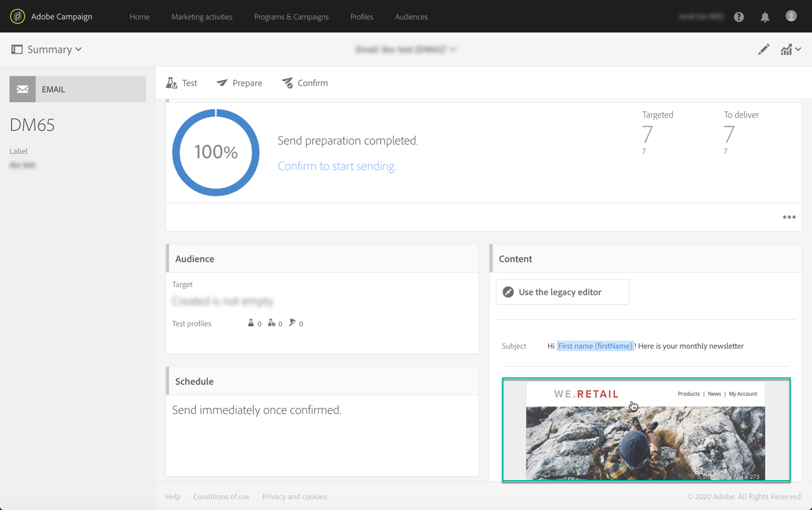

# Testa e-postmeddelanden med målprofiler {#testing-message-profiles}

## Översikt {#overview}

Ytterligare till [testprofiler](../../audiences/using/managing-test-profiles.md)kan du testa ett e-postmeddelande genom att placera dig själv i positionen för en av målprofilerna. På så sätt kan du få en exakt representation av meddelandet som profilen kommer att få (anpassade fält, dynamisk och personlig information, inklusive ytterligare data från arbetsflöden..).

>[!IMPORTANT]
>
>Med den här funktionen kan du skicka en profils personuppgifter till externa e-postadresser. Kom ihåg att när du kör förfrågningar om användaruppgifter (GDPR och CCPA) i Campaign Standard VERKSTÄLLS INTE den förfrågan externt.

De huvudsakliga stegen är följande:

1. Konfigurera meddelandet och starta sedan **Förberedelse** fas.
1. **Markera en eller flera profiler** bland de profiler som meddelandet riktar sig till.
1. Associera med varje profil a **ersättningsadress** till vilka korrektur ska skickas.
1. (valfritt) Definiera en **prefix** som ska läggas till på ämnesraden för korrektur.
1. **Förhandsgranska** i e-postdesignern hur meddelandet visas för profilerna.
1. Skicka korrektur.

   >[!IMPORTANT]
   >
   >Korrektur bearbetas av [!DNL Campaign Standard] som standardleveranser. Om du skickar korrektur med hjälp av profilersättning läggs poster till i leverans- och spårningsloggarna för de valda profilerna.

 [Upptäck den här funktionen i en video](#video)

## Välja profiler och ersättningsadresser {#selecting-profiles}

Om du vill använda målprofiler för testning måste du först markera dem och sedan definiera ersättningsadresserna som ska ta emot korrekturen. För att göra detta kan du antingen [välj specifika profiler](#selecting-individual-profiles) bland målprofilerna, eller [importera profiler från en befintlig målgrupp](#importing-from-audience).

>[!NOTE]
>
>Du kan välja högst 100 profiler för testning.

### Markera enskilda profiler {#selecting-individual-profiles}

1. Kontrollera att meddelandets förberedelse fungerar och klicka sedan på knappen **[!UICONTROL Audience]** -block.

   

1. I **[!UICONTROL Profile substitutions]** klickar du på **[!UICONTROL Create element]** för att välja de profiler som ska användas för testning.

   

1. Klicka på knappen för profilval för att visa listan över profiler som meddelandet riktar sig till.

   

1. Välj den profil som ska användas för testning och ange sedan i dialogrutan **[!UICONTROL Address]** välj en ersättningsadress och klicka sedan på **[!UICONTROL Confirm]**. Alla korrektur för profilen skickas till den här e-postadressen i stället för till den som definierats i databasen för den här profilen.

   Om du vill lägga till ett specifikt prefix till korrekturens ämnesrad fyller du i **[!UICONTROL Subject line prefix]** fält.

   >[!NOTE]
   >
   >Ämnesradens prefix kan innehålla upp till 500 tecken.

   

   Prefixet visas enligt nedan:

   

1. Profilen läggs till i listan, med tillhörande ersättningsadress och prefix. Upprepa stegen ovan för alla profiler som du vill använda för testning och klicka sedan på **[!UICONTROL Confirm]**.

   

   Om du vill skicka ett korrektur till flera ersättningsadresser för samma profil måste du lägga till profilen så många gånger som behövs.

   I exemplet nedan skickas korrekturet baserat på profilen Sven Svensson till två olika ersättningsadresser:

   

1. När du har definierat alla profiler och ersättningsadresser kan du testa meddelandet genom att skicka ett korrektur. Klicka på **[!UICONTROL Test]** och välj sedan den testtyp som ska utföras.

   Observera att om ingen testprofil har lagts till i meddelandemålet, kommer **[!UICONTROL Email rendering]** och **[!UICONTROL Proof + Email rendering]** är inte tillgängliga.  Mer information om hur du skickar korrektur finns i [det här avsnittet](../../sending/using/sending-proofs.md).

   

>[!IMPORTANT]
>
>Om du ändrar något i meddelandet måste du starta meddelandeförberedelsen igen. I annat fall återspeglas inte ändringarna i korrekturet.

### Importera profiler från en målgrupp {#importing-from-audience}

Med Campaign Standard kan du importera en hel grupp profiler som du kan använda för testning. På så sätt kan du till exempel skicka en hel uppsättning meddelanden till en unik e-postadress med olika profiler som mål.

Om målgruppen redan är konfigurerad med adresskolumnerna och prefixkolumnerna kan du dessutom importera informationen i **[!UICONTROL Profile substitutions]** -fliken. Ett exempel på publikimport med ersättningsadresser finns i [det här avsnittet](#use-case).

>[!NOTE]
>
>När du importerar en målgrupp markeras bara de profiler som motsvarar meddelandemålet och läggs till i **[!UICONTROL Profile substitutions]** -fliken.

Så här importerar du profiler som ska användas för testning från en målgrupp:

1. Kontrollera att meddelandets förberedelse har slutförts på meddelandekontrollpanelen och klicka sedan på **[!UICONTROL Audience]** -block.

   

1. På fliken **[!UICONTROL Profile substitutions]** klickar du på **[!UICONTROL Import from an audience]**.

   

1. Välj den målgrupp som ska användas och ange sedan ersättningsadressen och det prefix som ska användas för korrekturet som skickas till målgruppen.

   >[!NOTE]
   >
   >Ämnesradens prefix kan innehålla upp till 500 tecken.

   

   Om ersättningsadresserna och/eller prefixen som ska användas redan har definierats i målgruppen väljer du **[!UICONTROL From Audience]** anger du den kolumn som ska användas för att hämta informationen.

   

1. Klicka på knappen **[!UICONTROL Import]**. Profilerna från målgruppen som motsvarar meddelandemålet läggs till i **[!UICONTROL Profile substitution]** samt tillhörande ersättningsadresser och prefix.

>[!NOTE]
>
>Om du importerar samma målgrupp en gång till, med olika ersättningsadresser och/eller prefix, läggs profilerna till i listan utöver de som fanns vid den tidigare importen.

## Förhandsgranska meddelandet med målprofiler

>[!NOTE]
>
>Förhandsgranskning är endast tillgängligt med e-postdesignern.

Om du vill kunna förhandsgranska meddelanden med målprofiler måste du se till att du har lagt till de här profilerna i **[!UICONTROL Profile substitution]** lista (se [Definiera profiler och ersättningsadresser](#selecting-profiles)).

Om du vill använda anpassningsfält i meddelandet måste de läggas till **före** starta förberedelsen av meddelandet. I annat fall tas de inte med i förhandsgranskningen. Därför måste du starta meddelandeförberedelsen igen om några ändringar görs i personaliseringsfälten.

Så här förhandsgranskar du meddelanden med hjälp av profilersättning:

1. Klicka på ögonblicksbilden av innehållet i meddelandekontrollpanelen för att öppna meddelandet i e-postdesignern.

   

1. Välj **[!UICONTROL Preview]** tabbtangenten och klicka sedan på **[!UICONTROL Change profile]**.

   

1. Klicka på **[!UICONTROL Profile Substitution]** om du vill visa ersättningsprofiler som har lagts till för testning.

   Markera de profiler som du vill använda för förhandsgranskning och klicka sedan på **[!UICONTROL Select]**.

   

1. En förhandsgranskning av meddelandet visas. Använd pilarna för att navigera mellan de valda profilerna.

   

## Användningsfall {#use-case}

I det här fallet vill vi skicka ett personligt nyhetsbrev via e-post till en uppsättning specifika profiler. Innan vi skickar nyhetsbrevet vill vi förhandsgranska det med några av målprofilerna och skicka korrektur till interna e-postadresser som är definierade i en extern fil.

De viktigaste stegen för detta är följande:

1. Skapa målgruppen som ska användas för testning.
1. Bygg ett arbetsflöde för målprofiler och skicka nyhetsbrevet.
1. Konfigurera meddelandets profilersättningar.
1. Förhandsgranska meddelandet med målprofiler.
1. Skicka korrektur.    

### Steg 1: Skapa målgruppen som ska användas för testning

1. Förbered filen som ska importeras för att skapa målgruppen. I det här fallet bör den innehålla den ersättningsadress som ska användas för korrekturet och ett prefix som ska läggas till i korrekturets ämnesrad.

   I det här exemplet får e-postadressen&quot;oliver.vaughan@internal.com&quot; ett bevis på meddelandet som riktar sig till profilen med e-postadressen&quot;john.doe@mail.com&quot;. JD-prefixet läggs till i korrekturets ämnesrad.

   

1. Bygg arbetsflödet för att skapa en målgrupp utifrån filen. Lägg till och konfigurera aktiviteterna nedan för att göra detta:

   * **[!UICONTROL Load file]** aktivitet: Importerar CSV-filen (mer information om den här aktiviteten finns i [det här avsnittet](../../automating/using/load-file.md)).
   * **[!UICONTROL Reconciliation]** aktivitet: Länkar information från filen till information från databasen. I det här exemplet använder du profilens e-postadress som avstämningsfält (mer information om den här aktiviteten finns i [det här avsnittet](../../automating/using/reconciliation.md)).
   * **[!UICONTROL Save audience]** aktivitet: Skapar en målgrupp baserat på den importerade filen (mer information om den här aktiviteten finns i [det här avsnittet](../../automating/using/save-audience.md)).

   

1. Kör arbetsflödet och gå sedan till **[!UICONTROL Audiences]** för att kontrollera att målgruppen har skapats med önskad information.

   I det här exemplet består publiken av tre profiler. Var och en av dem är länkad till en e-postadress som ersätter korrekturet, med ett prefix som ska användas på korrekturets ämnesrad.

   

### Steg 2: Bygg ett arbetsflöde för målprofiler och skicka nyhetsbrevet

1. Lägg till **[!UICONTROL Query]** och **[!UICONTROL Email delivery]** -aktiviteter, konfigurera dem sedan efter dina behov (se [Fråga](../../automating/using/query.md) och [E-postleverans](../../automating/using/email-delivery.md) -avsnitt).

   

1. Kör arbetsflödet och kontrollera att meddelandeförberedelsen lyckas.

### Steg 3: Konfigurera fliken Profilersättning för meddelandet

1. Öppna **[!UICONTROL Email delivery]** aktivitet. Klicka på knappen **[!UICONTROL Audience]** -block.

   

1. Välj **[!UICONTROL Profile substitutions]** tabbtangenten och klicka sedan på **[!UICONTROL Import from an audience]**.

   

1. I **[!UICONTROL Audience]**  väljer du den målgrupp som skapas från filen.

   

1. Definiera ersättningsadressen och ämnesradsprefixet som ska användas när korrektur skickas.

   Om du vill göra det väljer du **[!UICONTROL From audience]** markerar du sedan kolumnen för den målgrupp som innehåller informationen.

   

1. Klicka på knappen **[!UICONTROL Import]**. Profiler från målgruppen läggs till i listan, med tillhörande ersättningsadresser och ämnesradprefix.

   

   >[!NOTE]
   >
   >I vårt fall är alla profiler från publiken riktade till **[!UICONTROL Query]** aktivitet. Om en av dessa profiler inte ingick i meddelandemålet läggs den inte till i listan.

### Steg 4: Förhandsgranska meddelandet med målprofiler

1. Klicka på ögonblicksbilden av innehållet i meddelandekontrollpanelen för att öppna meddelandet i e-postdesignern.

   

1. Välj **[!UICONTROL Preview]** tabbtangenten och klicka sedan på **[!UICONTROL Change profile]**.

   

1. Klicka på **[!UICONTROL Profile Substitution]** om du vill visa ersättningsprofiler som har lagts till tidigare.

   Markera de profiler som du vill använda för förhandsgranskning och klicka sedan på **[!UICONTROL Select]**.

   

1. En förhandsgranskning av meddelandet visas. Använd pilarna för att navigera mellan de valda profilerna.

   

### Steg 5: Skicka korrektur

1. Klicka på knappen **[!UICONTROL Test]** och sedan bekräfta.

   

1. Korrektur skickas enligt inställningarna i **[!UICONTROL Profile substitutions]** -fliken.

   

## Självstudievideo {#video}

I den här videon visas hur du kan testa dina e-postmeddelanden med hjälp av profilersättning.

>[!VIDEO](https://video.tv.adobe.com/v/32368?quality=12)

Det finns fler videor med Campaign Standard om hur man gör [här](https://experienceleague.adobe.com/docs/campaign-standard-learn/tutorials/overview.html?lang=sv).
