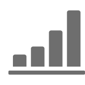

# Spåra meddelanden{#tracking-messages}

## Om spårning {#about-tracking}

Tack vare spårningsfunktionerna i Adobe Campaign kan ni spåra hur era mottagare beter sig. För att göra detta använder Adobe Campaign sessionscookies och permanenta cookies.

Du kan informera användare om att dina webbplatser är utrustade med verktyg för webbspårning via en auktoriseringsbegäran (som visas på sidan till exempel) med en kryssruta för att godkänna användningen av cookies, eller lägga till en banderoll högst upp på den första sidan som de landar på, osv. Popup-fönster bör undvikas eftersom de ofta blockeras av webbläsare.

Spårningsinformation finns tillgänglig för varje kontakt i databasen **[!UICONTROL integrated customer profiles]**. For more on this, refer to [this section](../../audiences/using/integrated-customer-profile.md).

Adobe Campaign använder två typer av cookies:

* En sessionscookie (nlid). Detta innehåller identifieraren för e-postmeddelandet som skickas till kontakten (broadlogId) och identifieraren för meddelandemallen (deliveryId). Den läggs till när kontakten klickar på en URL som ingår i ett e-postmeddelande som skickas av Adobe Campaign och gör att du kan spåra deras beteende på webben. Denna sessionscookie raderas automatiskt när webbläsaren stängs. Kontakten kan konfigurera sin webbläsare så att den inte tillåter cookies.
* En cookie som delas mellan Adobe Experience Cloud-lösningar. På så sätt kan ni identifiera de användare som interagerar med Experience Cloud-lösningarna när de besöker en webbplats. Beskrivningen av denna cookie finns [här](https://marketing.adobe.com/resources/help/en_US/whitepapers/cookies/cookies_mc.html).

Med hjälp av Adobe Campaign Standard kan ni få tillgång till följande funktioner:

<table>
<tr>
    <td valign="top">
        
    </td>
    <td valign="top">
        
    </td>
    <td valign="top">
        
    </td>
        <td valign="top">
          
    </td>
    </td>
    <td valign="top">
          
</tr>
<tr>
<td>E-postspårning</td>
<td>Penselspårning</td>
<td>Spårade URL:er</td>
<td>Spårningsloggar</td>
<td>Spårningsrapport</td>
</tr>
</table>

## Spårningsloggar {#tracking-logs}

På **[!UICONTROL Tracking logs]** fliken visas spårningshistoriken för leveransen. På den här fliken visas spårningsinformation för skickade meddelanden, t.ex. alla URL:er som har spårats av Adobe Campaign. Spårningsinformationen på den här fliken uppdateras var 10:e minut.

>[!NOTE]
>
>Om spårning inte är aktiverat för en leverans visas inte den här fliken. Spårningsloggar är endast tillgängliga för **e-post** - och **push-meddelanden** .

I exemplet ovan:

* Meddelandet öppnades.
* Klicka på den anpassade länken&quot;LÄS MER&quot;.
* Klicka på länken för att ta bort prenumerationen och spegelsidan.

I **[!UICONTROL Type]** kolumnen kan du ange följande värden:

* **[!UICONTROL Email click]**: mottagarna klickade på en anpassad länk.
* **[!UICONTROL Mirror page]**: mottagaren klickade på en länk till spegelsidan.
* **[!UICONTROL Open]**: mottagaren öppnade e-postmeddelandet.
* **[!UICONTROL Opt-out]**: mottagaren klickade på en länk för att avbryta prenumerationen.

>[!NOTE]
>
>För **push-meddelandekanalen** spåras bara klick på mobilmeddelanden. I så fall blir värdet **[!UICONTROL Click on mobile notification]**.

Mer information om hur du infogar spårningslänkar finns på [den här sidan](../../designing/using/links.md#inserting-a-link).

## Spårade URL:er {#tracked-urls}

På **[!UICONTROL Tracked URLs]** fliken grupperas URL-adresserna i det skickade meddelandet, inklusive deras URL-typ och deras käll-URL.

For more on tracking links, refer to [this section](../../designing/using/links.md#about-tracked-urls).
