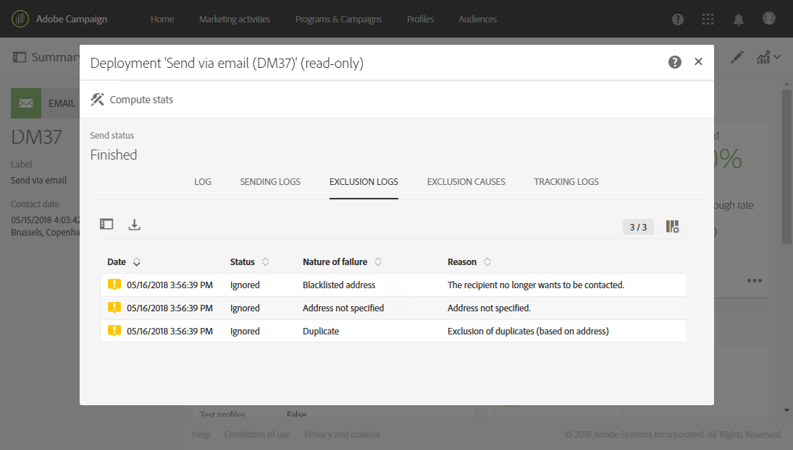
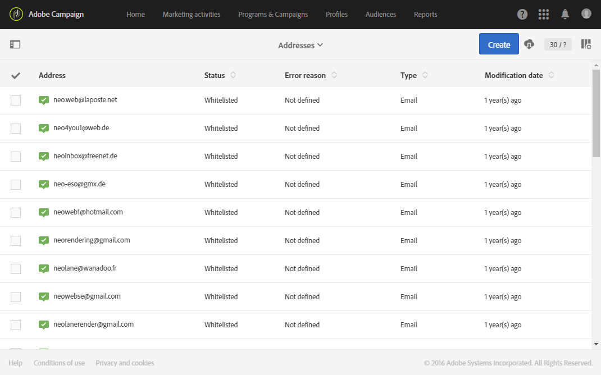
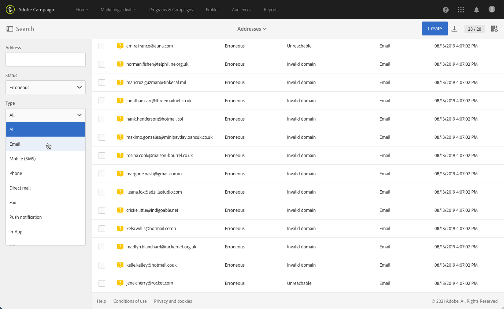
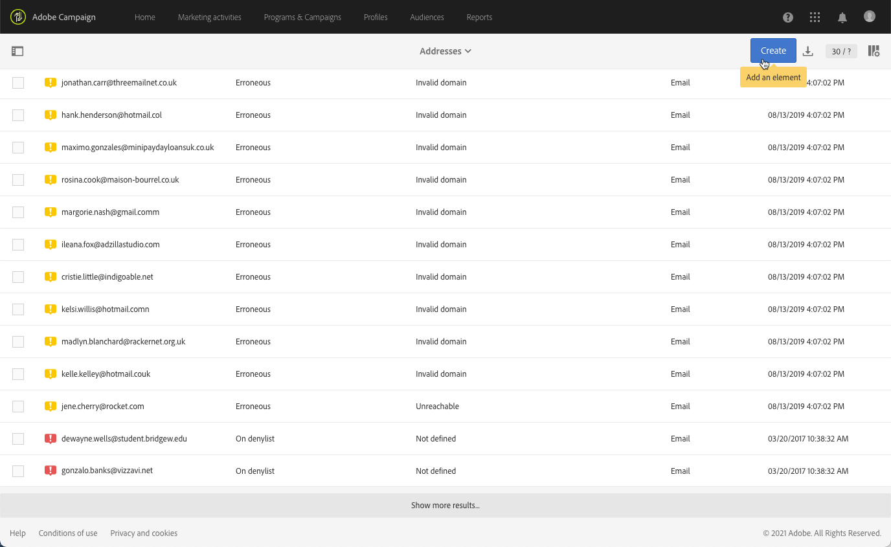

# Förstå karantänshantering{#understanding-quarantine-management}

## Om karantäner {#about-quarantines}

En e-postadress eller ett telefonnummer kan sättas i karantän om exempelvis inkorgen är full eller om adressen inte finns.

Under alla omständigheter så uppfyller karantänproceduren de särskilda regler som beskrivs i detta [avsnitt](#conditions-for-sending-an-address-to-quarantine).

### Optimera leveransen genom karantäner {#optimizing-your-delivery-through-quarantines}

De profiler vars e-postadresser eller telefonnummer är i karantän exkluderas automatiskt vid förberedelse av meddelanden (se [Identifiera karantänadresser vid en leverans](#identifying-quarantined-addresses-for-a-delivery)).  Detta snabbar upp leveranserna eftersom felfrekvensen avsevärt påverkar leveranshastigheten.

Vissa internetleverantörer betraktar automatisk e-post som skräppost om antalet ogiltiga adresser är för högt.  Med karantän kan du därför undvika att läggas till i blockeringslista av dessa leverantörer.

Dessutom bidrar karantäner till att minska SMS-kostnaderna genom att utesluta felaktiga telefonnummer från leveranser.

Mer information om de bästa sätten för att skydda och optimera leveranser finns på [den här sidan](../../sending/using/delivery-best-practices.md).

### Karantän mot Blockeringslista {#quarantine-vs-denylist}

Karantän och blockeringslista gäller inte för samma objekt:

* **Karantän** gäller endast för **adress** (eller telefonnummer osv.), inte själva profilen. En profil vars e-postadress är placerad i karantän kan till exempel uppdatera sin profil och ange en ny adress. Därefter kan den användas av leveransåtgärder igen. Om två profiler råkar ha samma telefonnummer, påverkas båda om numret sätts i karantän.

   Adresserna eller telefonnumren i karantän visas i [exkluderingsloggar](#identifying-quarantined-addresses-for-a-delivery) (för leverans) eller i [karantänlista](#identifying-quarantined-addresses-for-the-entire-platform) (för hela plattformen).

* Att vara på **blockeringslista**&#x200B;å andra sidan resulterar det i **profil** som inte längre används av leveransen, t.ex. efter en avanmälan (avanmälan), för en viss kanal. Om en profil på blockeringslista för e-postkanalen till exempel har två e-postadresser, kommer båda adresserna inte att levereras. Mer information om blockeringslista finns i [Om anmälan och avanmälan i Campaign](../../audiences/using/about-opt-in-and-opt-out-in-campaign.md).

   Du kan kontrollera om det finns en profil på blockeringslista för en eller flera kanaler i dialogrutan **[!UICONTROL No longer contact (on denylist)]** del av profilens **[!UICONTROL General]** -fliken. Se [det här avsnittet](../../audiences/using/managing-opt-in-and-opt-out-in-campaign.md#managing-opt-in-and-opt-out-from-a-profile).

>[!NOTE]
>
>Karantänen innehåller **På blockeringslista** status, som används när mottagarna rapporterar ditt meddelande som skräppost eller svarar på ett SMS-meddelande med ett nyckelord som &quot;STOP&quot;. I så fall skickas profilens adress eller telefonnummer till karantänen tillsammans med **[!UICONTROL On denylist]** status. Mer information om hur du hanterar STOP SMS-meddelanden finns i [det här avsnittet](../../channels/using/managing-incoming-sms.md#managing-stop-sms).

<!--When a user replies to an SMS message with a keyword such as STOP in order to opt-out from SMS deliveries, his profile is not added to the denylist like in the email opt-out process. Instead, the profile's phone number is sent to quarantine with the **[!UICONTROL On denylist]** status. This status refers to the phone number only, meaning that the profile will continue receiving email messages.<!-- Also, if the profile has another phone number, he can still receive SMS messages on the other number. For more on this, refer to [this section](../../channels/using/managing-incoming-sms.md#managing-stop-sms).-->

## Identifiera adresser i karantän {#identifying-quarantined-addresses}

Adresser i karantän kan visas för en viss leverans eller för hela plattformen.

<!--
If you need to remove an address from quarantine, contact your technical administrator.
-->

### Identifiera adresser i karantän för en leverans {#identifying-quarantined-addresses-for-a-delivery}

Adresser i karantän för en viss leverans visas när leveransen förbereds under **[!UICONTROL Exclusion logs]**-fliken i kontrollpanelen för leverans (se [det här avsnittet](../../sending/using/monitoring-a-delivery.md#exclusion-logs)).    Mer information om förberedande av leverans hittar du i [det här avsnittet](../../sending/using/preparing-the-send.md).

### Identifiera adresser i karantän för hela plattformen {#identifying-quarantined-addresses-for-the-entire-platform}

Administratörer kan komma åt den detaljerade listan över e-postadresser i karantän för hela plattformen från **[!UICONTROL Administration > Channels > Quarantines > Addresses]** -menyn.

<!--
This menu lists quarantined elements for **Email**, **SMS** and **Push notification** channels.
-->

>[!NOTE]
>
>Ökningen av antalet karantän är en normal effekt som har samband med databasens slitage. Om en e-postadress till exempel anses ha en livslängd på tre år och mottagartabellen ökar med 50 % varje år så kan ökningen av antalet karantän beräknas enligt följande: Slutet av år 1: (1*0.33)/(1+0.5)=22 %.    Slutet av år 2: ((1,22*0,33)+0,33)/(1,5+0,75)=32,5 %.

Det finns filter som hjälper dig att bläddra igenom listan. Du kan filtrera efter adress, status och/eller kanal.

Du kan redigera eller [delete](#removing-a-quarantined-address) och skapa nya.

Om du vill redigera en post klickar du på motsvarande rad och ändrar fälten efter behov.

Om du vill lägga till en ny post manuellt använder du **[!UICONTROL Create]** -knappen.

Definiera adressen (eller telefonnumret osv.) och kanaltyp. Du kan ange en status för att vara i karantänlistan och en felorsak. Du kan också ange datumet då felet inträffade, antalet fel och ange feltexten. Välj vid behov den senaste leveransen som skickades till adressen i listrutan.

### Ta bort en adress i karantän {#removing-a-quarantined-address}

Om det behövs kan du ta bort en adress manuellt från karantänlistan. Dessutom tas adresser som matchar specifika villkor automatiskt bort från karantänlistan av **[!UICONTROL Database cleanup]** arbetsflöde. (Mer information om tekniska arbetsflöden finns i [det här avsnittet](../../administration/using/technical-workflows.md#list-of-technical-workflows).)

Om du vill ta bort en adress manuellt från karantänlistan utför du någon av åtgärderna nedan.

>[!IMPORTANT]
Om du tar bort en e-postadress manuellt från karantänen börjar du leverera till den här adressen igen. Detta kan få allvarliga konsekvenser för din leveransförmåga och IP-anseende, vilket i slutänden kan leda till att din IP-adress eller sändande domän blockeras. Fortsätt med extra försiktighet när du överväger att ta bort en adress från karantän. Om du är osäker kan du kontakta en expert på slutprodukter.

* Välj adressen i **[!UICONTROL Administration > Channels > Quarantines > Addresses]** lista och markera **[!UICONTROL Delete element]**.

   

* Markera en adress och ändra dess **[!UICONTROL Status]** till **[!UICONTROL Valid]**.

   

   Du kan också ändra dess status till **[!UICONTROL On allowlist]**. I det här fallet finns adressen kvar på karantänlistan, men den kommer att riktas systematiskt, även om ett fel inträffar.

Adresserna tas automatiskt bort från karantänlistan i följande fall:

* Adresser i en **[!UICONTROL Erroneous]** status kommer att tas bort från karantänlistan efter en slutförd leverans.
* Adresser i en **[!UICONTROL Erroneous]** status tas bort från karantänlistan om den senaste mjuka studsen inträffade för mer än 10 dagar sedan. Mer information om mjuk felhantering finns i [det här avsnittet](#soft-error-management).
* Adresser i en **[!UICONTROL Erroneous]** status som studsade med **[!UICONTROL Mailbox full]** felet tas bort från karantänlistan efter 30 dagar.

Status ändras sedan till **[!UICONTROL Valid]**.

>[!IMPORTANT]
Mottagare med en adress i en **[!UICONTROL Quarantine]** eller **[!UICONTROL On denylist]** status tas aldrig bort automatiskt, även om de får ett e-postmeddelande.

Högsta antal återförsök som ska utföras om **[!UICONTROL Erroneous]** status och minsta fördröjning mellan återförsök baseras nu på hur bra en IP-adress fungerar både historiskt och för närvarande på en viss domän.

## Villkor för att skicka en adress till karantän {#conditions-for-sending-an-address-to-quarantine}

Adobe Campaign hanterar karantäner utifrån typ av leveransfel och orsaken som tilldelats under kvalificeringen av felmeddelanden (se [Leveransfel, orsaker](../../sending/using/understanding-delivery-failures.md#delivery-failure-types-and-reasons) och [kvalifikationer för bounce-mail](../../sending/using/understanding-delivery-failures.md#bounce-mail-qualification)).

* **Ignorerad avvikelse**: ignorerade avvikelser skickar ingen adress till karantänen.
* **Kritisk avvikelse**: motsvarande e-postadress skickas omedelbart till karantänen.
* **Icke-kritisk avvikelse**: En icke-kritiskt avvikelse skickar inte en adress till karantän omedelbart men ökar dock felräknaren.  Mer information finns i [Mjuk felhantering](#soft-error-management).

   <!--
  When the error counter reaches the limit threshold, the address goes into quarantine. In the default configuration, the threshold is set at five errors, where two errors are significant if they occur at least 24 hours apart. The address is placed in quarantine at the fifth error. The error counter threshold can be modified. For more on this, refer to this [page](../../administration/using/configuring-email-channel.md#email-channel-parameters).
  When a delivery is successful after a retry, the error counter of the address which was prior to that quarantined is reinitialized. The address status changes to **[!UICONTROL Valid]** and it is deleted from the list of quarantines after two days by the **[!UICONTROL Database cleanup]** workflow.
  -->

Om en användare kvalificerar ett e-postmeddelande som skräppost ([feedback-slinga](https://experienceleague.adobe.com/docs/deliverability-learn/deliverability-best-practice-guide/transition-process/infrastructure.html#feedback-loops)) dirigeras meddelandet automatiskt om till en teknisk brevlåda som hanteras av Adobe. Användarens e-postadress skickas sedan automatiskt till karantänen med status **[!UICONTROL On denylist]**.    Den här statusen avser endast adressen, profilen finns inte på blockeringslista, så att användaren fortsätter att ta emot SMS-meddelanden och push-meddelanden.

>[!NOTE]
Karantänen i Adobe Campaign är skiftlägeskänslig.    Se till att importera e-postadresser med små bokstäver så att inte e-postadresserna fortsätter att ta emot meddelanden.

I listan med adresser i karantän (se [Identifiera adresser i karantän för hela plattformen](#identifying-quarantined-addresses-for-the-entire-platform)) så visar fältet **[!UICONTROL Error reason]** varför den valda adressen placerades i karantän.

### Mjuk felhantering {#soft-error-management}

I motsats till hårda fel skickar inte mjuka fel en adress direkt till karantän, utan i stället ökar de en felräknare.

Försök utförs igen under [leveransvaraktighet](../../administration/using/configuring-email-channel.md#validity-period-parameters). När felräknaren når gränsvärdet sätts adressen i karantän.    Mer information finns i [Försök igen efter ett tillfälligt leveransfel](understanding-delivery-failures.md#retries-after-a-delivery-temporary-failure).

<!--In the default configuration, the threshold is set at five errors, where two errors are significant if they occur at least 24 hours apart. The address is placed in quarantine at the fifth error.
The error counter threshold can be modified.-->

Felräknaren initieras om om det senaste allvarliga felet inträffade för mer än 10 dagar sedan. Adressstatusen ändras sedan till **Giltig** och tas bort från listan över karantäner av **Databasrensning** arbetsflöde. (Mer information om tekniska arbetsflöden finns i [det här avsnittet](../../administration/using/technical-workflows.md#list-of-technical-workflows).)
