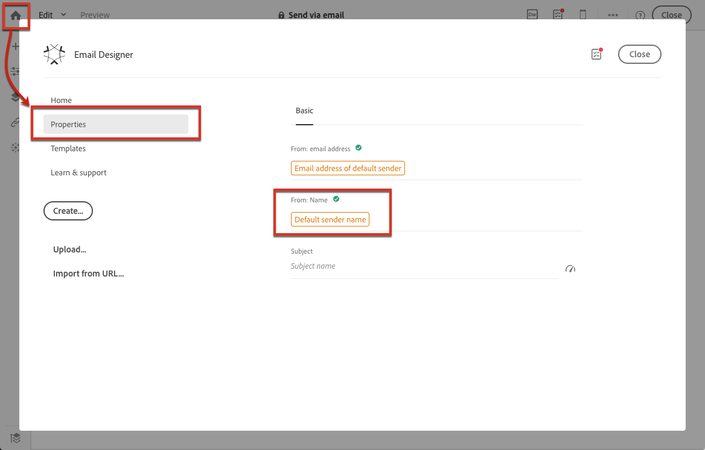
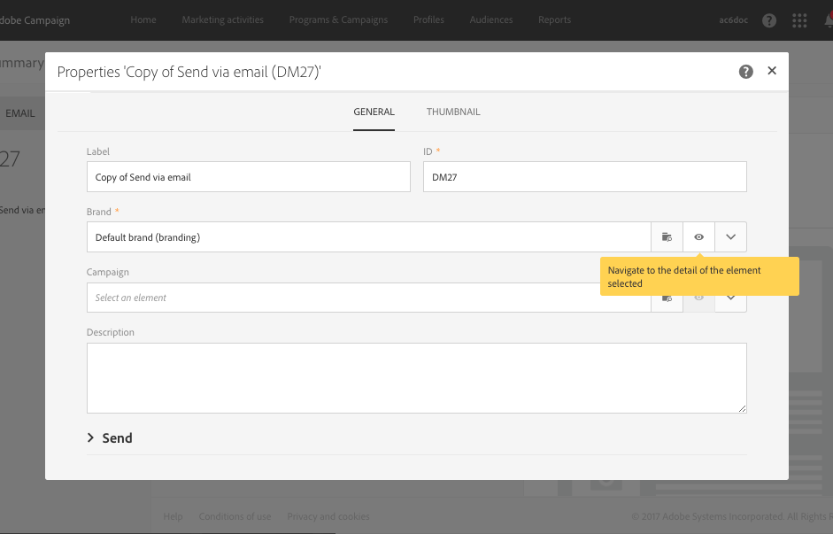

# Använd mallar {#use-templates}

Leveransmallar ger ökad effektivitet genom färdiga scenarier för de flesta vanliga typer av aktiviteter. Med mallar kan marknadsförarna driftsätta nya kampanjer med minimal anpassning på kortare tid.

Läs mer om leveransmallar i [det här avsnittet](../../start/using/marketing-activity-templates.md).

## Kom igång med leveransmallar {#gs-templates}

A [leveransmall](../../start/using/marketing-activity-templates.md#creating-a-new-template) Med kan du definiera en uppsättning tekniska och funktionella egenskaper som passar dina behov och som kan återanvändas för framtida leveranser. Sedan kan ni spara tid och standardisera leveranser vid behov.

När du hanterar flera varumärken i Adobe Campaign rekommenderar Adobe att du har en underdomän per varumärke. En bank kan till exempel ha flera underdomäner som motsvarar var och en av dess regionala myndigheter. Om en bank äger domänen bluebank.com kan dess underdomäner vara @ny.bluebank.com, @ma.bluebank.com, @ca.bluebank.com osv. Med en leveransmall per underdomän kan ni alltid använda rätt förkonfigurerade parametrar för varje varumärke, vilket undviker fel och sparar tid.

**Tips**: För att undvika konfigurationsfel i Campaign rekommenderar vi att du duplicerar en inbyggd mall och ändrar dess egenskaper i stället för att skapa en ny mall.

## Konfigurera adresser

* Avsändarens adress är obligatorisk för att tillåta att ett e-postmeddelande skickas.

* En del Internet-leverantörer (Internet Service Providers) kontrollerar avsändarens adress innan de accepterar meddelanden.

* En felformaterad adress kan leda till att den nekas av den mottagande servern. Du måste se till att rätt adress anges.

* Adressen måste uttryckligen identifiera avsändaren. Domänen måste ägas av och registreras hos avsändaren.

* Adobe rekommenderar att du skapar e-postkonton som motsvarar adresserna som angetts för leveranser och svar. Kontakta systemadministratören för meddelanden.

I **[!UICONTROL Advanced parameters]** i egenskaperna för en e-postmall, **[!UICONTROL From (email address)]** -fältet motsvarar avsändarens adress.

Adressdomänen måste vara samma som den underdomän som du konfigurerade.

The **[!UICONTROL Reply to]** fälten motsvarar den e-postadress och det namn som används för svaren.

**Tips** - Adobe rekommenderar att man använder en befintlig riktig adress som till exempel kundtjänst för ert varumärke. Om en mottagare skickar ett svar kan kundtjänst hantera det.

Om du vill ändra namnet på avsändaren som ska visas i huvudet för skickade meddelanden går du till **[!UICONTROL Properties]**  -fliken på startsidan för Email Designer (som du kommer åt via hemikonen) och klickar på **[!UICONTROL Default sender name]** -block.

För att öka öppningshastigheten för leveranser rekommenderar Adobe att du använder ett namn som lätt kan identifieras av mottagarna, till exempel varumärkesnamnet.

**Tips** - Om du vill förbättra mottagarens upplevelse ytterligare kan du lägga till en persons namn, till exempel&quot;Emma from Megastore&quot;.

Mer information om hur du anpassar avsändarnamnet finns i [E-postavsändare](../../designing/using/subject-line.md#email-sender).

## Anpassa SMS-avsändarens namn

I **Avancerade parametrar** i en SMS-malls egenskaper, **Från** gör att du kan anpassa namnet på SMS-meddelandets avsändare med en teckensträng. Det namnet visas som avsändarnamn för SMS-meddelandet på mottagarens mobiltelefon.

Om fältet är tomt är det källnumret som anges i det externa kontot som används.  Om inget källnummer anges används den korta koden.  Mer information finns i [SMS-konfiguration](../../administration/using/configuring-sms-channel.md).

**Tips** - Kontrollera lagstiftningen i ditt land angående ändring av avsändaradressen. Du bör också höra med din SMS-tjänstleverantör om de erbjuder en sådan funktion.

## Konfigurera en kontrollgrupp

När leveransen har skickats kan du jämföra beteendet hos de uteslutna mottagarna med mottagarna som tog emot leveransen. Sedan kan ni mäta effektiviteten i era kampanjer. Läs mer om kontrollgrupper [det här avsnittet](../../sending/using/control-group.md).

## Använd typografi för att tillämpa filter eller kontrollregler

En typologi innehåller kontrollregler som tillämpas under analysfasen innan ett meddelande skickas.

I **[!UICONTROL Advanced parameters]** > **[!UICONTROL Preparation]** i mallens egenskaper kan du ändra standardtypologin efter behov.

Om du till exempel vill ha bättre kontroll över utgående trafik kan du definiera vilka IP-adresser som kan användas genom att definiera en tillhörighet per underdomän och skapa en typologi per tillhörighet. Tillhörigheterna definieras i instansens konfigurationsfil. Kontakta Adobe Campaign-administratören.

Mer information om typologier finns i [det här avsnittet](../../sending/using/managing-typologies.md).

## Länka ett varumärke till en mall

Parametrarna för skickade e-postmeddelanden som rör ett varumärkes identitet (till exempel varumärkets logotyp eller avsändaradressen) hanteras centralt i Adobe Campaign. Du kan skapa ett eller flera varumärken och länka dem till leveransmallar.

Mer information om hur du använder och konfigurerar varumärken i Adobe Campaign finns i Varumärke.

Om du vill visa eller ändra varumärket som tilldelats en leveransmall väljer du mallens Redigera-egenskapsknapp och går till varumärkets detaljnivå.

Mer information om hur du länkar ett varumärke till en mall finns i [Tilldela ett varumärke till ett e-postmeddelande](../../administration/using/branding.md#assigning-a-brand-to-an-email).

Lär dig hur du skapar och konfigurerar ett varumärke [i det här avsnittet](../../administration/using/branding.md#creating-a-brand).
