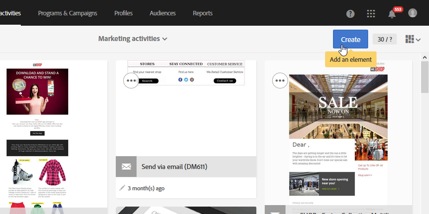

# Tillgänglighet i Adobe Campaign Standard {#accessibility-acs}

Läs mer om tillgänglighetsstöd i Adobe Campaign Standard Workspace.

Med hjälpmedel avses att göra produkter användbara för personer med funktionshinder som syn-, hörsel-, kognitiv-, motor- eller andra funktionshinder. Exempel på hjälpmedelsfunktioner för programprodukter är skärmläsarstöd, textmotsvarigheter för grafik, kortkommandon, ändringar av visningsfärger till hög kontrast osv.

Adobe Campaign Standard har vissa verktyg som gör dem tillgängliga att använda, till exempel kontrast, tangentbordsnavigering, sammanhangsberoende hjälp och responsiv storlek.

## Tillgänglighetsfunktioner {#accessibility-features}

### Kontrast {#contrast}

Adobe Campaign Standard användargränssnitt strävar efter att ge tillräckligt med kontrast i programmet för att ge en lättillgänglig visningsupplevelse för användare med nedsatt syn eller färgbrist.

* Ikonerna för paus och avbryt i arbetsflöden har uppdaterats för att förbättra kontrasten mellan bakgrund och förgrund.

   

* Den text som visas när en leverans lyckades innehöll stor grön text med otillräcklig kontrast mellan bakgrunden och förgrunden. Kontrasten har uppdaterats med ett minsta förhållande på 3:1.

   

* Adobe Campaign Standard säkerställer att färg, form eller plats inte är de enda metoder som används för att förmedla information eller hierarki.

### Användargränssnitt {#user-interface}

Adobe Campaign Standard användargränssnitt gör det enklare för användarna att se och höra innehåll, inklusive att separera förgrunden från bakgrunden och lägga till alternativa texter till de olika knapparna.

* När användaren lämnar ett obligatoriskt ID-fält tomt visar en bild visuellt vilket fält som är fel med felmeddelandetexten.

   

* Innehåll som visas vid hovring eller fokus kan stängas av användaren och döljer inte annat innehåll.

   

* Alternativa texter för bildknappar har lagts till och kan läsas i stället för att en bild visas.

   

* Datatabellrubrikernas celler lämnas inte tomma i tabellhörnet när listor används.

### Skapa responsiv storlek för flera enheter {#resize-devices}

När du utformar för flera enheter och plattformar är det viktigt att skapa en sömlös upplevelse för skärmstorlekar i olika upplösningar för mobila enheter och datorer.

Med Adobe Campaign Standard kan du utforma och testa e-postmeddelanden och push-meddelanden på olika enheter som: iPhone, Android-enheter, iPad, Android-surfplatta och -dator.

## Sammanhangsberoende hjälp {#contextual-help}

>[!NOTE]
>
> Kontexthjälpen är bara tillgänglig när du använder e-postdesignern.

Kontexthjälpen kan hjälpa dig att förstå de olika begärda fälten och funktionerna bättre. Den vägleder dig också genom produktdokumentationen för att lära dig mer om den valda funktionen.

När du utformar ett e-postmeddelande kan du hålla markören över informationsknappen. Ett verktygstips med beskrivningar och länkar till produktdokumentationen visas.

## Stöd för skärmförstorare {#screen-magnifiers}

En skärmläsare läser upp text som visas på datorskärmen. Den läser även information som inte är text, t.ex. knappetiketter eller bildbeskrivningar i programmet, som finns i hjälpmedelstaggar eller -attribut.

I Adobe Campaign Standard är innehåll och funktioner fortfarande tillgängliga även om användaren åsidosätter egenskaper för textavstånd.

## Arbeta på ditt favoritspråk {#languages}

Adobe Campaign Standard finns på olika språk: Engelska, franska och tyska.

Observera att språket är konfigurerat vid installationen och kan inte ändras efteråt.

## Kortkommandon {#shortcuts}

### Startsida {#homepage-shortcuts}

| Genväg | Åtgärd |
|:-:|:-:|
| Tabb | Navigera genom de olika elementen i användargränssnittet |
| Enter eller Space | Aktivera det markerade objektet |

### E-postdesigner {#email-designer-shortcuts}

| Genväg | Åtgärd |
|:-:|:-:|
| CTRL+Z | Ångra |
| CTRL + Y | Gör om |

### Dynamiska rapporter {#report-shortcuts}

| Genväg | Åtgärd |
|:-:|:-:|
| CTRL + O | Öppna projekt |
| CTRL + S | Spara |
| Skift + CTRL + S | Spara som |
| Alt + R | Uppdatera projekt |
| Skift + CTRL + V | Hämta CSV |
| Alt + P | Skriv ut |
| CTRL+Z | Ångra |
| CTRL + Skift + Z | Gör om |
| Alt + B | Ny tom panel |
| Alt + A | Ny frihandsfigur |
| Alt+1 | Ny frihandstabell |
| Alt+2 | Ny rad |
| Alt+3 | Nytt fält |
| Alt + S | Skicka rapporten nu |
| Skift+Alt+S | Skicka rapport enligt schema |
| Skift = Alt + L | Schemalagda rapporter |

## Ytterligare läsning {#further-reading}

Adobe Campaign Standard strävar efter att tillhandahålla en allt större grad av tillgänglighet, vilket gör produkten enkel att använda för alla.

Vi rekommenderar att du använder [Adobe-formuläret för tillgänglighetsfeedback](https://www.adobe.com/accessibility/feedback.html) för att skicka förbättringsförslag och tillgänglighetsproblem som du stöter på.

Du kan även läsa [Versionsinformation för Adobe Campaign Standard](https://experienceleague.adobe.com/docs/campaign-standard/using/release-notes/release-notes.html?lang=en#release-notes) för att följa de senaste förbättringarna och funktionerna.