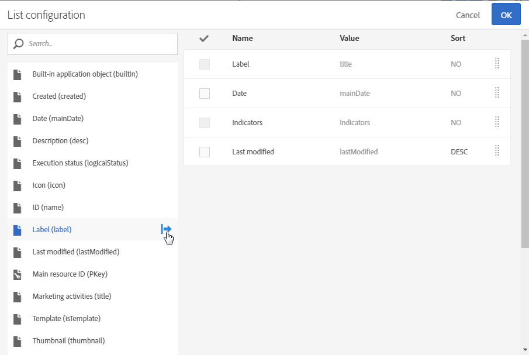

# Anpassa listor{#customizing-lists}

Med skärmar i **List** kan du visa element för en eller flera angivna resurser.

Adobe Campaign har två typer av listor:

* En **homogen**-lista, det vill säga när den innehåller en enda typ av resurs. Profillistan innehåller till exempel bara profiler.
* En **heterogen**-lista, vilket är när den innehåller flera typer av resurser. Till exempel innehåller listan över marknadsföringsaktiviteter landningssidor, arbetsflöden, e-post, SMS, osv.

Listorna visas i kolumner. Varje kolumn kan sorteras i stigande eller fallande ordning en i taget.

Elementen i en lista har en kryssruta där du kan markera dem. Genom att markera ett eller flera element kan du utföra flera åtgärder, som att redigera, duplicera och ta bort dessa element.

När du hovrar över ett element i listan **snabbåtgärder**. Dessa åtgärder gör att användaren kan utföra olika åtgärder för elementet som hovras över, till exempel redigera, markera, ta bort eller visa information.

Du kan också konfigurera om kolumner i en lista ska visas eller inte. Så här lägger du till eller tar bort kolumner:

1. Kontrollera att skärmen är i läget **Lista**.

   

1. Gå till fönstret för listkonfiguration genom att välja knappen  i åtgärdsfältet.

   

1. Lägg till de kolumner som du vill ta med i listan. Det gör du genom att markera en kolumn till vänster i fönstret och sedan använda knappen  i åtgärdsfältet för att lägga till en kolumn.

   De valbara kolumnerna motsvarar listresursen.

   För varje kolumn som läggs till anger du om du vill använda sortering som standard:

   * **[!UICONTROL NO]**: Ingen sortering i kolumnen
   * **[!UICONTROL ASC]**: Använder en stigande (stigande) sortering i kolumnen
   * **[!UICONTROL DESC]**: Tillämpar en fallande (avtagande) sortering på kolumnen.

1. Ta bort de kolumner som du inte vill ska visas genom att markera rutorna för de kolumner som ska tas bort. Använd sedan knappen  i åtgärdsfältet för att bekräfta att du vill ta bort dem.
1. När listan innehåller rätt kolumner kan du ändra visningsordningen genom att markera de kolumner som du vill flytta. Använd sedan pilarna  och .
1. Bekräfta listkonfigurationen genom att välja **[!UICONTROL OK]**.

Listan visas nu som den har konfigurerats.
