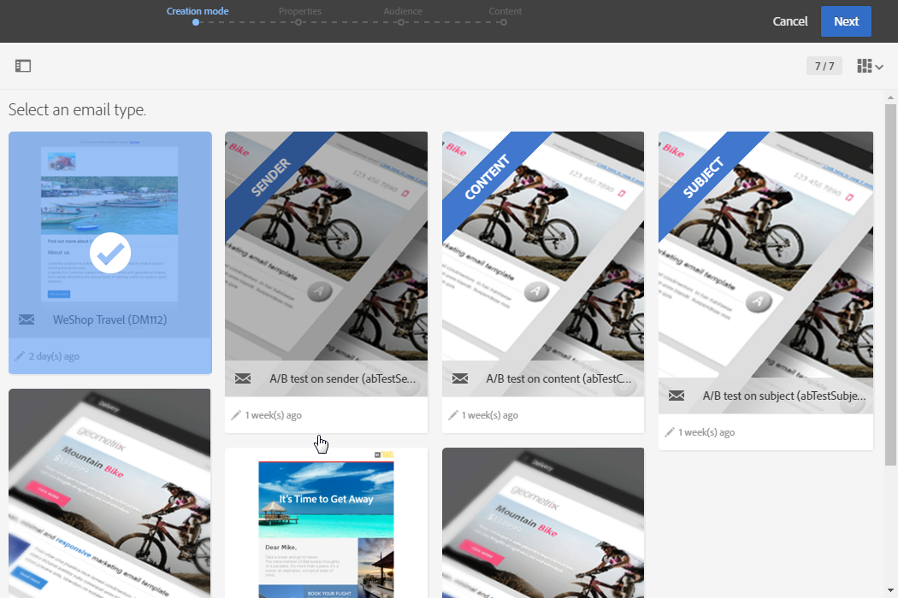
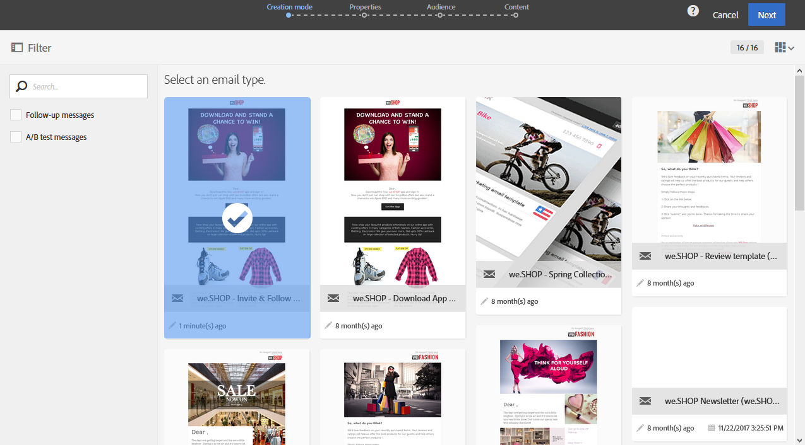

# Mallar för marknadsföringsaktiviteter {#marketing-activity-templates}

## Om mallar {#about-templates}

När du skapar en ny marknadsföringsaktivitet så uppmanas du att välja en typ eller mall i den första skärmen i guiden.  Med mallar kan du förkonfigurera vissa parametrar efter behov.  Mallen kan innehålla en fullständig eller delvis konfiguration av marknadsföringsaktiviteten.  Mallhanteringen utförs av den funktionella administratören.

Slutanvändaren ser ett förenklat gränssnitt.  När du skapar en ny marknadsföringsaktivitet behöver du bara välja den mall du vill använda.  Du behöver inte bekymra dig om några tekniska konfigurationer.  Detta har redan förkonfigurerats av mallens funktionsadministratör.

Om det till exempel gäller en e-postmall kan du fylla i HTML-innehållet, målgruppen och andra parametrar i förväg inför leveransen. Som exempelvis schemaläggning, testprofiler, leveransens allmänna egenskaper, avancerade parametrar osv.  På så vis kan du spara tid när du skapar en ny aktivitet.

För varje typ av marknadsföringsaktivitet finns det en eller flera färdiga mallar med minimal konfiguration.  Dessa färdiga mallar kan inte ändras eller raderas.

Det finns mallar för följande marknadsföringsaktiviteter:

* Program
* Kampanjer
* E-postleveranser
* SMS-leveranser
* Push-meddelanden
* Landningssidor
* Arbetsflöden
* Tjänster
* Import
* Transaktionsmeddelanden

## Skapa en ny mall {#creating-a-new-template}

Meddelandemallar kan hanteras av plattformens funktionsadministratör i **[!UICONTROL Resources > Templates]**-menyn.  Körklara mallar kan inte ändras eller tas bort.  Om du vill skapa en ny mall så måste du duplicera en befintlig mall.

1. Välj en befintlig mall.  I vårt exempel har vi valt en **[!UICONTROL Delivery template]**.

   

1. Håll pekaren över den med musen och välj sedan **[!UICONTROL Duplicate element]**-alternativet.

   

1. Konfigurera vilka inställningar du vill precis som när du [skapar en ny marknadsföringsaktivitet](../../start/using/marketing-activities.md#creating-a-marketing-activity) från grunden.

   

Skapade mallar kan sedan väljas av standardanvändaren på den första skärmen i guiden när en marknadsföringsaktivitet skapas.

## Använda en mall {#using-a-template}

Vi ska nu titta närmare på hur du använder en mall som har skapats i det tidigare avsnittet.

>[!NOTE]
>
>Att skapa en marknadsföringsaktivitet baserad på en mall utförs vanligtvis med en vanlig typ av användarprofil.

1. Skapa en ny marknadsföringsaktivitet.

   

1. På den första skärmen i guiden väljer du den mall som du vill använda.

   

   Marknadsföringsaktiviteten är förkonfigurerad med de parametrar som definieras i mallen.

   
