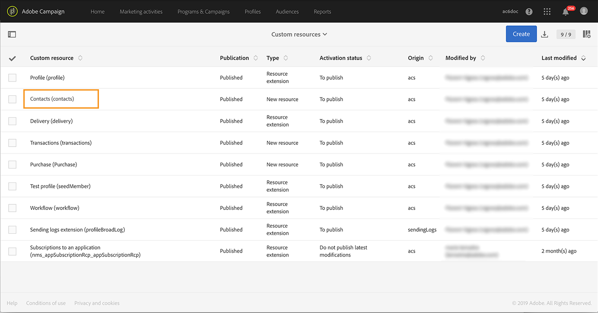

# Hantera förfrågningar om användarens information {#privacy-requests}

Se [det här avsnittet](../../start/using/privacy-management.md) för en allmän presentation om sekretesshantering.

Denna information gäller för GDPR, CCPA, PDPA och LGPD. Se [det här avsnittet](../../start/using/privacy-management.md#privacy-management-regulations) för mer information om dessa regelverk.

[Det här avsnittet](#sale-of-personal-information-ccpa) förklarar avanmälan till försäljning av personuppgifter vilken är specifik för CCPA.

>[!IMPORTANT]
>
>Från och med version 19.4 är användningen av API och gränssnitt i Campaign för förfrågningar gällande åtkomst och borttagning inaktuell. För alla förfrågningar om åtkomst och borttagning gällande GDPR, CCPA, PDPA eller LGPD måste du använda integreringsmetoden [Privacy Core Service](#create-privacy-request).

## Om förfrågningar om användarens information {#about-privacy-requests}

För att underlätta beredskapen gällande din integritet kan du hantera förfrågningar om åtkomst och borttagning med Adobe Campaign. **Det här avsnittet** beskriver **åtkomsträttigheter** och [rätten att glömmas](../../start/using/privacy-management.md#right-access-forgotten) (borttagningsbegäran).

För att kunna utföra dessa förfrågningar måste du använda integreringen **Privacy Core Service**. Förfrågningar om användarens information som skickas från Privacy Core Service till alla lösningar i Experience Cloud hanteras automatiskt av Campaign via ett dedikerat arbetsflöde.

### Förhandskrav {#prerequesites}

Adobe Campaign erbjuder verktyg för personuppgiftsansvarig som låter dig skapa och bearbeta förfrågningar om användarens information gällande data som lagras i Adobe Campaign. Det är dock den personuppgiftsansvariges ansvar att hantera relationen med den registrerade (e-post, kundtjänst eller en webbportal).

Det är därför ditt ansvar som personuppgiftsansvarig att bekräfta identiteten på den registrerade som gör förfrågan och bekräfta att de uppgifter som skickas tillbaka till den som utförde förfrågan avser den registrerade.

>[!NOTE]
>
>Mer information om personuppgifter och de olika enheter som hanterar data (personuppgiftsansvarig, personuppgiftsbiträde och registrerad) finns i [Personuppgifter och personer](../../start/using/privacy.md#personal-data).

### Namnrymder {#namesspaces}

Innan du skapar förfrågningar om användarens information måste du definiera den namnrymd som ska användas. Namnrymden är nyckeln som används för att identifiera den registrerade i databasen i Adobe Campaign. Det finns två färdiga namnrymder: e-post och mobiltelefon. Om du behöver en annan namnrymd (såsom ett anpassat profilfält) ska du följa de här stegen.

Se även den här [självstudiekursen](https://experienceleague.adobe.com/docs/campaign-standard-learn/tutorials/privacy/namespaces-for-privacy-requests.html?lang=sv#privacy) om hur du skapar en namnrymd.

>[!NOTE]
>
>Om du använder flera namnrymder måste du skapa en förfrågan om användarens information per namnrymd.

1. Klicka på Adobe Campaign-logotypen i det övre vänstra hörnet och välj sedan **[!UICONTROL Administration]** > **[!UICONTROL Namespaces]**.

   

1. Klicka på **[!UICONTROL Create]** i listan med namnrymder.

   

1. Ange en **[!UICONTROL Label]**.

   

1. Välj **[!UICONTROL Map from Identity Namespace Service]** och markera en namnrymd i listan **[!UICONTROL Identity Service Namespaces]** om du vill använda en befintlig namnrymd för en identitetstjänst .

   

   Markera **[!UICONTROL Create new]** och ange ett namn i fältet **[!UICONTROL Identity namespace name]** om du vill skapa en ny namnrymd i **[!UICONTROL Identity Service]** och registrera den i Campaign.

   

   Mer information om namnrymder för identiteter finns i dokumentationen för [Experience Platform](https://experienceleague.adobe.com/docs/experience-platform/identity/namespaces.html?lang=sv) .

1. Namnrymden för en identitetstjänst registreras till en namnrymd i Campaign. Du måste ange hur namnrymden ska stämmas av i Campaign.

   Välj en målregistrering (**[!UICONTROL Recipients]**, **[!UICONTROL Real-time event]** eller **[!UICONTROL Subscriptions to an application]**). Om du vill använda flera målregistreringar måste du skapa en namnrymd per målregistrering.

   

1. Välj **[!UICONTROL Reconciliation key]**. Det här är fältet som används för att identifiera den registrerade i databasen i Adobe Campaign.

   

1. Klicka på **[!UICONTROL Create]**. Du kan nu skapa förfrågningar om användarens information baserat på din nya namnrymd. Om du använder flera namnrymder måste du skapa en förfrågan om användarens information per namnrymd.

### Skapa en förfrågan om användarens information {#create-privacy-request}

>[!IMPORTANT]
>
>Integreringen av **Privacy Core Service** är den metod du bör använda för alla förfrågningar om åtkomst och borttagning.
>
>Från och med version 19.4 är användningen av API och gränssnitt i Campaign för förfrågningar gällande åtkomst och borttagning inaktuell. Använd Core Privacy Service för alla förfrågningar om åtkomst och borttagning gällande GDPR, CCPA, PDPA eller LGPD.

Integrationen av Privacy Core Service låter dig automatisera dina förfrågningar om användarens information i ett sammanhang med flera olika lösningar via ett enda JSON API-anrop. Förfrågningar om användarens information som skickas från Privacy Core Service till alla lösningar i Experience Cloud hanteras automatiskt av Campaign via ett dedikerat arbetsflöde.

Läs dokumentationen för [Experience Platform Privacy Service](https://experienceleague.adobe.com/docs/experience-platform/privacy/home.html?lang=sv) om hur du skapar förfrågningar om användarens information via Privacy Core Service.

Varje jobb i Privacy core service delas upp i flera förfrågningar om användarens information i Campaign baserat på hur många namnrymder som används. En förfrågan motsvarar en namnrymd. Ett jobb kan även köras på flera instanser. Därför skapas flera filer för ett jobb. Om en förfrågan till exempel har två namnrymder och körs i tre instanser skickas totalt sex filer. En fil per namnrymd och instans.

Mönstret för ett filnamn är: `<InstanceName>-<NamespaceId>-<ReconciliationKey>.xml`

* **InstansNamn**: namn på instansen i Campaign
* **Namnrymd-ID**: identitetstjänstens namnrymd-ID för den namnrymd som används
* **Avstämningsnyckel**: krypterad avstämningsnyckel

### Lista över resurser {#list-of-resources}

När en förfrågan om borttagning eller åtkomst till användarens information utförs söker Adobe Campaign igenom alla den registrerades data baserat på **avstämningsvärdet** i alla resurser som har en länk till profilresursen (egen typ).

Här följer en lista över färdiga resurser som tas i beaktande när förfrågningar om användarens information utförs:

* Profiler (mottagare)
* Leveransloggar för profiler (broadLogRcp)
* Spårningsloggar för profiler (trackingLogRcp)
* Leveransloggar (prenumerationer på ett program) (broadLogAppSubRcp)
* Spårningsloggar (prenumerationer på ett program) (trackingLogAppSubRcp)
* Prenumerationer på ett program (appSubscriptionRcp)
* Prenumerationshistorik för profiler (subHistoRcp)
* Profilprenumerationer (subscriptionRcp)
* Besökare (besökare)

Om du har skapat anpassade resurser som har en länk till profilresursen (egen typ) beaktas även de. Om du till exempel har en transaktionsresurs länkad till profilresursen och en transaktionsinformationsresurs länkad till transaktionsresursen beaktas båda.

Se även [den här självstudiekursen](https://experienceleague.adobe.com/docs/campaign-standard-learn/tutorials/privacy/custom-resources-for-privacy-requests.html?lang=sv#privacy) om hur du modifierar anpassade resurser.

För att det här ska fungera måste du välja alternativet **[!UICONTROL Deleting the target record implies deleting records referenced by the link]** i den anpassade resursen:

1. Klicka på Adobe Campaign-logotypen i det övre vänstra hörnet och välj sedan **[!UICONTROL Administration]** > **[!UICONTROL Development]** > **[!UICONTROL Custom resources]**.

1. Välj en anpassad resurs som har en länk till profilresursen (egen typ).

1. Klicka på avsnittet **[!UICONTROL Links]**.

1. Klicka på pennikonen (**[!UICONTROL Edit properties]**) för varje länk.

1. Välj alternativet **[!UICONTROL Deleting the target record implies deleting records referenced by the link]** i avsnittet **[!UICONTROL Behavior if deleted/duplicated]**.

   

### Status gällande förfrågningar om användarens information {#privacy-request-statuses}

Här följer de olika statusarna gällande förfrågningar om användarens information:

* **[!UICONTROL New]**/**[!UICONTROL Retry pending]**: arbetsflödet har inte bearbetat förfrågan ännu.
* **[!UICONTROL Processing]**/**[!UICONTROL Retry in progress]**: arbetsflödet bearbetar förfrågan.
* **[!UICONTROL Delete pending]**: arbetsflödet har identifierat alla mottagardata för borttagning.
* **[!UICONTROL Delete in progress]**: arbetsflödet bearbetar borttagningen.
   <!--**[!UICONTROL Delete Confirmation Pending]** (Delete request in 2-steps process mode): the workflow has processed the Access request. Manual confirmation is requested to perform the deletion. The button is available for 15 days.-->
* **[!UICONTROL Complete]**: behandlingen av förfrågan har slutförts utan fel.
* **[!UICONTROL Error]**: arbetsflödet har påträffat ett fel. Orsaken visas i listan över förfrågningar om användarens information i kolumnen **[!UICONTROL Request status]**. Till exempel innebär **[!UICONTROL Error data not found]** att inga mottagardata som matchar den registrerades **[!UICONTROL Reconciliation value]** har hittats i databasen.

<!--### Disabling the 2-step process {#disabling-two-step-process}

The Core Privacy Service does not support the 2-step process.

>[!IMPORTANT]
>
>Before using the Core Privacy Service integration to manage your Privacy requests, you must disable the 2-step process for Delete requests from the Campaign Standard interface.

If this option is not disabled, all Delete requests managed with the Privacy Core Service will remain in pending state and will not complete.

By default, the 2-step process is activated.

To change this mode, click **[!UICONTROL Edit properties]**, in the top right corner of the **[!UICONTROL Privacy Requests]** screen, then uncheck the **[!UICONTROL Activate the 2-step process]** option.

-->

## Avanmäl dig till försäljning av personuppgifter (CCPA) {#sale-of-personal-information-ccpa}

**CCPA (California Consumer Privacy Act)** ger personer bosatta i Kalifornien nya rättigheter när det gäller deras personuppgifter och ålägger vissa företag som bedriver verksamhet i Kalifornien skyldigheter när det gäller uppgiftsskydd.

Konfigurationen och användningen av förfrågningar gällande åtkomst och borttagning är gemensamma för både GDPR och CCPA. Det här avsnittet presenterar avanmälan för försäljning av personuppgifter vilken är specifik för CCPA.

Förutom de verktyg för [medgivandehantering](../../start/using/privacy-management.md#consent-management) som tillhandahålls av Adobe Campaign har du möjligheten att spåra om en konsument har avanmält sig till försäljning av personuppgifter.

En konsument bestämmer genom ert system att denne inte tillåter att sina personuppgifter säljs till tredje part. I Adobe Campaign kan du lagra och spåra den här informationen.

>[!NOTE]
>
>Du kan använda funktionen för avanmälan till försäljning av personuppgifter via gränssnittet och API:et i Campaign. Du kan inte använda den via Privacy Core Service.

>[!IMPORTANT]
>
>Det är ditt ansvar som personuppgiftsansvarig att ta emot den registrerades förfrågan och att hålla reda på förfrågningsdatum för CCPA. Som teknikleverantör erbjuder vi bara ett sätt att avanmäla sig. Mer information om din roll som personuppgiftsansvarig finns i [Personuppgifter och personer](../../start/using/privacy.md#personal-data).

### Krav för anpassade tabeller {#ccpa-prerequisite}

Från och med version 19.4 visas fältet **[!UICONTROL CCPA Opt-Out]** som ett färdigt fält i gränssnittet och API:et i Campaign. Som standard är fältet tillgängligt för standardresursen **[!UICONTROL Profile]**.

Om du använder en anpassad profilresurs måste du utöka resursen och lägga till fältet. Vi rekommenderar att du använder ett annat namn än det färdiga fältets, såsom: **[!UICONTROL Opt-Out for CCPA]** (optoutccpa). När ett nytt fält skapas stöds det automatiskt av API:et i Campaign.

Se [det här avsnittet](../../developing/using/extending-the-profile-resource-with-a-new-field.md) för mer information om hur du utökar profilresursen.

>[!NOTE]
>
>Att ändra resurser är en känslig åtgärd som endast får utföras av behöriga användare.

1. Gå till **[!UICONTROL Administration]** > **[!UICONTROL Development]** > **[!UICONTROL Custom Resources]**. Klicka på den anpassade profilresursen. Se [det här avsnittet](../../developing/using/creating-or-extending-the-resource.md) för mer information om att utöka en resurs.

   

1. Klicka på **[!UICONTROL Add field]** eller **[!UICONTROL Create Element]**, lägg till etiketten, ID:et och välj typen **[!UICONTROL Boolean]**. Använd **avanmälan för CCPA** som namn. Använd följande för ID:t: **optOutCcpa**.

   

1. Lägg till fältet och välj **[!UICONTROL Input field]** på fliken **[!UICONTROL Screen definition]** under **[!UICONTROL Detail screen configuration]**. Detta gör att fältet blir tillgängligt i profillistan och detaljerna.  Se [det här avsnittet](../../developing/using/configuring-the-screen-definition.md) för mer information om hur du konfigurerar bildskärmsdefinitionen.

   

1. Gå till **[!UICONTROL Administration]** > **[!UICONTROL Development]** > **[!UICONTROL Publishing]**, förbered publikationen och publicera ändringarna. Se [det här avsnittet](../../developing/using/updating-the-database-structure.md) för mer information om att publicera en resurs.

   

1. Kontrollera att fältet är tillgängligt på en profils information. Mer information finns i [det här avsnittet](#usage).

### Användning {#usage}

Det är den personuppgiftsansvariges ansvar att fylla i fältets värde och följa CCPA:s riktlinjer och regler för försäljning av personuppgifter.

Du kan använda flera olika metoder för att fylla i värdena:

* Använda gränssnittet i Campaign genom att redigera mottagarens information (se nedan)
* Använda API:et i Campaign Privacy (se [API-dokumentationen](../../api/using/managing-ccpa-opt-out.md))
* Via ett arbetsflöde för dataimport

Du ska sedan se till att du aldrig säljer personuppgifter, från profiler som har avanmält sig, till någon tredje part.

1. Redigera en profil via gränssnittet i Campaign för att ändra avanmälningsstatusen.

   

1. När värdet för fältet är **[!UICONTROL True]** visas informationen i profilens information.

   

1. Du kan konfigurera profillistan så att den visar kolumnen avanmälan. Se [det här avsnittet](../../start/using/customizing-lists.md) för mer information om hur du konfigurerar listor.

   

1. Du kan klicka på kolumnen för att sortera mottagare enligt avanmälningsinformationen.

   
