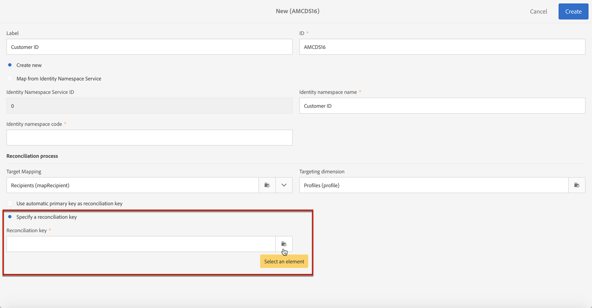

# Hantera sekretessförfrågningar {#privacy-requests}

En allmän presentation om sekretesshantering finns i [detta avsnitt](../../start/using/privacy-management.md).

Denna information gäller GDPR, CCPA, PDPA och LGPD. For more on these regulations, see [this section](../../start/using/privacy-management.md#privacy-management-regulations).

Avanmäla försäljning av personuppgifter, som är specifikt för CCPA, förklaras i [detta avsnitt](#sale-of-personal-information-ccpa).

>[!IMPORTANT]
>
>Från och med 19.4 är användningen av Campaign-API:t och gränssnittet för begäranden om åtkomst och borttagning föråldrad. För alla GDPR-, CCPA-, PDPA- eller LGPD Access- och Delete-begäranden måste du använda integreringsmetoden [Privacy Core Service](#create-privacy-request) .

## Om sekretessförfrågningar {#about-privacy-requests}

För att underlätta beredskapen för din integritet kan du hantera förfrågningar om åtkomst och borttagning med Adobe Campaign. I **det här avsnittet** beskrivs **rätten till åtkomst** och [rätten att bli glömd](../../start/using/privacy-management.md#right-access-forgotten)(borttagningsbegäran).

För att kunna utföra dessa förfrågningar måste du använda integreringen av **integritetspolicyn Core Service** . Sekretessförfrågningar som skickas från sekretesskärntjänsten till alla Experience Cloud-lösningar hanteras automatiskt av Campaign via ett dedikerat arbetsflöde.

### Förutsättningar {#prerequesites}

Adobe Campaign erbjuder datakontrollerarverktyg för att skapa och bearbeta sekretessförfrågningar för data som lagras i Adobe Campaign. Det är dock den personuppgiftsansvariges ansvar att hantera relationen till den registrerade (e-post, kundtjänst eller en webbportal).

Det är därför ditt ansvar som personuppgiftsansvarig att bekräfta identiteten på den registrerade som gör begäran och att bekräfta att de uppgifter som skickas tillbaka till den som gjorde begäran avser den registrerade.

>[!NOTE]
>
>Mer information om personuppgifter och om de olika enheter som hanterar data (personuppgiftsansvariga, databehandlare och registrerade) finns i [Personuppgifter och personuppgifter](../../start/using/privacy.md#personal-data).

### Namnutrymmen {#namesspaces}

Innan du skapar sekretessförfrågningar måste du definiera det namnutrymme som du ska använda. Namnutrymmet är nyckeln som ska användas för att identifiera den registrerade i Adobe Campaign-databasen. Det finns två färdiga namnutrymmen: e-post och mobiltelefon. Om du behöver ett annat namnutrymme (till exempel ett anpassat profilfält) följer du de här stegen.

Se även den här [självstudiekursen](https://experienceleague.adobe.com/docs/campaign-standard-learn/tutorials/privacy/namespaces-for-privacy-requests.html?lang=en#privacy) om hur du skapar ett namnutrymme.

>[!NOTE]
>
>Om du använder flera namnutrymmen måste du skapa en sekretessbegäran per namnutrymme.

1. Click the Adobe Campaign logo in the top left corner, then select **[!UICONTROL Administration]** > **[!UICONTROL Namespaces]**.

   

1. Klicka på i listan med namnutrymmen **[!UICONTROL Create]**.

   

1. Ange ett **[!UICONTROL Label]** värde.

   

1. Om du vill använda ett befintligt namnutrymme för en identitetstjänst väljer du **[!UICONTROL Map from Identity Namespace Service]** och väljer ett namnutrymme i **[!UICONTROL Identity Service Namespaces]** listan.

   

   Om du vill skapa ett nytt namnutrymme i **[!UICONTROL Identity Service]** och mappa det i Campaign markerar du **[!UICONTROL Create new]** och anger ett namn i **[!UICONTROL Identity namespace name]** fältet.

   

   Mer information om namnutrymmen för identiteter finns i dokumentationen för [Experience Platform](https://experienceleague.adobe.com/docs/experience-platform/identity/namespaces.html?lang=en) .

1. Ett identitetstjänstens namnutrymme mappas till ett namnutrymme i Campaign. Du måste ange hur namnutrymmet ska förenas i Campaign.

   Välj en målmappning (**[!UICONTROL Recipients]**, **[!UICONTROL Real-time event]** eller **[!UICONTROL Subscriptions to an application]**). Om du vill använda flera målmappningar måste du skapa ett namnutrymme per målmappning.

   

1. Välj **[!UICONTROL Reconciliation key]**. Detta är det fält som ska användas för att identifiera den registrerade i Adobe Campaign-databasen.

   

1. Klicka på **[!UICONTROL Create]**. Nu kan du skapa sekretessförfrågningar baserat på ditt nya namnutrymme. Om du använder flera namnutrymmen måste du skapa en sekretessbegäran per namnutrymme.

### Creating a Privacy request {#create-privacy-request}

>[!IMPORTANT]
>
>Integreringen av **integritetstjänsten** Core är den metod du bör använda för alla begäranden om åtkomst och borttagning.
>
>Från och med 19.4 är användningen av Campaign-API:t och gränssnittet för begäranden om åtkomst och borttagning föråldrad. Använd Privacy Servicen Core för alla GDPR-, CCPA-, PDPA- eller LGPD Access- och Delete-begäranden.

Integriteten i bastjänstintegreringen gör att du kan automatisera dina sekretessförfrågningar i ett flerlösningssammanhang via ett enda JSON API-anrop. Sekretessförfrågningar som skickas från sekretesskärntjänsten till alla Experience Cloud-lösningar hanteras automatiskt av Campaign via ett dedikerat arbetsflöde.

Läs dokumentationen till [Experience Platform Privacy Service](https://experienceleague.adobe.com/docs/experience-platform/privacy/home.html?lang=en) om hur du skapar sekretessförfrågningar från tjänsten Privacy Core.

Varje sekretessjobb för kärntjänsten delas upp i flera sekretessbegäranden i Campaign baserat på hur många namnutrymmen som används, en begäran som motsvarar ett namnutrymme. Ett jobb kan också köras på flera instanser. Därför skapas flera filer för ett jobb. Om en begäran till exempel har två namnutrymmen och körs i tre instanser, skickas totalt sex filer. En fil per namnutrymme och instans.

Mönstret för ett filnamn är: `<InstanceName>-<NamespaceId>-<ReconciliationKey>.xml`

* **InstanceName**: Namn på Campaign-instans
* **NamespaceId**: Identitetstjänstens namnområdes-ID för det namnområde som används
* **Avstämningsnyckel**: Kodad avstämningsnyckel

### Lista över resurser {#list-of-resources}

När Adobe Campaign utför en begäran om att ta bort eller få åtkomst till sekretess söker igenom alla den registrerade personens data baserat på **avstämningsvärdet** i alla resurser som har en länk till profilresursen (egen typ).

Här följer en lista över färdiga resurser som tas i beaktande när sekretessförfrågningar utförs:

* Profiler (mottagare)
* Profilleveransloggar (broadLogRcp)
* Profilspårningsloggar (trackingLogRcp)
* Leveransloggar (prenumerationer på ett program) (broadLogAppSubRcp)
* Spårningsloggar (prenumerationer på ett program) (trackingLogAppSubRcp)
* Prenumerationer på ett program (appSubscriptionRcp)
* Prenumerationshistorik för profiler (subHistoryRcp)
* Profilprenumerationer (subscriptionRcp)
* Besökare (besökare)

Om du har skapat anpassade resurser som har en länk till profilresursen (egen typ), kommer de också att beaktas. Om du till exempel har en transaktionsresurs som är länkad till profilresursen och en transaktionsinformationsresurs som är länkad till transaktionsresursen, kommer båda att beaktas.

Se även [den här självstudiekursen](https://experienceleague.adobe.com/docs/campaign-standard-learn/tutorials/privacy/custom-resources-for-privacy-requests.html?lang=en#privacy) om hur du ändrar anpassade resurser.

För att detta ska fungera måste du välja alternativet **[!UICONTROL Deleting the target record implies deleting records referenced by the link]** i den anpassade resursen:

1. Click the Adobe Campaign logo in the top left corner, then select **[!UICONTROL Administration]** > **[!UICONTROL Development]** > **[!UICONTROL Custom resources]**.

1. Välj en anpassad resurs som har en länk till profilresursen (egen typ).

1. Klicka på **[!UICONTROL Links]** avsnittet.

1. Klicka på pennikonen (**[!UICONTROL Edit properties]**) för varje länk.

1. In the **[!UICONTROL Behavior if deleted/duplicated]** section, select the **[!UICONTROL Deleting the target record implies deleting records referenced by the link]** option.

   

### Status för sekretessförfrågningar {#privacy-request-statuses}

Här är de olika statusvärdena för sekretessförfrågningar:

* **[!UICONTROL New]** / **[!UICONTROL Retry pending]**: arbetsflödet har inte bearbetat begäran ännu.
* **[!UICONTROL Processing]** / **[!UICONTROL Retry in progress]**: arbetsflödet bearbetar begäran.
* **[!UICONTROL Delete pending]**: arbetsflödet har identifierat alla mottagardata som ska tas bort.
* **[!UICONTROL Delete in progress]**: arbetsflödet bearbetar borttagningen.
   <!--**[!UICONTROL Delete Confirmation Pending]** (Delete request in 2-steps process mode): the workflow has processed the Access request. Manual confirmation is requested to perform the deletion. The button is available for 15 days.-->
* **[!UICONTROL Complete]**: behandlingen av begäran har slutförts utan fel.
* **[!UICONTROL Error]**: arbetsflödet har påträffat ett fel. Orsaken visas i listan över sekretessförfrågningar i **[!UICONTROL Request status]** kolumnen. Till exempel **[!UICONTROL Error data not found]** innebär det att inga mottagardata som matchar den registrerade har **[!UICONTROL Reconciliation value]** hittats i databasen.

### Inaktivera tvåstegsprocessen {#disabling-two-step-process}

Core-Privacy Servicen stöder inte tvåstegsprocessen.

>[!IMPORTANT]
>
>Innan du använder integreringen med Core Privacy Service för att hantera dina sekretessförfrågningar måste du inaktivera tvåstegsprocessen för Delete-begäranden från Campaign Standardens gränssnitt.

Om det här alternativet inte är inaktiverat kommer alla Delete-begäranden som hanteras med sekretesskärntjänsten att förbli i väntande läge och inte slutföras.

Som standard aktiveras tvåstegsprocessen.

Om du vill ändra det här läget klickar du **[!UICONTROL Edit properties]** i det övre högra hörnet av **[!UICONTROL Privacy Requests]** skärmen och avmarkerar sedan **[!UICONTROL Activate the 2-step process]** alternativet.

## Avanmäl dig till försäljning av personuppgifter (CCPA) {#sale-of-personal-information-ccpa}

The **California Consumer Privacy Act** (CCPA) provides California residents new rights in regards to their personal information and imposes data protection responsibilities on certain entities whom conduct business in California.

Konfigurationen och användningen av begäranden om åtkomst och borttagning är gemensamma för både GDPR och CCPA. I det här avsnittet presenteras avanmälan för försäljning av personuppgifter, som är specifikt för CCPA.

Förutom de verktyg för [hantering](../../start/using/privacy-management.md#consent-management) av samtycke som tillhandahålls av Adobe Campaign har ni möjlighet att spåra om en konsument har valt att sälja personuppgifter.

En konsument bestämmer genom ert system att han/hon inte tillåter att hans/hennes personuppgifter säljs till tredje part. I Adobe Campaign kan du lagra och spåra den här informationen.

>[!NOTE]
>
>Ni kan utnyttja avanmälningen för försäljning av personuppgifter via Campaign-gränssnittet och via API:t. Du kan inte använda den via tjänsten Privacy Core.

>[!IMPORTANT]
>
>Det är ditt ansvar som personuppgiftsansvariga att ta emot den registrerade personens begäran och att hålla reda på förfrågningsdatum för CCPA. Som teknikleverantör erbjuder vi bara ett sätt att avanmäla oss. Mer information om din roll som personuppgiftsansvariga finns i [Personliga data och personuppgifter](../../start/using/privacy.md#personal-data).

### Krav för anpassade tabeller {#ccpa-prerequisite}

Från och med 19.4 visas fältet som ett **[!UICONTROL CCPA Opt-Out]** färdigt fält i Campaign-gränssnittet och API:t. Som standard är fältet tillgängligt för **[!UICONTROL Profile]** standardresursen.

Om du använder en anpassad profilresurs måste du utöka resursen och lägga till fältet. Vi rekommenderar att du använder ett annat namn än fältet som är öppet, till exempel:  **[!UICONTROL Opt-Out for CCPA]** (optoutccpa). När ett nytt fält skapas stöds det automatiskt av Campaign-API:t.

Mer detaljerad information om hur du utökar profilresursen finns i [det här avsnittet](../../developing/using/extending-the-profile-resource-with-a-new-field.md).

>[!NOTE]
>
>Att ändra resurser är en känslig åtgärd som bara måste utföras av expertanvändare.

1. Gå till **[!UICONTROL Administration]** > **[!UICONTROL Development]** > **[!UICONTROL Custom Resources]**. Klicka på den anpassade profilresursen. Mer information om hur du utökar en resurs finns i [det här avsnittet](../../developing/using/creating-or-extending-the-resource.md).

   

1. Klicka på **[!UICONTROL Add field]** eller **[!UICONTROL Create Element]** lägg till etiketten, ID:t och välj **[!UICONTROL Boolean]** typ. Använd **avanmälan för CCPA** som namn. Använd följande för ID: **optOutCcpa**.

   

1. Lägg till fältet under **[!UICONTROL Screen definition]** fliken **[!UICONTROL Detail screen configuration]** och markera **[!UICONTROL Input field]**. Detta gör att fältet blir tillgängligt i profillistan och detaljerna.  Mer information om hur du konfigurerar skärmdefinitionen finns i [det här avsnittet](../../developing/using/configuring-the-screen-definition.md).

   

1. Gå till **[!UICONTROL Administration]** > **[!UICONTROL Development]** > **[!UICONTROL Publishing]**, förbered publikationen och publicera ändringarna. Mer information om hur du publicerar en resurs finns i [det här avsnittet](../../developing/using/updating-the-database-structure.md).

   

1. Kontrollera att fältet är tillgängligt på information om en profil. Mer information finns i [det här avsnittet](#usage).

### Användning {#usage}

Det är Data Controller som ska fylla i fältets värde och följa CCPA:s riktlinjer och regler för dataförsäljning.

Om du vill fylla i värdena kan du använda flera metoder:

* Använda gränssnittet i Campaign genom att redigera mottagarinformationen (se nedan)
* Använda API:t för kampanjsekretess (se [API-dokumentationen](../../api/using/managing-ccpa-opt-out.md))
* Via ett arbetsflöde för dataimport

Du bör då se till att du aldrig säljer personuppgifter till någon tredje part för profiler som har avanmält sig.

1. Redigera en profil i gränssnittet för Campaign för att ändra avanmälningsstatusen.

   

1. När värdet för fältet är **[!UICONTROL True]** visas informationen i profilinformationen.

   

1. Du kan konfigurera profillistan så att den visar den utfällbara kolumnen. Mer information om hur du konfigurerar listor finns i [det här avsnittet](../../start/using/customizing-lists.md).

   

1. Du kan klicka på kolumnen för att sortera mottagare enligt avanmälningsinformationen.

   
